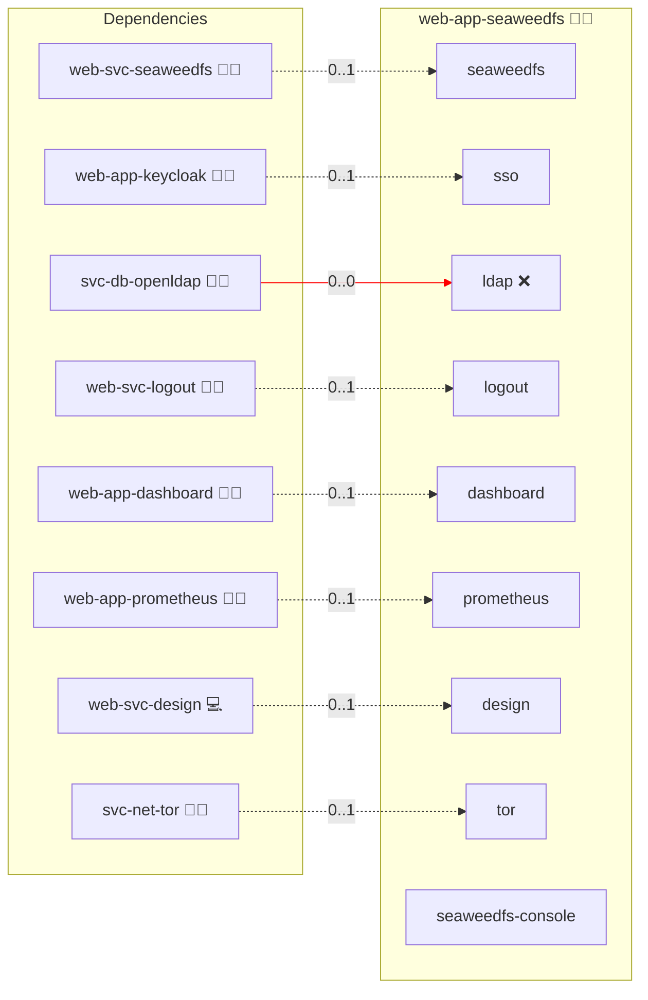

# SeaweedFS Console

## Description

[SeaweedFS](https://github.com/seaweedfs/seaweedfs) ships two browser interfaces: the filer console for browsing stored files and the master console for cluster state.
This role serves both behind an administrator-only oauth2-proxy.

## Overview

The object store itself lives in [web-svc-seaweedfs](../web-svc-seaweedfs/), which owns the storage engine, the per-consumer identities and the public S3 endpoint.
This role adds only the human-facing half: an nginx sidecar that routes two canonical domains to the engine's internal filer and master ports.

- `filer.seaweedfs.s3.*` serves the filer web UI.
- `master.seaweedfs.s3.*` serves the master web UI.

The sidecar reaches the engine over the shared object-store network, so the console can be deployed, removed or left out of a node without touching the store.
A node that does not run this role keeps its object store and its S3 endpoint; it simply has no browser console.

## Cosmos

The diagram places SeaweedFS Console in the Infinito.Nexus cosmos: the components it deploys (capabilities), the central services it consumes (dependencies), and its outward reach (federation and bridged external networks).


```mermaid
flowchart LR
    subgraph deps [Dependencies]
        dep_svc_db_openldap["svc-db-openldap 🐳🐝"]
        dep_svc_net_tor["svc-net-tor 🐳🐝"]
        dep_web_app_dashboard["web-app-dashboard 🐳🐝"]
        dep_web_app_keycloak["web-app-keycloak 🐳🐝"]
        dep_web_app_prometheus["web-app-prometheus 🐳🐝"]
        dep_web_svc_design["web-svc-design 💻"]
        dep_web_svc_logout["web-svc-logout 🐳🐝"]
        dep_web_svc_seaweedfs["web-svc-seaweedfs 🐳🐝"]
    end
    subgraph role [web-app-seaweedfs 🐳🐝]
        svc_seaweedfs["seaweedfs"]
        svc_sso["sso"]
        svc_ldap["ldap ❌"]
        svc_logout["logout"]
        svc_dashboard["dashboard"]
        svc_prometheus["prometheus"]
        svc_design["design"]
        svc_tor["tor"]
        svc_seaweedfs_console["seaweedfs-console"]
    end
    dep_svc_db_openldap -- "0..0" --> svc_ldap
    dep_svc_net_tor -. "0..1" .-> svc_tor
    dep_web_app_dashboard -. "0..1" .-> svc_dashboard
    dep_web_app_keycloak -. "0..1" .-> svc_sso
    dep_web_app_prometheus -. "0..1" .-> svc_prometheus
    dep_web_svc_design -. "0..1" .-> svc_design
    dep_web_svc_logout -. "0..1" .-> svc_logout
    dep_web_svc_seaweedfs -. "0..1" .-> svc_seaweedfs
    linkStyle 0 stroke:red;
```

Solid `1:1` edges are fixed relationships; dashed `0..1` edges are conditional (enabled only in matching deployments); red `0..0` edges are turned off in this role. Node markers show the role's deploy modes (💻 host, 🐳 compose, 🐝 swarm); ❌ marks a service that is explicitly turned off, and ⚙️ an Ansible role dependency declared in `meta/main.yml`.

## Features

- **Admin-gated consoles:** Both interfaces are reachable only for members of the administrator group.
- **Separable from the store:** The console deploys and scales independently of the storage engine.
- **Onion-capable:** Unlike the storage engine, the console is a browser surface and is served over the node onion when Tor is enabled.

## Quick Setup

### Development

Clone, set up the workstation, and deploy SeaweedFS Console onto the local stack:

```bash
git clone https://github.com/infinito-nexus/core.git
cd core
make onboard
make compose-deploy mode=reinstall apps=web-app-seaweedfs full_cycle=false
```

### Production

Run the published image to provision the inventory and deploy SeaweedFS Console to a managed server (the mounted volume persists the inventory):

```bash
APP=web-app-seaweedfs
HOST="<your-server>"
DOMAIN="<your-domain>"
TLS_MODE=self_signed
SSH_PUBLIC_KEY="<your-ssh-public-key>"

docker run --rm -it \
  -v "$PWD/inventories:/etc/infinito.nexus/inventories" \
  -e APP="$APP" -e HOST="$HOST" -e DOMAIN="$DOMAIN" -e TLS_MODE="$TLS_MODE" -e SSH_PUBLIC_KEY="$SSH_PUBLIC_KEY" \
  ghcr.io/infinito-nexus/core/debian:latest bash -c '
    INVENTORY=/etc/infinito.nexus/inventories/production
    infinito administration inventory provision "$INVENTORY" \
      --inventory-file "$INVENTORY/devices.yml" \
      --host "$HOST" \
      --include "$APP" \
      --vars "{\"TLS_MODE\": \"$TLS_MODE\", \"DOMAIN_PRIMARY\": \"$DOMAIN\", \"users\": {\"administrator\": {\"authorized_keys\": [\"$SSH_PUBLIC_KEY\"]}}}" &&
    infinito administration deploy dedicated "$INVENTORY/devices.yml" \
      --password-file "$INVENTORY/.password" \
      --diff -vv'
```

## Further Resources

- [SeaweedFS on GitHub](https://github.com/seaweedfs/seaweedfs)
- [SeaweedFS Wiki](https://github.com/seaweedfs/seaweedfs/wiki)

## Credits

Implemented by **[Kevin Veen-Birkenbach](https://social.infinito.nexus/profile/kevinveenbirkenbach/profile)**.
Part of the [Infinito.Nexus Project](https://s.infinito.nexus/code) and maintained by [Kevin Veen-Birkenbach](https://www.veen.world).
Licensed under the [Infinito.Nexus Community License (Non-Commercial)](https://s.infinito.nexus/license).
