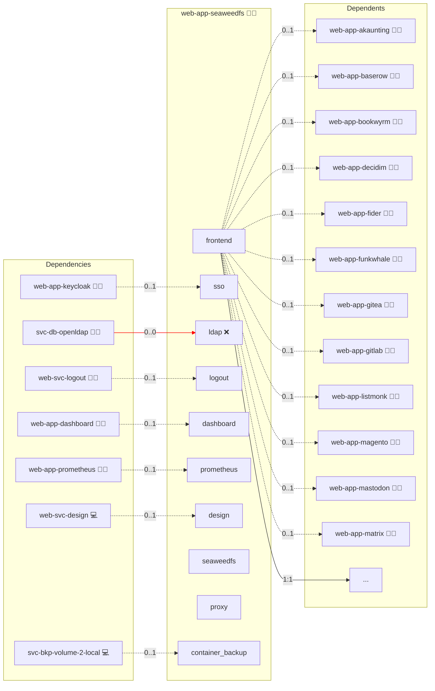

# SeaweedFS Console

## Description

[SeaweedFS](https://github.com/seaweedfs/seaweedfs) ships two browser interfaces: the filer console for browsing stored files and the master console for cluster state.
This role serves both behind an administrator-only oauth2-proxy.

## Overview

The object store itself lives in [web-svc-seaweedfs](../web-svc-seaweedfs/), which owns the storage engine, the per-consumer identities and the public S3 endpoint.
This role adds only the human-facing half: an nginx sidecar that routes two canonical domains to the engine's internal filer and master ports.

- `filer.seaweedfs.s3.*` serves the filer web UI.
- `master.seaweedfs.s3.*` serves the master web UI.

The sidecar reaches the engine over the shared object-store network, so the console can be deployed, removed or left out of a node without touching the store.
A node that does not run this role keeps its object store and its S3 endpoint; it simply has no browser console.

Per-consumer S3 identities are rendered into `s3.json`: each consuming role receives an access key and bucket-scoped `Read`, `Write`, `List`, and `Tagging` actions, and consumers marked `public` additionally receive anonymous read on their bucket.
Consumer buckets are created through `weed shell` when a consumer role requests provisioning.

In embedded mode (`shared: false`) a consumer's compose stack receives a storage-only SeaweedFS container without UI or published ports.
The embedded S3 listener performs no authentication, so it MUST stay confined to the consumer's isolated compose network.

## Cosmos

The diagram places SeaweedFS in the Infinito.Nexus cosmos: the components it deploys (capabilities), the central services it consumes (dependencies), and its outward reach (federation and bridged external networks).

```mermaid
flowchart LR
    subgraph deps [Dependencies]
        dep_svc_bkp_volume_2_local["svc-bkp-volume-2-local 💻"]
        dep_svc_db_openldap["svc-db-openldap 🐳🐝"]
        dep_web_app_dashboard["web-app-dashboard 🐳🐝"]
        dep_web_app_keycloak["web-app-keycloak 🐳🐝"]
        dep_web_app_prometheus["web-app-prometheus 🐳🐝"]
        dep_web_svc_design["web-svc-design 💻"]
        dep_web_svc_logout["web-svc-logout 🐳🐝"]
    end
    subgraph role [web-app-seaweedfs 🐳🐝]
        svc_frontend["frontend"]
        svc_sso["sso"]
        svc_ldap["ldap ❌"]
        svc_logout["logout"]
        svc_dashboard["dashboard"]
        svc_prometheus["prometheus"]
        svc_design["design"]
        svc_seaweedfs["seaweedfs"]
        svc_proxy["proxy"]
        svc_container_backup["container_backup"]
    end
    subgraph dependents [Dependents]
        dpt_web_app_akaunting["web-app-akaunting 🐳🐝"]
        dpt_web_app_baserow["web-app-baserow 🐳🐝"]
        dpt_web_app_bookwyrm["web-app-bookwyrm 🐳🐝"]
        dpt_web_app_decidim["web-app-decidim 🐳🐝"]
        dpt_web_app_fider["web-app-fider 🐳🐝"]
        dpt_web_app_funkwhale["web-app-funkwhale 🐳🐝"]
        dpt_web_app_gitea["web-app-gitea 🐳🐝"]
        dpt_web_app_gitlab["web-app-gitlab 🐳🐝"]
        dpt_web_app_listmonk["web-app-listmonk 🐳🐝"]
        dpt_web_app_magento["web-app-magento 🐳🐝"]
        dpt_web_app_mastodon["web-app-mastodon 🐳🐝"]
        dpt_web_app_matrix["web-app-matrix 🐳🐝"]
        dpt_more["..."]
    end
    dep_svc_bkp_volume_2_local -. "0..1" .-> svc_container_backup
    dep_svc_db_openldap -- "0..0" --> svc_ldap
    dep_web_app_dashboard -. "0..1" .-> svc_dashboard
    dep_web_app_keycloak -. "0..1" .-> svc_sso
    dep_web_app_prometheus -. "0..1" .-> svc_prometheus
    dep_web_svc_design -. "0..1" .-> svc_design
    dep_web_svc_logout -. "0..1" .-> svc_logout
    svc_frontend -- "1:1" --> dpt_more
    svc_frontend -. "0..1" .-> dpt_web_app_akaunting
    svc_frontend -. "0..1" .-> dpt_web_app_baserow
    svc_frontend -. "0..1" .-> dpt_web_app_bookwyrm
    svc_frontend -. "0..1" .-> dpt_web_app_decidim
    svc_frontend -. "0..1" .-> dpt_web_app_fider
    svc_frontend -. "0..1" .-> dpt_web_app_funkwhale
    svc_frontend -. "0..1" .-> dpt_web_app_gitea
    svc_frontend -. "0..1" .-> dpt_web_app_gitlab
    svc_frontend -. "0..1" .-> dpt_web_app_listmonk
    svc_frontend -. "0..1" .-> dpt_web_app_magento
    svc_frontend -. "0..1" .-> dpt_web_app_mastodon
    svc_frontend -. "0..1" .-> dpt_web_app_matrix
    linkStyle 1 stroke:red;
```

Solid `1:1` edges are fixed relationships; dashed `0..1` edges are conditional (enabled only in matching deployments); red `0..0` edges are turned off in this role. Node markers show the role's deploy modes (💻 host, 🐳 compose, 🐝 swarm); ❌ marks a service that is explicitly turned off, and ⚙️ an Ansible role dependency declared in `meta/main.yml`.

## Features

- **Admin-gated consoles:** Both interfaces are reachable only for members of the administrator group.
- **Separable from the store:** The console deploys and scales independently of the storage engine.
- **Onion-capable:** Unlike the storage engine, the console is a browser surface and is served over the node onion when Tor is enabled.

## Further Resources

- [SeaweedFS on GitHub](https://github.com/seaweedfs/seaweedfs)
- [SeaweedFS Wiki](https://github.com/seaweedfs/seaweedfs/wiki)
- [Corporate design review: screenshots in light, dark, desktop and mobile](https://claude.ai/artifact/KARCkLWPrQKjbZDUynYfit)
