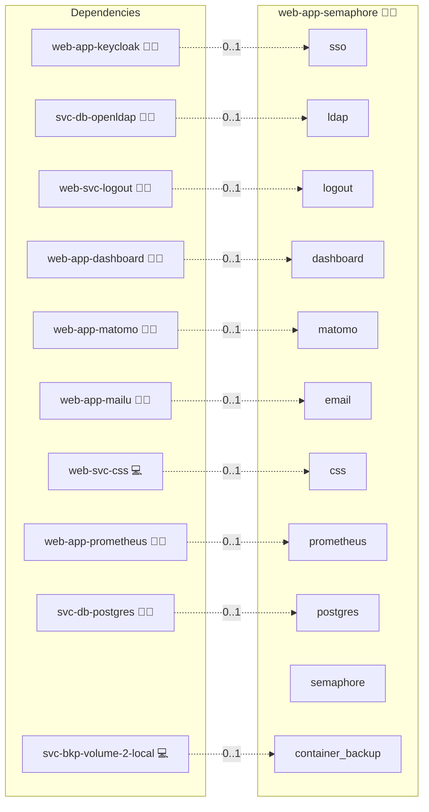

# Semaphore UI

## Description

[Semaphore UI](https://semaphoreui.com/) is a modern web UI and API for running Ansible playbooks, Terraform/OpenTofu plans, and shell scripts on a schedule or on demand. This role deploys the official [`semaphoreui/semaphore`](https://github.com/semaphoreui/semaphore) container behind the Infinito.Nexus reverse proxy with central PostgreSQL, native Keycloak OIDC Single Sign-On, and optional LDAP login.

## Overview

The role deploys the single Semaphore container (with its embedded task runner) and wires it into the platform via `SEMAPHORE_*` environment variables. The setup wizard is bypassed by seeding the initial admin from rendered secrets, so a fresh deploy lands directly on the Semaphore login page. When SSO is enabled, the Keycloak `administrator` is created at deploy time as an external Semaphore admin via `semaphore user add --admin --external`; the OIDC callback matches it by email and signs the operator in as a Semaphore admin.

## Cosmos

The diagram places Semaphore UI in the Infinito.Nexus cosmos: the components it deploys (capabilities), the central services it consumes (dependencies), and its outward reach (federation and bridged external networks).



Solid `1:1` edges are fixed relationships; dashed `0..1` edges are conditional (enabled only in matching deployments). Node markers show the role's deploy modes (💻 host, 🐳 compose, 🐝 swarm); ❌ marks a service that is explicitly turned off, and ⚙️ an Ansible role dependency declared in `meta/main.yml`.

## Features

- **Central PostgreSQL:**
  `SEMAPHORE_DB_DIALECT=postgres` against the shared `svc-db-postgres` (or a per-role engine when not shared), with centralised backup and monitoring.

- **Native OIDC SSO:**
  Semaphore renders its own "Sign in with Keycloak" button via `SEMAPHORE_OIDC_PROVIDERS`; the Keycloak client is auto-provisioned by `web-app-keycloak`.

- **LDAP login:**
  When `svc-db-openldap` is present, Semaphore's login form binds against the central OpenLDAP directory (`SEMAPHORE_LDAP_*`). With LDAP enabled the form is LDAP-only; there is no local-password fallback.

- **Break-glass local admin:**
  `SEMAPHORE_ADMIN*` seeds a local admin from the `web-app-semaphore-breakglass` user in every variant, reachable through the login form only when LDAP is disabled.

- **Embedded runner:**
  Automation executes inside the main container.

## Quick Setup

### Development

Clone, set up the workstation, and deploy Semaphore UI onto the local stack:

```bash
git clone https://github.com/infinito-nexus/core.git
cd core
make onboard
make compose-deploy mode=reinstall apps=web-app-semaphore full_cycle=false
```

### Production

Run the published image to provision the inventory and deploy Semaphore UI to a managed server (the mounted volume persists the inventory):

```bash
APP=web-app-semaphore
HOST=<your-server>
TLS_MODE=self_signed
SSH_PUBLIC_KEY="<your-ssh-public-key>"

docker run --rm -it \
  -v "$PWD/inventories:/etc/infinito.nexus/inventories" \
  -e APP="$APP" -e HOST="$HOST" -e TLS_MODE="$TLS_MODE" -e SSH_PUBLIC_KEY="$SSH_PUBLIC_KEY" \
  ghcr.io/infinito-nexus/core/debian bash -c '
    INVENTORY=/etc/infinito.nexus/inventories/production
    infinito administration inventory provision "$INVENTORY" \
      --inventory-file "$INVENTORY/devices.yml" \
      --host "$HOST" \
      --include "$APP" \
      --vars "{\"TLS_MODE\": \"$TLS_MODE\", \"users\": {\"administrator\": {\"authorized_keys\": [\"$SSH_PUBLIC_KEY\"]}}}" &&
    infinito administration deploy dedicated "$INVENTORY/devices.yml" \
      --password-file "$INVENTORY/.password" \
      --diff -vv'
```

## Further Resources

- [Semaphore UI Official Website](https://semaphoreui.com/)
- [Semaphore Documentation](https://docs.semaphoreui.com/)
- [OIDC / Keycloak configuration](https://docs.semaphoreui.com/administration-guide/openid/keycloak/)
- [Semaphore GitHub Repository](https://github.com/semaphoreui/semaphore)

## Credits

Implemented by **[Kevin Veen-Birkenbach](https://www.veen.world)**.
Part of the [Infinito.Nexus Project](https://s.infinito.nexus/code) and maintained by [Kevin Veen-Birkenbach](https://www.veen.world).
Licensed under the [Infinito.Nexus Community License (Non-Commercial)](https://s.infinito.nexus/license).
