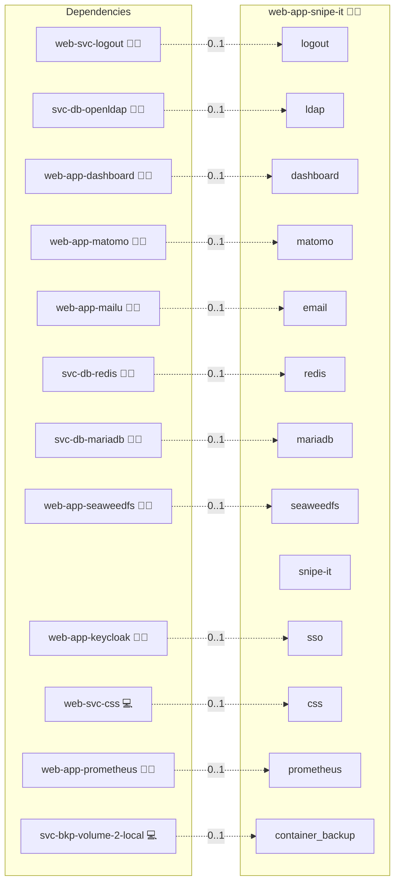

# Snipe‑IT

## Description

Snipe‑IT is an open‑source asset management system designed to streamline hardware and software inventory tracking. This deployment provides an automated, containerized solution using Docker Compose, centralized MariaDB database integration, and secure, configurable environment settings, including robust SMTP email support and pending SAML authentication enhancements.

## Overview

This Docker deployment uses Ansible automation to set up Snipe‑IT along with necessary services such as a MariaDB database, an optional OAuth2 proxy for additional security, and a reverse proxy configuration. The system is built for reliable asset management in various environments.

## Cosmos

The diagram places Snipe‑IT in the Infinito.Nexus cosmos: the components it deploys (capabilities), the central services it consumes (dependencies), and its outward reach (federation and bridged external networks).



Solid `1:1` edges are fixed relationships; dashed `0..1` edges are conditional (enabled only in matching deployments). Node markers show the role's deploy modes (💻 host, 🐳 compose, 🐝 swarm); ❌ marks a service that is explicitly turned off, and ⚙️ an Ansible role dependency declared in `meta/main.yml`.

## Features

- **Automated Deployment:**  
  Launch Snipe‑IT quickly with Docker Compose and Ansible automation for a production‑ready platform.

- **Centralized Database Support:**  
  Leverage MariaDB for secure and reliable data storage.

- **Configurable SMTP Settings:**  
  Manage email notifications and alerts with customizable SMTP configurations.

- **Trusted-Header SSO Bridge:**  
  When the oauth2-proxy SSO flavor is active, Snipe-IT's native
  `loginViaRemoteUser()` is enabled via the `Setting` model
  (`login_remote_user_enabled`, `login_remote_user_header_name =
  HTTP_X_FORWARDED_PREFERRED_USERNAME`). nginx gates `/login` through
  oauth2-proxy/Keycloak and injects the verified
  `X-Forwarded-Preferred-Username` header, which Snipe-IT matches against
  `users.username` (the user must pre-exist and be activated — sync them
  via LDAP) to mint a native `snipeit_session`. Visitors without a matching
  activated user silently fall through to the normal login form (no error).
  The password/LDAP login form stays available as a fallback
  (`login_common_disabled = 0`), and the in-app logout is redirected to the
  central OIDC end-session URL.

- **Optional SAML Authentication:**  
  Prepare for enhanced, standards‑based authentication (integration pending).

- **Redis Caching:**  
  Improve application performance with built‑in Redis caching support.

## Quick Setup

### Development

Clone, set up the workstation, and deploy Snipe‑IT onto the local stack:

```bash
git clone https://github.com/infinito-nexus/core.git
cd core
make onboard
make compose-deploy mode=reinstall apps=web-app-snipe-it full_cycle=false
```

### Production

Run the published image to provision the inventory and deploy Snipe‑IT to a managed server (the mounted volume persists the inventory):

```bash
APP=web-app-snipe-it
HOST=<your-server>
TLS_MODE=self_signed
SSH_PUBLIC_KEY="<your-ssh-public-key>"

docker run --rm -it \
  -v "$PWD/inventories:/etc/infinito.nexus/inventories" \
  -e APP="$APP" -e HOST="$HOST" -e TLS_MODE="$TLS_MODE" -e SSH_PUBLIC_KEY="$SSH_PUBLIC_KEY" \
  ghcr.io/infinito-nexus/core/debian bash -c '
    INVENTORY=/etc/infinito.nexus/inventories/production
    infinito administration inventory provision "$INVENTORY" \
      --inventory-file "$INVENTORY/devices.yml" \
      --host "$HOST" \
      --include "$APP" \
      --vars "{\"TLS_MODE\": \"$TLS_MODE\", \"users\": {\"administrator\": {\"authorized_keys\": [\"$SSH_PUBLIC_KEY\"]}}}" &&
    infinito administration deploy dedicated "$INVENTORY/devices.yml" \
      --password-file "$INVENTORY/.password" \
      --diff -vv'
```

## Other Resources

- [Snipe‑IT Official Documentation](https://snipe-it.readme.io/)
- [Mattermost SSO Integration Guide](https://docs.mattermost.com/onboard/sso-saml-keycloak.html)
- [Additional GitHub Issues and Discussions](https://github.com/snipe/snipe-it/issues)

## Credits

Implemented by **[Kevin Veen-Birkenbach](https://www.veen.world)**.
Part of the [Infinito.Nexus Project](https://s.infinito.nexus/code) and maintained by [Kevin Veen-Birkenbach](https://www.veen.world).
Licensed under the [Infinito.Nexus Community License (Non-Commercial)](https://s.infinito.nexus/license).
