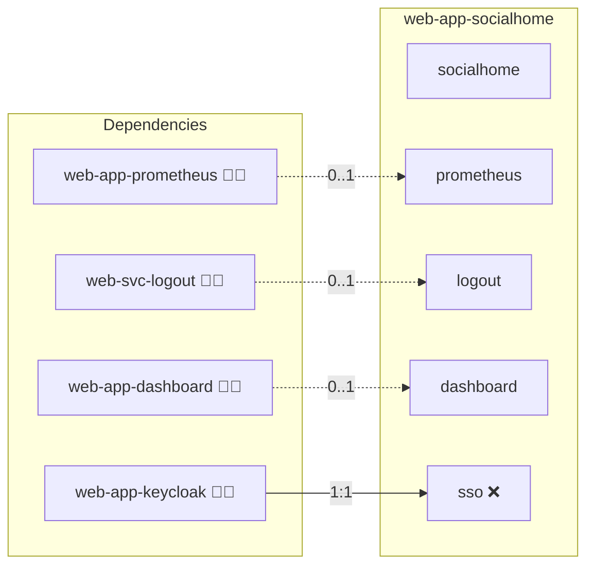

# SocialHome

## Description

Deploy **SocialHome**, a federated social network focused on content hubs and federation. This role provides a Docker-based scaffold and domain wiring so you can bring SocialHome into your Infinito.Nexus stack.

## Overview

This role sets up a SocialHome application using Docker Compose with basic domain and port wiring. It follows your standard role layout and prepares the service to run behind your existing reverse proxy. The current version is a scaffold intended to be expanded with database/cache services and app-specific settings.

## Cosmos

The diagram places SocialHome in the Infinito.Nexus cosmos: the components it deploys (capabilities), the central services it consumes (dependencies), and its outward reach (federation and bridged external networks).



Solid `1:1` edges are fixed relationships; dashed `0..1` edges are conditional (enabled only in matching deployments). Node markers show the role's deploy modes (💻 host, 🐳 compose, 🐝 swarm); ❌ marks a service that is explicitly turned off, and ⚙️ an Ansible role dependency declared in `meta/main.yml`.

## Features

- **Dockerized Scaffold:** Baseline Docker Compose integration and role structure to get you started quickly.
- **Domain & Port Wiring:** Integrates cleanly with your central domain/ports configuration.
- **Ready for Federation:** Intended to support ActivityPub-based federation once the application is fully wired.
- **Extensible Configuration:** Room for adding database, cache, worker processes, and environment tuning.
- **Desktop Integration Hooks:** This README ensures inclusion in the Web App Desktop overview.

## Quick Setup

### Development

Clone, set up the workstation, and deploy SocialHome onto the local stack:

```bash
git clone https://github.com/infinito-nexus/core.git
cd core
make onboard
make compose-deploy mode=reinstall apps=web-app-socialhome full_cycle=false
```

### Production

Install SocialHome directly onto the target machine — clone the repository, install the OS prerequisites and the repository toolchain, then deploy against localhost over a local connection (no SSH, no container):

```bash
git clone https://github.com/infinito-nexus/core.git
cd core
bash scripts/install/package.sh
make install
source scripts/meta/env/load.sh

APP=web-app-socialhome
TLS_MODE=self_signed
SSH_PUBLIC_KEY="<your-ssh-public-key>"
INVENTORY=inventories/production
infinito administration inventory provision "$INVENTORY" \
  --inventory-file "$INVENTORY/devices.yml" \
  --host localhost \
  --include "$APP" \
  --vars "{\"TLS_MODE\": \"$TLS_MODE\", \"users\": {\"administrator\": {\"authorized_keys\": [\"$SSH_PUBLIC_KEY\"]}}}"
infinito administration deploy dedicated "$INVENTORY/devices.yml" \
  --password-file "$INVENTORY/.password" \
  --diff -vv
```

## Further Resources

- [SocialHome Project](https://socialhome.network/)
- [ActivityPub (W3C)](https://www.w3.org/TR/activitypub/)

## Credits

Implemented by **[Kevin Veen-Birkenbach](https://www.veen.world)**.
Part of the [Infinito.Nexus Project](https://s.infinito.nexus/code) and maintained by [Kevin Veen-Birkenbach](https://www.veen.world).
Licensed under the [Infinito.Nexus Community License (Non-Commercial)](https://s.infinito.nexus/license).
