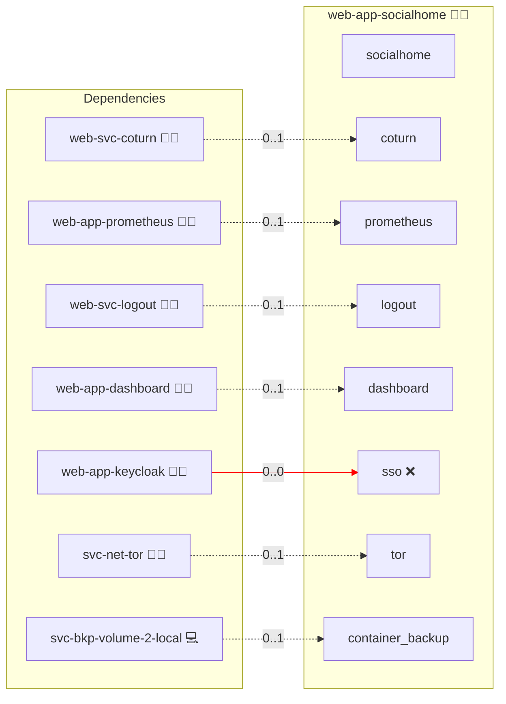

# Social Home

## Description

Deploy **[Social Home](https://github.com/social-home-io/socialhome)**, a privacy-first federated social platform built for a single household. One container, an embedded SQLite database, and peer-to-peer federation between households over Ed25519-signed WebRTC data channels — no ActivityPub, no message broker, no object store.

This is **not** [jaywink/socialhome](https://github.com/jaywink/socialhome), the Django content-hub project of the same name. Different codebase, different protocol, different maintainers.

## Overview

The role runs the upstream `ghcr.io/social-home-io/socialhome` image behind the central reverse proxy on its own canonical domain. Everything the application keeps lives in one volume at `/data`: the SQLite database, uploaded media, and installed apps. The administrator account is provisioned from the role's generated credential, and the role finishes the upstream first-boot wizard over the API so the front page renders a login form instead of a setup screen.

A rendered `socialhome.toml` is mounted alongside the environment file. It carries exactly one setting — `[standalone].external_url` — because that value has no `SH_*` environment equivalent upstream and federation pairing returns `422 NOT_CONFIGURED` without it.

## Cosmos

The diagram places Social Home in the Infinito.Nexus cosmos: the components it deploys (capabilities), the central services it consumes (dependencies), and its outward reach (federation and bridged external networks).


```mermaid
flowchart LR
    subgraph deps [Dependencies]
        dep_svc_bkp_volume_2_local["svc-bkp-volume-2-local 💻"]
        dep_svc_net_tor["svc-net-tor 🐳🐝"]
        dep_web_app_dashboard["web-app-dashboard 🐳🐝"]
        dep_web_app_keycloak["web-app-keycloak 🐳🐝"]
        dep_web_app_prometheus["web-app-prometheus 🐳🐝"]
        dep_web_svc_coturn["web-svc-coturn 🐳🐝"]
        dep_web_svc_logout["web-svc-logout 🐳🐝"]
    end
    subgraph role [web-app-socialhome 🐳🐝]
        svc_socialhome["socialhome"]
        svc_coturn["coturn"]
        svc_prometheus["prometheus"]
        svc_logout["logout"]
        svc_dashboard["dashboard"]
        svc_sso["sso ❌"]
        svc_tor["tor"]
        svc_container_backup["container_backup"]
    end
    dep_svc_bkp_volume_2_local -. "0..1" .-> svc_container_backup
    dep_svc_net_tor -. "0..1" .-> svc_tor
    dep_web_app_dashboard -. "0..1" .-> svc_dashboard
    dep_web_app_keycloak -- "0..0" --> svc_sso
    dep_web_app_prometheus -. "0..1" .-> svc_prometheus
    dep_web_svc_coturn -. "0..1" .-> svc_coturn
    dep_web_svc_logout -. "0..1" .-> svc_logout
    linkStyle 3 stroke:red;
```

Solid `1:1` edges are fixed relationships; dashed `0..1` edges are conditional (enabled only in matching deployments); red `0..0` edges are turned off in this role. Node markers show the role's deploy modes (💻 host, 🐳 compose, 🐝 swarm); ❌ marks a service that is explicitly turned off, and ⚙️ an Ansible role dependency declared in `meta/main.yml`.

## Features

- **Single Container:** No database server, no cache, no worker, no object store. SQLite in one volume.
- **Headless Provisioning:** The administrator is seeded from the role's credential and the first-boot wizard is completed over the API, so no manual click-through is required.
- **Federation Ready:** The rendered `socialhome.toml` publishes the instance's external URL, which is what QR pairing hands to peer households.
- **Own STUN/TURN:** When `web-svc-coturn` is part of the deployment, WebRTC uses it with time-limited HMAC credentials instead of a third-party STUN server.
- **No Outbound Surprises:** The upstream app catalog fetch to github.com is disabled. Without `web-svc-coturn` the app still falls back to its built-in Google STUN server, since suppressing the variable entirely would leave WebRTC with none at all.
- **Desktop Integration Hooks:** This README ensures inclusion in the Web App Desktop overview.

## Limitations

- The role has never been deployed. `lifecycle` is `alpha`, so CI deploys it from the next run on; that run is its first execution. See [TODO.md](TODO.md).
- No SSO. The application authenticates against its own user table and has no OIDC client, so the reverse proxy is not SSO-gated — federation endpoints must stay publicly reachable.
- The application ships no logout control at `2026.6.16`, so the Playwright administrator persona is declared blocked.

## Quick Setup

### Development

Clone, set up the workstation, and deploy Social Home onto the local stack:

```bash
git clone https://github.com/infinito-nexus/core.git
cd core
make onboard
make compose-deploy mode=reinstall apps=web-app-socialhome full_cycle=false
```

### Production

Run the published image to provision the inventory and deploy Social Home to a managed server (the mounted volume persists the inventory):

```bash
APP=web-app-socialhome
HOST=<your-server>
TLS_MODE=self_signed
SSH_PUBLIC_KEY="<your-ssh-public-key>"

docker run --rm -it \
  -v "$PWD/inventories:/etc/infinito.nexus/inventories" \
  -e APP="$APP" -e HOST="$HOST" -e TLS_MODE="$TLS_MODE" -e SSH_PUBLIC_KEY="$SSH_PUBLIC_KEY" \
  ghcr.io/infinito-nexus/core/debian bash -c '
    INVENTORY=/etc/infinito.nexus/inventories/production
    infinito administration inventory provision "$INVENTORY" \
      --inventory-file "$INVENTORY/devices.yml" \
      --host "$HOST" \
      --include "$APP" \
      --vars "{\"TLS_MODE\": \"$TLS_MODE\", \"users\": {\"administrator\": {\"authorized_keys\": [\"$SSH_PUBLIC_KEY\"]}}}" &&
    infinito administration deploy dedicated "$INVENTORY/devices.yml" \
      --password-file "$INVENTORY/.password" \
      --diff -vv'
```

## Further Resources

- [Social Home source](https://github.com/social-home-io/socialhome)
- [Published container images](https://github.com/social-home-io/socialhome/pkgs/container/socialhome)
- [TURN REST API credential scheme](https://datatracker.ietf.org/doc/html/draft-uberti-behave-turn-rest-00)

## Credits

Implemented by **Kevin Veen-Birkenbach**.
Part of the [Infinito.Nexus Project](https://s.infinito.nexus/code) and maintained by [Kevin Veen-Birkenbach](https://www.veen.world).
Licensed under the [Infinito.Nexus Community License (Non-Commercial)](https://s.infinito.nexus/license).
