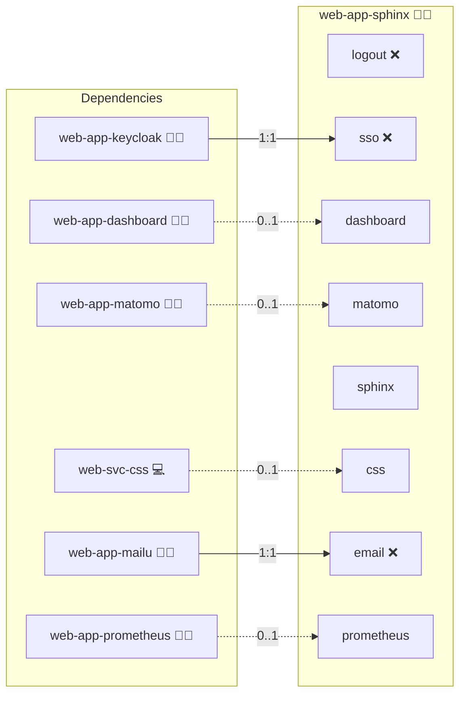

# Sphinx

## Description

Sphinx is a powerful documentation generator originally created for Python projects and now widely used to build and maintain comprehensive documentation for all kinds of software projects. This role automates the process of building and deploying Sphinx documentation using Docker, ensuring reproducible builds and seamless updates.

## Overview

This Docker Compose deployment leverages Ansible to automatically pull your source repository, build the documentation using Sphinx, and serve the generated HTML through a lightweight HTTP server. The entire process is containerized, which guarantees a consistent and isolated environment regardless of the host system. By default it uses [Infinito.Nexus Sphinx](https://s.infinito.nexus/code-sphinx) to build the docs.

## Cosmos

The diagram places Sphinx in the Infinito.Nexus cosmos: the components it deploys (capabilities), the central services it consumes (dependencies), and its outward reach (federation and bridged external networks).



Solid `1:1` edges are fixed relationships; dashed `0..1` edges are conditional (enabled only in matching deployments). Node markers show the role's deploy modes (💻 host, 🐳 compose, 🐝 swarm); ❌ marks a service that is explicitly turned off, and ⚙️ an Ansible role dependency declared in `meta/main.yml`.

## Purpose

By automating the Sphinx build process and containerized deployment, this role minimizes manual intervention and helps you ensure that your documentation is always up-to-date with the latest changes in your codebase. It is ideal for continuous integration environments and for projects that require frequent documentation updates.

## Features

- **Automated Sphinx Build:**  
  The role automatically triggers a Sphinx build using a Makefile. This build process compiles source files into clean, navigable HTML documentation.

- **Dynamic and Reproducible Builds:**  
  Source code is dynamically pulled from your repository before each build. This ensures that every documentation update accurately reflects the latest version of your project.

- **Docker Compose Integration:**  
  By harnessing Docker Compose, the role deploys the Sphinx build and serving process in an isolated, reproducible container environment, which simplifies the setup and improves portability.

- **Customizable Configuration:**  
  Variables allow you to define source and output directories, build parameters, and other settings. This flexibility enables you to tailor the documentation build process to your project’s specific needs.

- **Reliable Serving of Documentation:**  
  Once the build is complete, the generated HTML is served through a lightweight HTTP server. Health checks are in place to ensure the service is running reliably.

- **Consistent Deployment Workflow:**  
  The entire process (from pulling the repository to serving the final output) is automated. This reduces human error and makes it easy to update or roll back documentation builds.

## Quick Setup

### Development

Clone, set up the workstation, and deploy Sphinx onto the local stack:

```bash
git clone https://github.com/infinito-nexus/core.git
cd core
make onboard
make compose-deploy mode=reinstall apps=web-app-sphinx full_cycle=false
```

### Production

Run the published image to provision the inventory and deploy Sphinx to a managed server (the mounted volume persists the inventory):

```bash
APP=web-app-sphinx
HOST=<your-server>
TLS_MODE=self_signed
SSH_PUBLIC_KEY="<your-ssh-public-key>"

docker run --rm -it \
  -v "$PWD/inventories:/etc/infinito.nexus/inventories" \
  -e APP="$APP" -e HOST="$HOST" -e TLS_MODE="$TLS_MODE" -e SSH_PUBLIC_KEY="$SSH_PUBLIC_KEY" \
  ghcr.io/infinito-nexus/core/debian bash -c '
    INVENTORY=/etc/infinito.nexus/inventories/production
    infinito administration inventory provision "$INVENTORY" \
      --inventory-file "$INVENTORY/devices.yml" \
      --host "$HOST" \
      --include "$APP" \
      --vars "{\"TLS_MODE\": \"$TLS_MODE\", \"users\": {\"administrator\": {\"authorized_keys\": [\"$SSH_PUBLIC_KEY\"]}}}" &&
    infinito administration deploy dedicated "$INVENTORY/devices.yml" \
      --password-file "$INVENTORY/.password" \
      --diff -vv'
```

## Further Resources

For more information about Sphinx and its capabilities, please visit the [Sphinx Official Website](https://www.sphinx-doc.org/).

For detailed Sphinx documentation, see the [Sphinx Documentation](https://www.sphinx-doc.org/en/master/).

## Credits

Implemented by **Marko Pjevac, Kevin Veen-Birkenbach**.
Part of the [Infinito.Nexus Project](https://s.infinito.nexus/code) and maintained by [Kevin Veen-Birkenbach](https://www.veen.world).
Licensed under the [Infinito.Nexus Community License (Non-Commercial)](https://s.infinito.nexus/license).
