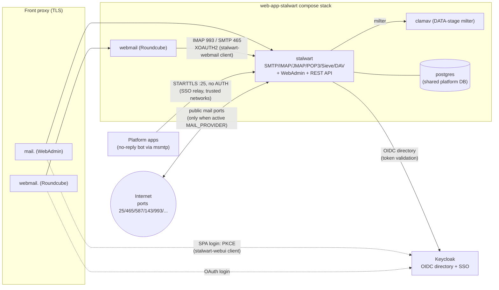

# Stalwart Mail Server

## Description

Runs [Stalwart](https://stalw.art/) — a secure, all-in-one mail and
collaboration server — as the platform's email provider. A single hardened
service speaks **SMTP, Submission, IMAP, POP3, JMAP, ManageSieve, CalDAV,
CardDAV and WebDAV**, with a **built-in spam filter**, **DKIM/DMARC** signing
and a **WebAdmin + REST management API**.

This role replaces the deprecated [`web-app-mailu`](../web-app-mailu/) role.
Applications send mail through the same provider-agnostic abstraction
(`lookup('email')` / [`sys-svc-mail`](../sys-svc-mail/)) — no consumer changes
are needed beyond the provider repoint.

## Overview

Compared with Mailu's multi-container stack, Stalwart collapses the mail server
into one binary. This role runs:

| Container | Purpose |
|-----------|---------|
| `stalwart` | SMTP/IMAP/JMAP/POP3/Sieve/DAV + built-in spam filter + WebAdmin/REST API |
| `webmail` (Roundcube) | Browser webmail (parity with Mailu) |
| `clamav` | Attachment antivirus, called as an SMTP DATA-stage milter |
| `postgres` *(shared)* | Account / mail / metadata store |

Dynamic state (domains, accounts, passwords, DKIM, certificates) is administered
at runtime via the JMAP management API; `config.json` only bootstraps the data
store. Spam filtering is built into Stalwart; **antivirus** is provided by the
`clamav` container (registered via `x:MtaMilter`, `services.clamav.enabled` —
set it to `false` to run spam-only). Infected mail is rejected at DATA.

## SSO (Keycloak / OpenID Connect)

When `web-app-keycloak` is present the role joins the shared Keycloak client and
delegates **interactive** authentication to Keycloak:

- **WebAdmin + IMAP/SMTP/JMAP** authenticate against an **OIDC directory**
  (`tasks/08_oidc.yml`): Stalwart validates Keycloak-issued tokens, matching the
  `preferred_username` claim to the provisioned account.
- **Roundcube** logs users in over OAuth2 and talks to Stalwart with **XOAUTH2**
  (`templates/roundcube-oauth.inc.php.j2`).

**Design constraint (validated against the live JMAP schema):** Stalwart's
authentication directory is *Internal XOR one external directory* — there is no
chaining or fallback. Enabling SSO therefore **disables password submission**
for every account, including the machine `no-reply` account. To keep outbound
notifications working, the role:

1. Widens `x:MtaStageRcpt.allowRelaying` to trust the internal Docker networks
   (`STALWART_TRUSTED_NETWORKS`), so the bot relays without SMTP AUTH; and
2. Self-declares `services.sso.oidc.submission_via_relay: true`, which makes
   [`plugins/lookup/email.py`](../../plugins/lookup/email.py) switch the
   `no-reply` client to unauthenticated STARTTLS relay on port 25.

With SSO disabled the role uses the Internal directory and password submission,
exactly as before. Mailu keeps password submission in both modes and does not
set `submission_via_relay`.

## Calendar & Contacts (CalDAV / CardDAV / WebDAV)

Stalwart serves DAV natively on the mail HTTP listener — no extra container
(Mailu used a separate Radicale service). Clients auto-discover via
`https://mail.<domain>/.well-known/{caldav,carddav}`, which redirect to
`https://mail.<domain>/dav/cal` and `/dav/card`. Authenticate with the mailbox
account (or the Keycloak SSO token when SSO is enabled).

## Features

- All-in-one mail server (SMTP/IMAP/JMAP/POP3/ManageSieve)
- CalDAV / CardDAV / WebDAV collaboration
- Built-in spam filtering
- ClamAV antivirus as an SMTP DATA-stage milter (`services.clamav.enabled: false` for spam-only)
- DKIM signing with automatic key management; SPF / DMARC published in DNS
- OpenID Connect SSO via Keycloak
- Roundcube webmail
- PostgreSQL backing store

## Migration from Mailu

The provider cutover is a one-line inventory change; mailbox data moves with the bundled migration script.

1. Keep `web-app-mailu` in the host's groups and add `web-app-stalwart` — both MUST be present so Mailu re-renders as a legacy instance (`legacy-mail.<domain>`, no public mail ports) and releases `mail.<domain>` to Stalwart.
2. Remove `MAIL_PROVIDER` from the inventory (Stalwart is the default) and run the full deploy.
3. Migrate mailbox data with [`files/migrate_from_mailu.py`](files/migrate_from_mailu.py): it reads Mailu's Dovecot Maildir volume directly (no running Mailu required) and imports messages per account via IMAP APPEND, preserving folders, flags and internal dates. Re-runs are idempotent (Message-ID dedup).
4. Accounts and aliases are provisioned from the inventory by this role; mailboxes created only inside Mailu's admin UI MUST be added to the inventory first. Sieve filters and CalDAV/CardDAV data are out of scope for the script.
5. Non-Cloudflare DNS: publish the new DKIM TXT record reported by the deploy; MX and A records keep their hostname.

The migration is covered by [`files/test.sh`](files/test.sh): it seeds a Mailu-layout maildir stump, migrates it into a pinned Stalwart container and verifies contents, flags and idempotency — run it with `make test-migration`, or in CI via the `INFINITO_TEST_MIGRATION` gate (manual-workflow field or GitHub repository variable).

## Further Reading

- [Stalwart documentation](https://stalw.art/docs)
- [`sys-svc-mail`](../sys-svc-mail/) — how applications send mail
- [`plugins/lookup/email.py`](../../plugins/lookup/email.py) — the email abstraction

> **Note:** Stalwart's JMAP object schema is version-sensitive. Pin
> `services.stalwart.version`; the provisioning payloads in `tasks/` were
> validated against that release's `GET /api/schema`.

## Credits

Developed and maintained by **Kevin Veen-Birkenbach**.
Learn more at [veen.world](https://www.veen.world).
Part of the [Infinito.Nexus Project](https://s.infinito.nexus/code).
Licensed under the [Infinito.Nexus Community License (Non-Commercial)](https://s.infinito.nexus/license).
