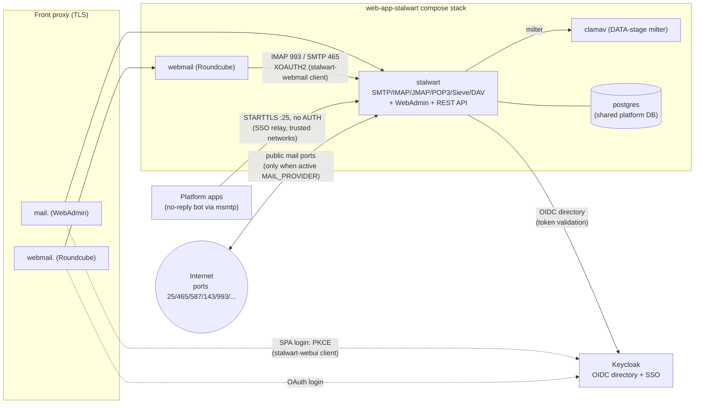
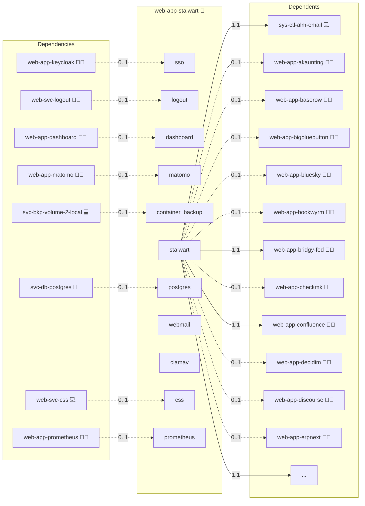

# Stalwart Mail Server

## Description

Runs [Stalwart](https://stalw.art/) — a secure, all-in-one mail and
collaboration server — as the platform's email provider. A single hardened
service speaks **SMTP, Submission, IMAP, POP3, JMAP, ManageSieve, CalDAV,
CardDAV and WebDAV**, with a **built-in spam filter**, **DKIM/DMARC** signing
and a **WebAdmin + REST management API**.

This role replaces the deprecated [`web-app-mailu`](../web-app-mailu/) role.
Applications send mail through the same provider-agnostic abstraction
(`lookup('email')` / [`sys-svc-mail`](../sys-svc-mail/)) — no consumer changes
are needed beyond the provider repoint.

## Overview

Compared with Mailu's multi-container stack, Stalwart collapses the mail server
into one binary. This role runs:

| Container | Purpose |
|-----------|---------|
| `stalwart` | SMTP/IMAP/JMAP/POP3/Sieve/DAV + built-in spam filter + WebAdmin/REST API |
| `webmail` (Roundcube) | Browser webmail (parity with Mailu) |
| `clamav` | Attachment antivirus, called as an SMTP DATA-stage milter |
| `postgres` *(shared)* | Account / mail / metadata store |

Dynamic state (domains, accounts, passwords, DKIM, certificates) is administered
at runtime via the JMAP management API; `config.json` only bootstraps the data
store. Spam filtering is built into Stalwart; **antivirus** is provided by the
`clamav` container (registered via `x:MtaMilter`, `services.clamav.enabled` —
set it to `false` to run spam-only). Infected mail is rejected at DATA.


```mermaid
flowchart LR
    subgraph edge["Front proxy (TLS)"]
        MAIL_VHOST["mail.<domain> (WebAdmin)"]
        WEBMAIL_VHOST["webmail.<domain> (Roundcube)"]
    end

    subgraph stack["web-app-stalwart compose stack"]
        STALWART["stalwart<br/>SMTP/IMAP/JMAP/POP3/Sieve/DAV<br/>+ WebAdmin + REST API"]
        WEBMAIL["webmail (Roundcube)"]
        CLAMAV["clamav (DATA-stage milter)"]
        PG[("postgres<br/>(shared platform DB)")]
    end

    KC["Keycloak<br/>OIDC directory + SSO"]
    APPS["Platform apps<br/>(no-reply bot via msmtp)"]
    WORLD(("Internet<br/>ports 25/465/587/143/993/..."))

    MAIL_VHOST --> STALWART
    WEBMAIL_VHOST --> WEBMAIL
    WEBMAIL -- "IMAP 993 / SMTP 465<br/>XOAUTH2 (stalwart-webmail client)" --> STALWART
    STALWART -- "milter" --> CLAMAV
    STALWART --- PG
    STALWART -- "OIDC directory<br/>(token validation)" --> KC
    MAIL_VHOST -. "SPA login: PKCE<br/>(stalwart-webui client)" .-> KC
    WEBMAIL_VHOST -. "OAuth login" .-> KC
    APPS -- "STARTTLS :25, no AUTH<br/>(SSO relay, trusted networks)" --> STALWART
    WORLD <-- "public mail ports<br/>(only when active MAIL_PROVIDER)" --> STALWART
```

## Cosmos

The diagram places Stalwart Mail Server in the Infinito.Nexus cosmos: the components it deploys (capabilities), the central services it consumes (dependencies), and its outward reach (federation and bridged external networks).


```mermaid
flowchart LR
    subgraph deps [Dependencies]
        dep_svc_bkp_volume_2_local["svc-bkp-volume-2-local 💻"]
        dep_svc_db_postgres["svc-db-postgres 🐳🐝"]
        dep_web_app_dashboard["web-app-dashboard 🐳🐝"]
        dep_web_app_keycloak["web-app-keycloak 🐳🐝"]
        dep_web_app_matomo["web-app-matomo 🐳🐝"]
        dep_web_app_prometheus["web-app-prometheus 🐳🐝"]
        dep_web_svc_css["web-svc-css 💻"]
        dep_web_svc_logout["web-svc-logout 🐳🐝"]
    end
    subgraph role [web-app-stalwart 🐳]
        svc_sso["sso"]
        svc_logout["logout"]
        svc_dashboard["dashboard"]
        svc_matomo["matomo"]
        svc_container_backup["container_backup"]
        svc_stalwart["stalwart"]
        svc_postgres["postgres"]
        svc_webmail["webmail"]
        svc_clamav["clamav"]
        svc_css["css"]
        svc_prometheus["prometheus"]
    end
    subgraph dependents [Dependents]
        dpt_sys_ctl_alm_email["sys-ctl-alm-email 💻"]
        dpt_web_app_akaunting["web-app-akaunting 🐳🐝"]
        dpt_web_app_baserow["web-app-baserow 🐳🐝"]
        dpt_web_app_bigbluebutton["web-app-bigbluebutton 🐳🐝"]
        dpt_web_app_bluesky["web-app-bluesky 🐳🐝"]
        dpt_web_app_bookwyrm["web-app-bookwyrm 🐳🐝"]
        dpt_web_app_bridgy_fed["web-app-bridgy-fed 🐳🐝"]
        dpt_web_app_checkmk["web-app-checkmk 🐳🐝"]
        dpt_web_app_confluence["web-app-confluence 🐳🐝"]
        dpt_web_app_decidim["web-app-decidim 🐳🐝"]
        dpt_web_app_discourse["web-app-discourse 🐳🐝"]
        dpt_web_app_erpnext["web-app-erpnext 🐳🐝"]
        dpt_more["..."]
    end
    dep_svc_bkp_volume_2_local -. "0..1" .-> svc_container_backup
    dep_svc_db_postgres -. "0..1" .-> svc_postgres
    dep_web_app_dashboard -. "0..1" .-> svc_dashboard
    dep_web_app_keycloak -. "0..1" .-> svc_sso
    dep_web_app_matomo -. "0..1" .-> svc_matomo
    dep_web_app_prometheus -. "0..1" .-> svc_prometheus
    dep_web_svc_css -. "0..1" .-> svc_css
    dep_web_svc_logout -. "0..1" .-> svc_logout
    svc_stalwart -- "1:1" --> dpt_more
    svc_stalwart -- "1:1" --> dpt_sys_ctl_alm_email
    svc_stalwart -. "0..1" .-> dpt_web_app_akaunting
    svc_stalwart -. "0..1" .-> dpt_web_app_baserow
    svc_stalwart -. "0..1" .-> dpt_web_app_bigbluebutton
    svc_stalwart -. "0..1" .-> dpt_web_app_bluesky
    svc_stalwart -. "0..1" .-> dpt_web_app_bookwyrm
    svc_stalwart -- "1:1" --> dpt_web_app_bridgy_fed
    svc_stalwart -. "0..1" .-> dpt_web_app_checkmk
    svc_stalwart -- "1:1" --> dpt_web_app_confluence
    svc_stalwart -. "0..1" .-> dpt_web_app_decidim
    svc_stalwart -. "0..1" .-> dpt_web_app_discourse
    svc_stalwart -. "0..1" .-> dpt_web_app_erpnext
```

Solid `1:1` edges are fixed relationships; dashed `0..1` edges are conditional (enabled only in matching deployments). Node markers show the role's deploy modes (💻 host, 🐳 compose, 🐝 swarm); ❌ marks a service that is explicitly turned off, and ⚙️ an Ansible role dependency declared in `meta/main.yml`.

## SSO (Keycloak / OpenID Connect)

When `web-app-keycloak` is present the role joins the shared Keycloak client and
delegates **interactive** authentication to Keycloak:

- **WebAdmin + IMAP/SMTP/JMAP** authenticate against an **OIDC directory**
  (`tasks/06_oidc.yml`): Stalwart validates Keycloak-issued tokens, matching the
  `preferred_username` claim to the provisioned account.
- **Roundcube** logs users in over OAuth2 and talks to Stalwart with **XOAUTH2**
  (`templates/roundcube-oauth.inc.php.j2`).

**Design constraint (validated against the live JMAP schema):** Stalwart's
authentication directory is *Internal XOR one external directory* — there is no
chaining or fallback. Enabling SSO therefore **disables password submission**
for every account, including the machine `no-reply` account. To keep outbound
notifications working, the role:

1. Widens `x:MtaStageRcpt.allowRelaying` to trust the internal Docker networks
   (`STALWART_TRUSTED_NETWORKS`), so the bot relays without SMTP AUTH; and
2. Self-declares `services.sso.oidc.submission_via_relay: true`, which makes
   [`plugins/lookup/email.py`](../../plugins/lookup/email.py) switch the
   `no-reply` client to unauthenticated STARTTLS relay on port 25.

With SSO disabled the role uses the Internal directory and password submission,
exactly as before. Mailu keeps password submission in both modes and does not
set `submission_via_relay`.

## Calendar & Contacts (CalDAV / CardDAV / WebDAV)

Stalwart serves DAV natively on the mail HTTP listener — no extra container
(Mailu used a separate Radicale service). Clients auto-discover via
`https://mail.<domain>/.well-known/{caldav,carddav}`, which redirect to
`https://mail.<domain>/dav/cal` and `/dav/card`. Authenticate with the mailbox
account (or the Keycloak SSO token when SSO is enabled).

## Design Decisions

- **Client ports are implicit-TLS only (465/993/995).** Stalwart's default
  configuration binds no STARTTLS listeners, so the role neither publishes
  587/143/110 nor advertises them via SRV records.
- **The WebUI (WebAdmin) bundle is staged by the controller.** Stalwart fetches
  it from GitHub on first boot, which fails behind restricted egress; the
  controller downloads it into a host-level cache (matrix rounds purge the
  instance dir, and per-round downloads hit GitHub rate limits) and bind-mounts
  it read-only. `webui_version` in `meta/services.yml` MUST be bumped together
  with the Stalwart `version`.
- **The embedded PostgreSQL pins the plain `postgres` image** — the platform's
  postgis default defeats baudolo's substring database detection and would
  degrade backups to torn live-file snapshots. `backup.project_hard_restart`
  brings the whole project back through one coherent restart after baudolo's
  per-volume stop/start cycles.
- **ClamAV runs fail-open with short milter timeouts** so mail keeps flowing
  while clamd warms its signature database instead of blocking the DATA stage.
- **`config.json` is bootstrap-only** (data store selection); all other
  configuration lives in the database and is provisioned over JMAP
  (`templates/jmap/*.json.j2`).
- **Under SSO, trusted internal networks relay without SMTP AUTH** — the
  no-reply bot has no password once the auth directory is OIDC.

## Features

- All-in-one mail server (SMTP/IMAP/JMAP/POP3/ManageSieve)
- CalDAV / CardDAV / WebDAV collaboration
- Built-in spam filtering
- ClamAV antivirus as an SMTP DATA-stage milter (`services.clamav.enabled: false` for spam-only)
- DKIM signing with automatic key management; SPF / DMARC published in DNS
- OpenID Connect SSO via Keycloak
- Roundcube webmail
- PostgreSQL backing store

## Quick Setup

### Development

Clone, set up the workstation, and deploy Stalwart Mail Server onto the local stack:

```bash
git clone https://github.com/infinito-nexus/core.git
cd core
make onboard
make compose-deploy mode=reinstall apps=web-app-stalwart full_cycle=false
```

### Production

Run the published image to provision the inventory and deploy Stalwart Mail Server to a managed server (the mounted volume persists the inventory):

```bash
APP=web-app-stalwart
HOST=<your-server>
TLS_MODE=self_signed
SSH_PUBLIC_KEY="<your-ssh-public-key>"

docker run --rm -it \
  -v "$PWD/inventories:/etc/infinito.nexus/inventories" \
  -e APP="$APP" -e HOST="$HOST" -e TLS_MODE="$TLS_MODE" -e SSH_PUBLIC_KEY="$SSH_PUBLIC_KEY" \
  ghcr.io/infinito-nexus/core/debian bash -c '
    INVENTORY=/etc/infinito.nexus/inventories/production
    infinito administration inventory provision "$INVENTORY" \
      --inventory-file "$INVENTORY/devices.yml" \
      --host "$HOST" \
      --include "$APP" \
      --vars "{\"TLS_MODE\": \"$TLS_MODE\", \"users\": {\"administrator\": {\"authorized_keys\": [\"$SSH_PUBLIC_KEY\"]}}}" &&
    infinito administration deploy dedicated "$INVENTORY/devices.yml" \
      --password-file "$INVENTORY/.password" \
      --diff -vv'
```

## Migration from Mailu

The provider cutover is an inventory change; mailbox data moves with it when the migration switch is on.

> **Compose only.** The import reads the legacy maildir volume on the stack host and submits over the host-published IMAPS port, neither of which holds under swarm. Migrate in compose mode, then move the stack to swarm.

1. Keep `web-app-mailu` in the host's groups and add `web-app-stalwart` — both MUST be present so Mailu re-renders as a legacy instance (`legacy-mail.<domain>`, no public mail ports) and releases `mail.<domain>` to Stalwart.
2. Remove `MAIL_PROVIDER` from the inventory (Stalwart is the default).
3. Set `applications["web-app-stalwart"].services.stalwart.migration.import_mailu: true` and run the full deploy. The role then reads Mailu's Dovecot Maildir volume and imports every inventory account's messages via IMAP APPEND, preserving folders, flags and internal dates. Re-runs are idempotent (Message-ID dedup), so the switch may stay on across deploys; turn it off once Mailu is retired.
   The import authenticates per account with the inventory password, so it MUST run while `services.sso.enabled` is false. An OIDC directory replaces password login outright (see [`tasks/06_oidc.yml`](tasks/06_oidc.yml)), and every IMAP login then fails with `AUTHENTICATIONFAILED`. Migrate first, enable SSO afterwards.
4. Accounts and aliases are provisioned from the inventory by this role; mailboxes created only inside Mailu's admin UI MUST be added to the inventory first. Sieve filters and CalDAV/CardDAV data are out of scope.
5. Non-Cloudflare DNS: publish the new DKIM TXT record reported by the deploy; MX and A records keep their hostname.

The cutover is covered end to end by [`files/test/test.sh`](files/test/test.sh), which runs as this role's CLI test whenever `web-app-mailu` is co-deployed — matrix **variant 1**, the round where SSO is off, because the import authenticates with per-account passwords. The whole scenario runs inside the deployed host and needs nothing from the environment around it: it stores mail in both directions in the legacy Mailu, confirms it landed in the maildir volume, runs [`files/python/migrate_from_mailu.py`](files/python/migrate_from_mailu.py) — the same script and argv a real cutover uses — and then asserts over IMAP that the stored mail survived and that live mail still flows. No redeploy is involved; the cutover is a docker-level data move.

## Verifying a production server

Deploying against a publicly reachable mail server additionally asserts that server's live **hard facts** — the records and listeners either match the deployed configuration or they do not. There is no mail-flow scenario here; that is what the suites above are for.

Set `INFINITO_MAIL_PRODUCTION_HOST` to the server's public FQDN (in CI, a GitHub repository variable of the same name; empty disables the whole check). Optionally set `INFINITO_MAIL_PRODUCTION_RESOLVER` to the address of a public resolver so the records are read from the outside view instead of `/etc/resolv.conf`, which matters on a host whose own resolver answers from a split-horizon zone.

[`files/python/production_facts.py`](files/python/production_facts.py) then checks, read-only:

| Fact | Assertion |
|---|---|
| A / AAAA | the mail host resolves |
| MX | the zone's only MX is the mail host (the role publishes it `solo`) |
| SPF | exactly one `v=spf1` record, authorising `mx` or `a:<mailhost>` |
| DMARC | `_dmarc` publishes a `v=DMARC1` record with a policy |
| DKIM | the selector this deploy read back publishes a non-empty `v=DKIM1` key |
| SRV | `_submissions`/465, `_imaps`/993, `_pop3s`/995 point at the mail host |
| PTR | rDNS does not contradict the mail host (absent → warning; rDNS is provisioned for Hetzner only) |
| SMTP | port 25 greets with `220` carrying the FQDN, proving the `rejectNonFqdn` identity |

The same variable points [`sys-ctl-mtn-cert-deploy`](../sys-ctl-mtn-cert-deploy/)'s remote check at `:465` and `:993`, so the live TLS chain and its remaining validity are verified alongside. A misconfigured production server therefore fails the deploy instead of surfacing as an outage.

## Further Reading

- [Stalwart documentation](https://stalw.art/docs)
- [`sys-svc-mail`](../sys-svc-mail/) — how applications send mail
- [`plugins/lookup/email.py`](../../plugins/lookup/email.py) — the email abstraction

> **Note:** Stalwart's JMAP object schema is version-sensitive. Pin
> `services.stalwart.version`; the provisioning payloads in `tasks/` were
> validated against that release's `GET /api/schema`.

## Credits

Implemented by **Alejandro Roman Ibanez**.
Part of the [Infinito.Nexus Project](https://s.infinito.nexus/code) and maintained by [Kevin Veen-Birkenbach](https://www.veen.world).
Licensed under the [Infinito.Nexus Community License (Non-Commercial)](https://s.infinito.nexus/license).
