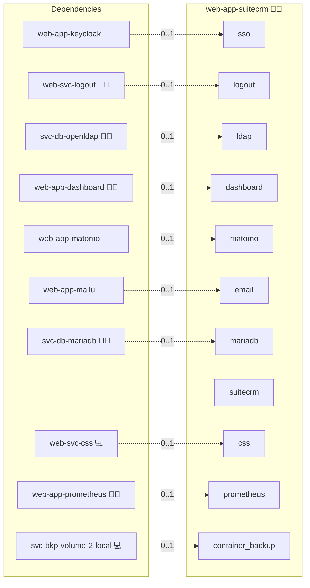

# SuiteCRM

## Description

Manage your customer relationships with SuiteCRM, a powerful open-source CRM platform extending SugarCRM with advanced modules, workflows, and integrations. This role integrates SuiteCRM into the Infinito.Nexus ecosystem with centralized database, mail and LDAP-ready single sign-on integration. 🚀💼

## Overview

This Ansible role deploys SuiteCRM using Docker and the Infinito.Nexus shared stack. It handles:

- MariaDB database provisioning via the `sys-svc-rdbms` role  
- NGINX domain and reverse-proxy configuration  
- Environment variable management through Jinja2 templates  
- Docker Compose orchestration for the **SuiteCRM** application container  
- Native **LDAP** authentication via Symfony’s LDAP configuration  
- SSO integration via SAML / OAuth2 configured inside SuiteCRM’s Administration Panel

With this role, you get a production-ready CRM environment that plugs into your existing IAM stack.

## Cosmos

The diagram places SuiteCRM in the Infinito.Nexus cosmos: the components it deploys (capabilities), the central services it consumes (dependencies), and its outward reach (federation and bridged external networks).



Solid `1:1` edges are fixed relationships; dashed `0..1` edges are conditional (enabled only in matching deployments). Node markers show the role's deploy modes (💻 host, 🐳 compose, 🐝 swarm); ❌ marks a service that is explicitly turned off, and ⚙️ an Ansible role dependency declared in `meta/main.yml`.

## Features

- **Sales & Service CRM:** Accounts, Contacts, Leads, Opportunities, Cases, Campaigns and more 📊  
- **Workflow Engine:** Automate business processes and notifications 🛠️  
- **LDAP Authentication:** Centralize user authentication against OpenLDAP 🔐  
- **SSO-Ready:** Integrates with SAML / OAuth2 providers (e.g. Keycloak as IdP) via SuiteCRM’s admin UI 🌐  
- **Config via Templates:** Fully customizable `.env` and `compose.yml` rendered via Jinja2 ⚙️  
- **Health Checks & Logging:** Integrates with Infinito.Nexus health checking and journald logging 📈  
- **Modular Role Composition:** Uses shared roles for DB, proxy and monitoring to keep your stack consistent 🔄  

## Quick Setup

### Development

Clone, set up the workstation, and deploy SuiteCRM onto the local stack:

```bash
git clone https://github.com/infinito-nexus/core.git
cd core
make onboard
make compose-deploy mode=reinstall apps=web-app-suitecrm full_cycle=false
```

### Production

Run the published image to provision the inventory and deploy SuiteCRM to a managed server (the mounted volume persists the inventory):

```bash
APP=web-app-suitecrm
HOST=<your-server>
TLS_MODE=self_signed
SSH_PUBLIC_KEY="<your-ssh-public-key>"

docker run --rm -it \
  -v "$PWD/inventories:/etc/infinito.nexus/inventories" \
  -e APP="$APP" -e HOST="$HOST" -e TLS_MODE="$TLS_MODE" -e SSH_PUBLIC_KEY="$SSH_PUBLIC_KEY" \
  ghcr.io/infinito-nexus/core/debian bash -c '
    INVENTORY=/etc/infinito.nexus/inventories/production
    infinito administration inventory provision "$INVENTORY" \
      --inventory-file "$INVENTORY/devices.yml" \
      --host "$HOST" \
      --include "$APP" \
      --vars "{\"TLS_MODE\": \"$TLS_MODE\", \"users\": {\"administrator\": {\"authorized_keys\": [\"$SSH_PUBLIC_KEY\"]}}}" &&
    infinito administration deploy dedicated "$INVENTORY/devices.yml" \
      --password-file "$INVENTORY/.password" \
      --diff -vv'
```

## Further Resources

- [SuiteCRM Official Website](https://suitecrm.com/) 🌍  
- [SuiteCRM Documentation](https://docs.suitecrm.com/) 📖  
- [Infinito.Nexus Project Repository](https://s.infinito.nexus/code) 🔗  

## LDAP & SSO Notes

- **LDAP** is configured via environment variables (`AUTH_TYPE=ldap`, `LDAP_*`).  
  The role writes a `config_override.php` so SuiteCRM’s legacy backend
  uses LDAP for authentication against your OpenLDAP service.

- **SSO** in SuiteCRM 8 is handled via **SAML** (e.g. with Keycloak as IdP) and
  **OAuth providers** configured in the Administration panel (for outbound email and API access).
  This role does not implement full OIDC login flows; instead, you configure SAML/OAuth inside SuiteCRM’s admin UI.

## Credits

Implemented by **[Kevin Veen-Birkenbach](https://www.veen.world)**.
Part of the [Infinito.Nexus Project](https://s.infinito.nexus/code) and maintained by [Kevin Veen-Birkenbach](https://www.veen.world).
Licensed under the [Infinito.Nexus Community License (Non-Commercial)](https://s.infinito.nexus/license).
