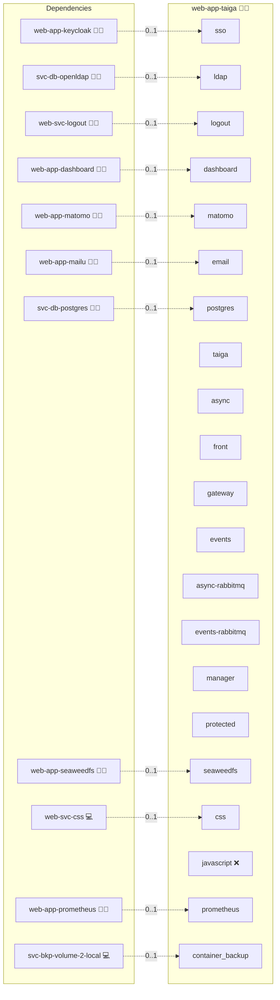

# Taiga

## Description

[Taiga](https://www.taiga.io/) is a powerful and intuitive open-source project management platform tailored for agile teams. Whether you're practicing Scrum, Kanban, or a custom hybrid workflow, Taiga offers a rich, customizable environment to plan, track, and collaborate on your projects, without the complexity of enterprise tools or the vendor lock-in of SaaS platforms.

This Ansible role deploys Taiga in a Docker-based environment, allowing fast, reproducible, and secure installations. Authentication defaults to Taiga's own OpenID Connect integration against Keycloak, which federates users from OpenLDAP.

---

## Overview

This role supercharge your project management with Taiga, a dynamic, agile tool designed for teams that thrive on creativity and collaboration. Experience a vibrant interface, robust task tracking, and an energetic platform that drives your projects to success.

## Cosmos

The diagram places Taiga in the Infinito.Nexus cosmos: the components it deploys (capabilities), the central services it consumes (dependencies), and its outward reach (federation and bridged external networks).



Solid `1:1` edges are fixed relationships; dashed `0..1` edges are conditional (enabled only in matching deployments). Node markers show the role's deploy modes (💻 host, 🐳 compose, 🐝 swarm); ❌ marks a service that is explicitly turned off, and ⚙️ an Ansible role dependency declared in `meta/main.yml`.

## Why Taiga?

Taiga is ideal for developers, designers, and agile teams who want:

- ✅ **Beautiful UI:** Clean, modern, and responsive interface.
- 📌 **Agile Workflows:** Supports Scrum, Kanban, Scrumban, and Epics.
- 🗃️ **Backlog & Sprint Management:** Create user stories, tasks, and sprints with ease.
- 📈 **Burn-down Charts & Metrics:** Monitor velocity and progress.
- 🔄 **Custom Workflows:** Define your own states, priorities, and permissions.
- 📎 **Attachments & Wiki:** Collaborate with file uploads and internal documentation.
- 🔐 **SSO/Authentication Plugins:** OpenID Connect, LDAP, GitHub, GitLab and more.
- 🌍 **Multilingual UI:** Used by teams worldwide.

---

## Purpose

This role automates the deployment and configuration of a complete, production-ready Taiga stack using Docker Compose. It ensures integration with common infrastructure tools such as NGINX, PostgreSQL, and RabbitMQ, while optionally enabling OpenID Connect authentication for enterprise-grade SSO.

By using this role, teams can set up Taiga in minutes on Arch Linux systems, whether in a homelab, dev environment, or production cluster.

---

## Features

- 🐳 **Docker-Based Deployment:** Easy containerized setup of backend, frontend, async workers, and events service.
- 🔐 **Optional OAuth2 Proxy access guard:** [OAuth2 Proxy](https://oauth2-proxy.github.io/oauth2-proxy/) can be layered in front of Taiga when you want proxy-level access control in addition to Taiga's own authentication flow.
- 🔑 **LDAP direct login (Option A, default off):** [`taiga-contrib-ldap-auth-ext`](https://github.com/Monogramm/taiga-contrib-ldap-auth-ext) enables users to log into Taiga directly with their LDAP credentials via the Taiga login form. Settings are appended to `config.py` at container startup.
- 🔑 **OIDC login via Keycloak (Option B, default on):** [`taiga-contrib-oidc-auth`](https://github.com/taigaio/taiga-contrib-oidc-auth) enables SSO via Keycloak → LDAP. **Note:** The OIDC plugin is not published on PyPI and requires a custom `taiga-front` image with the frontend plugin built in (CoffeeScript/Gulp). Without the custom frontend image the SSO button will not appear in the UI.
- 📨 **Email Backend:** Supports SMTP and console backends for development.
- 🔁 **Async & Realtime Events:** Includes RabbitMQ and support for Taiga’s event system.
- 🌐 **Reverse Proxy Ready:** Integrates with NGINX using the `sys-stk-front-proxy` role.
- 🧩 **Composable Design:** Integrates cleanly with other Infinito.Nexus infrastructure roles.

---

## Quick Setup

### Development

Clone, set up the workstation, and deploy Taiga onto the local stack:

```bash
git clone https://github.com/infinito-nexus/core.git
cd core
make onboard
make compose-deploy mode=reinstall apps=web-app-taiga full_cycle=false
```

### Production

Run the published image to provision the inventory and deploy Taiga to a managed server (the mounted volume persists the inventory):

```bash
APP=web-app-taiga
HOST=<your-server>
TLS_MODE=self_signed
SSH_PUBLIC_KEY="<your-ssh-public-key>"

docker run --rm -it \
  -v "$PWD/inventories:/etc/infinito.nexus/inventories" \
  -e APP="$APP" -e HOST="$HOST" -e TLS_MODE="$TLS_MODE" -e SSH_PUBLIC_KEY="$SSH_PUBLIC_KEY" \
  ghcr.io/infinito-nexus/core/debian bash -c '
    INVENTORY=/etc/infinito.nexus/inventories/production
    infinito administration inventory provision "$INVENTORY" \
      --inventory-file "$INVENTORY/devices.yml" \
      --host "$HOST" \
      --include "$APP" \
      --vars "{\"TLS_MODE\": \"$TLS_MODE\", \"users\": {\"administrator\": {\"authorized_keys\": [\"$SSH_PUBLIC_KEY\"]}}}" &&
    infinito administration deploy dedicated "$INVENTORY/devices.yml" \
      --password-file "$INVENTORY/.password" \
      --diff -vv'
```

## Credits

Implemented by **[Kevin Veen-Birkenbach](https://www.veen.world)**.
Part of the [Infinito.Nexus Project](https://s.infinito.nexus/code) and maintained by [Kevin Veen-Birkenbach](https://www.veen.world).
Licensed under the [Infinito.Nexus Community License (Non-Commercial)](https://s.infinito.nexus/license).
