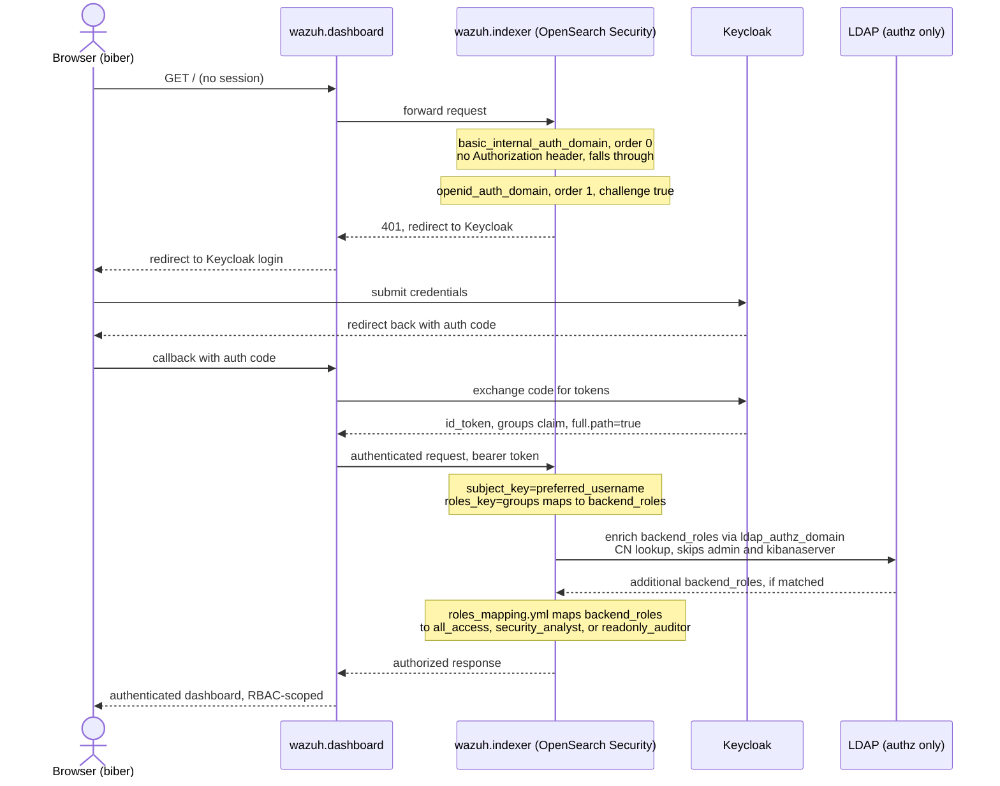

# Wazuh

## Description

[Wazuh](https://wazuh.com/) is an open-source SIEM and XDR platform providing security monitoring, log analysis, intrusion and vulnerability detection, and compliance support.

## Overview

This role deploys the single-node Wazuh stack (`wazuh.manager`, `wazuh.indexer`, `wazuh.dashboard`) using Docker Compose, pinned to `4.14.6` (the latest stable `wazuh-docker` tag at the time of writing, newer than the `4.14.5` originally targeted). Agent enrollment across the platform's Docker/DinD fleet is explicitly **out of scope** for this role: the agent-facing ports (`1514`, `1515`, `514/udp`) are declared in `meta/services.yml` so a follow-up role does not need to renegotiate port allocation, but they are not published or wired to any enrollment logic yet.

The indexer (an OpenSearch fork) is entirely self-contained: it is Wazuh's own datastore and also holds the OpenSearch security plugin's RBAC configuration. This role does not wire Wazuh to the platform's shared MariaDB/PostgreSQL.

## Features

- **Single-node Wazuh stack:** manager, indexer, and dashboard, TLS-bootstrapped by a genuine one-shot `wazuh-certs-generator` job (`restart: "no"`, gated via Compose's `service_completed_successfully` condition, never a persistent service).
- **Native OIDC login:** the dashboard authenticates directly against Keycloak's discovery endpoint (`http_authenticator: type: openid` in the indexer's `config.yml`) — no oauth2-proxy sidecar, following the same native pattern as `web-app-bigbluebutton`.
- **LDAP as a secondary authorization backend:** `config.dynamic.authz.ldap_authz_domain` enriches an already-OIDC-authenticated user with `backend_roles` pulled from LDAP group membership. LDAP never verifies a password here; it cannot be used as a login path.
- **Three-tier RBAC:** Administrator, Security Analyst (a genuinely custom OpenSearch role, not a stock template), and Read-only Auditor, mapped at both the indexer (OpenSearch security roles/roles_mapping) and enforced implicitly at the dashboard layer (see RBAC section below).
- **No literal secrets:** indexer admin, dashboard service account, Wazuh API, and manager cluster-key credentials are all generated via `meta/schema.yml`, never shipped as defaults.

## Auth flow

LDAP is consulted only for authorization enrichment, never to verify a password (see LDAP section below); `admin`/`kibanaserver` bypass both OIDC and LDAP entirely via `basic_internal_auth_domain`.

## Authentication: OIDC investigation

**What was tried:** native OIDC directly against Keycloak, per the decision gate in the original implementation spec. No existing role in this fork does native OIDC against Keycloak to crib from (`web-app-n8n`'s OIDC is the oauth2-proxy trusted-header pattern, a different mechanism); `web-app-bigbluebutton` (`services.sso.flavor: oidc`) is the closest structural precedent and was used as the model. The implementation:

- Indexer (`templates/config.yml.j2`): `openid_auth_domain` with `http_authenticator: type: openid`, `challenge: true`, `subject_key: {{ OIDC.ATTRIBUTES.USERNAME }}`, `roles_key: groups`, `openid_connect_url: {{ OIDC.CLIENT.DISCOVERY_DOCUMENT }}`.
- Dashboard (`templates/opensearch_dashboards.yml.j2`): `opensearch_security.auth.type: "openid"` plus the matching `connect_url`/`client_id`/`client_secret`/`base_redirect_url`/`scope`/`logout_url`, all sourced from `OIDC.CLIENT.*`.
- `basic_internal_auth_domain` stays present alongside `openid_auth_domain` so the `admin`/`kibanaserver` service accounts keep working regardless of SSO state.

**Outcome: implemented and empirically verified working end-to-end against a live deploy.** The full redirect chain (dashboard → Keycloak login → authorization code → token exchange → session) completes cleanly for both the platform's standard administrator fixture and a dynamically-group-assigned `biber` account. `roles_key: groups` correctly resolves against the `full.path=true` leading-slash shape (see the RBAC table below) — no claim-shape surprises. Getting there required fixing seven real, non-obvious bugs, all confirmed by direct log/source inspection rather than guessing:

1. **Front-proxy vhost was never wired.** The primary/metadata entity (`wazuh`) carries no ports, so `sys-stk-full` (which derives `http_port` from the acting role's own entity) can't be used; `sys-stk-front-proxy` must be included directly with `http_port` pointed at the `console` (dashboard) entity's port, the same structural reason `web-app-bluesky` does the same thing.
2. **`compose exec`/`docker compose exec` address services by their compose *service key* (`indexer`), never the `container_name` (`wazuh.indexer`)** — used incorrectly in `tasks/02_securityadmin.yml`, producing a misleading `service "wazuh.indexer" is not running` even while the container was healthy.
3. **`securityadmin.sh` hangs indefinitely without `JAVA_HOME` set explicitly** — its own `which java` fallback doesn't work in this image; the fix passes `-e JAVA_HOME=/usr/share/wazuh-indexer/jdk` on the `compose exec` invocation.
4. **The indexer's own outbound OIDC calls to Keycloak (discovery + JWKS) failed with `PKIX path building failed`.** The platform's shared CA-trust injection only sets `CURL_CA_BUNDLE`/`SSL_CERT_FILE`/`REQUESTS_CA_BUNDLE`/`NODE_EXTRA_CA_CERTS` — none of which the JVM's own `cacerts` keystore honours. OpenSearch Security surfaced this as a bare, unhelpful `"Authentication Exception"` on every login attempt; the real cause was only found by reading the indexer's own Java stack trace (`com.amazon.dlic.auth.http.jwt.keybyoidc.AuthenticatorUnavailableException`). Fixed by prepending a `keytool -importcert` step to a vendored copy of the indexer's own entrypoint (`files/indexer-entrypoint.sh`) — there is no env-var shortcut for the JVM trust store.
5. **`authc` domain evaluation order matters**: with `openid_auth_domain` at `order: 0`, it short-circuited on any request that wasn't a Bearer token — including plain Basic-auth requests from the health check/`admin` service account — and never fell through to `basic_internal_auth_domain`. Fixed by putting `basic_internal_auth_domain` first (`order: 0`).
6. **`internal_users.yml`'s `admin` account (`backend_roles: ["admin"]`) and `kibanaserver` account (no `backend_roles` at all) both need their own `roles_mapping.yml` entries** — separate from the RBAC-group-path mappings for real human users — or they authenticate successfully and then get 403 on every request.
7. **Wazuh's own `wz-home` app throws an uncaught client-side exception during its bootstrap for any OpenSearch role other than `all_access`.** This is a genuine upstream Wazuh bug, not a permission gap on this role's side and not a test artifact: it would affect every real security-analyst/readonly-auditor end-user hitting their landing page, identically to the Playwright reproduction. Confirmed via a full network-waterfall comparison between a working administrator session and a failing `readonly-auditor` session — both follow an *identical* request sequence through `POST /api/saved_objects/_bulk_get` (200, real data, no embedded per-object errors), then the non-admin session simply stops issuing requests and OpenSearch Dashboards' core falls back to its generic "Application Not Found" page. This isn't specific to `wz-home` as a *landing* page either: a completely fresh session navigated directly to `/app/discover` first (never touching `wz-home` at all) hit the identical failure, while `/app/home` — OpenSearch Dashboards' own framework-standard page, not a Wazuh customization — rendered correctly for the same `readonly-auditor` session. `defaultRoute` (`opensearch_dashboards.yml.j2`) is therefore pointed at `/app/home` rather than `wz-home`: it has no native per-role conditionality (`schema.string()`, a single global value — confirmed by reading `src/core/server/ui_settings/settings/navigation.js` directly), so a uniform, confirmed-working landing page for every role is the real fix, not a client-side role-detection hack layered on top of a broken app. Administrators can still reach `wz-home` via in-app navigation once past this landing page; non-admin roles should be told to expect `wz-home` itself to be unusable until Wazuh fixes this upstream.

No SAML fallback was needed; the OIDC-first plan worked once these were fixed.

**Verification note:** the "empirically verified working end-to-end" claim above was originally written using `files/playwright/_shared.js`'s `wazuhLoginViaOidc` helper, whose only success check was `expect.poll(() => page.url()).toContain(host)` — trivially true even while sitting unauthenticated on OpenSearch Dashboards' own `/app/login` shell, with zero session cookies ever established (confirmed empirically: a "passing" run had `page.context().cookies()` return `[]`). The helper has since been fixed to assert a real session cookie exists after login (and to click through to Keycloak when no auto-redirect occurs), and the claim above has been re-verified against the corrected helper: all three RBAC tiers (`administrator`, `security-analyst`, `readonly-auditor`) pass `files/playwright/test-rbac-roles.js` with genuine authenticated sessions.

## LDAP

LDAP (`svc-db-openldap`) is wired as a **secondary, authorization-only** backend, independent of whichever mechanism handles login:

- `config.dynamic.authz.ldap_authz_domain` (`templates/config.yml.j2`) has `authorization_backend: type: ldap` and **no** `authentication_backend` — it is consulted only to enrich the already-authenticated user's `backend_roles` from LDAP group membership.
- Every LDAP-side value is sourced from `LDAP.*` (never hardcoded): `LDAP.SERVER.URI` (scheme stripped, since OpenSearch's LDAP module wants a bare `host:port`), `LDAP.SERVER.SECURITY` (drives `enable_ssl`/`enable_start_tls`), `LDAP.DN.ADMINISTRATOR.DATA`/`LDAP.BIND_CREDENTIAL` (bind), `LDAP.DN.OU.USERS`/`LDAP.DN.OU.ROLES` (search bases), `LDAP.USER.ATTRIBUTES.ID` (login attribute).
- The one deliberate deviation from the canonical `LDAP.FILTERS.USERS.LOGIN` filter: OpenSearch's LDAP module hardcodes its own `{0}`-subject placeholder syntax, incompatible with that filter's `%uid` placeholder, so the search filter is built from `LDAP.USER.ATTRIBUTES.ID` directly instead.
- `skip_users: [admin, kibanaserver]` so the two internal service accounts don't trigger LDAP lookups.

## RBAC

RBAC roles are declared in `meta/rbac.yml` and consumed exclusively through the platform's `rbac_group_path` lookup — **no ad-hoc Keycloak client scope or literal-named LDAP/Keycloak groups were created for this role.**

| Required role | Indexer-level OpenSearch role | `backend_roles` (OIDC shape) | `backend_roles` (LDAP shape) |
|---|---|---|---|
| Administrator | `all_access` (built-in) | `/roles/web-app-wazuh/administrator` | `web-app-wazuh-administrator` |
| Security Analyst | `security_analyst` (custom, `templates/roles.yml.j2`: read-only over `wazuh-alerts-*`/`wazuh-archives-*`/`wazuh-monitoring-*`/`wazuh-statistics-*`, no security-index or admin actions) | `/roles/web-app-wazuh/security-analyst` | `web-app-wazuh-security-analyst` |
| Read-only Auditor | `readonly_auditor` (custom, `files/roles.yml`: `read` action group over all indices, no writes) + `kibana_read_only` (built-in, harmless/inert here — see Developer Notes) | `/roles/web-app-wazuh/readonly-auditor` | `web-app-wazuh-readonly-auditor` |

Each `roles_mapping.yml` entry lists **both** shapes because OIDC (Keycloak `groups` claim, `full.path=true`) and LDAP (CN pattern `<application_id>-<role_name>` per `docs/contributing/design/iam/rbac.md`'s LDAP layout contract) produce different strings for the same conceptual role; either can enrich a user's `backend_roles`, so both must be listed.

The Security Analyst role's inability to reach the OpenSearch Dashboards Security app (internal users, roles, role mappings) is **not** separately wired — it falls out naturally from the role's OpenSearch permissions: OpenSearch Dashboards itself only renders/allows that app for roles carrying cluster-admin security actions, which `security_analyst` deliberately does not have. `files/playwright/test-rbac-roles.js` verifies this is a real, live UI-level effect (direct navigation + DOM assertion) rather than an inference from the permission definitions.

A *positive* "security-analyst has write actions somewhere" UI check was deliberately **not** added: Wazuh's agent-management views only render mutating controls (restart/upgrade/delete/edit) for enrolled agents, and agent enrollment is explicitly out of scope for this role, so that check would be untestable in this environment regardless of role. A read-only-mode UI banner was considered as an agent-independent alternative, but OpenSearch Dashboards' own `ReadonlyService` (`server/readonly/readonly_service.js`, confirmed by reading the file directly inside the running container) only activates when multitenancy is enabled, and this role runs with `opensearch_security.multitenancy.enabled: false` — so no such banner exists to check here.

**Auth cache is disabled (`plugins.security.cache.ttl_minutes: 0`, `templates/wazuh.indexer.yml.j2`).** OpenSearch Security's default 60-minute auth cache resolves a user's `backend_roles` once and reuses them by username for the cache lifetime, independent of subsequent logins with an updated token — confirmed via manual testing: after changing a test user's Keycloak group membership (verified correct both in Keycloak and in a freshly-issued token's `groups` claim), the dashboard kept serving the *previous*, more-permissive role set even after a full logout/login in a private browser window, until the indexer's cache was flushed (`DELETE _plugins/_security/api/cache`). For a SIEM's RBAC, prompt revocation matters more than the auth-latency cost of disabling caching at this deployment's scale, so it's disabled outright rather than shortened.

## Content Security Policy (CSP)

`meta/server.yml` grants `script-src-elem` `unsafe-inline`/`unsafe-eval` and `worker-src: blob:` for this role. The `worker-src: blob:` grant is **confirmed required, via reproducible live testing** — not a guess: `files/playwright/test-csp.js` drives the OpenSearch Dashboards Dev Tools console (Ace-editor-based), the route most likely to spawn a Web Worker from a `blob:` URL. Without the grant, three consecutive live runs against the deployed dashboard produced an identical, reproducible browser-level block (`Creating a worker from 'blob:...' violates ... "worker-src 'self'". The action has been blocked.`). After adding the grant, three consecutive live runs produced zero CSP violations (`cspRelated: []`, `consoleErrors: []`). This is a `whitelist` entry, not a `flags` boolean: `plugins/filter/csp_filters.py`'s `get_csp_flags` quotes its keys (`'blob'` is not valid CSP syntax for a scheme source), while `get_csp_whitelist` appends list entries verbatim — the same mechanism 10+ other roles (`web-app-nextcloud`, `web-app-gitea`, `web-app-mastodon`, etc.) already use for the identical grant.

**Known, unresolved issue: the Dev Tools console editor cannot be reliably clicked into via Playwright, for reasons unrelated to CSP.** The same live testing that confirmed the `worker-src: blob:` grant above also surfaced two separate UI blockers on the path to actually typing a query:

1. A first-visit "Welcome to Console" tour dialog (an EUI overlay mask) sits on top of the editor and blocks any click until dismissed — worked around in `test-csp.js` by dismissing it first.
2. Even after dismissing that dialog, Ace's own internal `.ace_content` div (inside `.ace_scroller`) intercepts the click on the underlying `.ace_text-input` textarea — confirmed via a live DOM snapshot captured at the point of failure. This is a rendering quirk internal to the Ace editor itself, not a CSP or dismiss-dialog issue, and was not investigated further (same category of accepted, documented limitation as the `wz-home` bootstrap bug under "Authentication: OIDC investigation" above).

Because of this, `test-csp.js` treats the console-typing step as a **logged observation, not a hard assertion**: a bounded per-action click timeout (10s) lets a failed click be caught and reported quickly rather than consuming the whole test budget, so the test's actual, hard-asserted verdict (`expectNoCspViolations`) reflects only what was actually proven — that `worker-src: blob:` eliminates the CSP violation — independent of whether the click-through itself succeeds.

## Bootstrap

1. `vm.max_map_count=262144` (OpenSearch requirement) is set via a host-level `ansible.posix.sysctl` pre-task, skipped only when Ansible itself runs inside a DinD sandbox. There is no per-container Compose fallback: Docker/runc rejects a `sysctls:` override for a non-namespaced parameter (confirmed against a live deploy), so a DinD sandbox deploy may see the indexer fail to boot on an under-provisioned host, the same accepted limitation as `svc-runner`'s inotify tuning.
2. `wazuh-certs-generator` runs as a genuine one-shot Compose service (`restart: "no"`), gated via `service_completed_successfully` so manager/indexer never start before certs exist.
3. The indexer's cluster health is polled (`uri_retry`, real retries, no `ignore_errors`) until `green`/`yellow` before `securityadmin.sh` applies `internal_users.yml`/`config.yml`/`roles.yml`/`roles_mapping.yml` to the security index.

## Developer Notes

The `wazuh.dashboard` compose entity is named `console` in `meta/services.yml` (not `dashboard`): the file root already uses `dashboard` for the platform's `web-app-dashboard` tile-integration service bond, and reusing it for the compose entity silently dropped that bond's `enabled`/`shared` flags during development (a real YAML top-level key collision, caught and fixed before this PR). See `meta/services.yml` and `vars/main.yml` for the full explanation.

The manager/indexer/dashboard container names are **dotted** (`wazuh.manager`, `wazuh.indexer`, `wazuh.dashboard`), not hyphenated, matching upstream's own single-node naming exactly. This is load-bearing, not cosmetic: `wazuh-certs-tool.sh`'s own SAN-validation regex requires a dot followed by a 2+ letter suffix to accept a value as a DNS name at all; a hyphenated name like `wazuh-manager` fails that regex and the tool aborts with `Invalid IP or DNS` (confirmed against a live deploy).

The `wazuh-certs-generator` service bind-mounts a replacement `/entrypoint.sh` (`files/certs-entrypoint.sh`, an unmodified copy of the vendor script plus one `unset` line) over the image's own entrypoint. The platform's shared CA-trust injection (`compose.ca.override.yml`, generated per `roles/sys-svc-compose/handlers/main.yml`) force-sets `CURL_CA_BUNDLE`/`SSL_CERT_FILE`/`REQUESTS_CA_BUNDLE`/`NODE_EXTRA_CA_CERTS` to the platform's own single-cert dev CA and is always merged **after** this role's `compose.yml`, so an `environment:` override in `templates/compose.yml.j2` is silently clobbered (confirmed empirically). This container needs the opposite: it downloads its cert-generation tool from the genuinely-public internet (`packages.wazuh.com`) at startup, which a single-cert bundle cannot verify. Volumes merge as a list rather than a per-key override, so a bind-mounted replacement entrypoint is the one lever that override file does not reach.

There is no per-container fallback for `vm.max_map_count`: Docker/runc rejects a `sysctls:` override for a parameter that is not namespaced (confirmed against a live deploy: `sysctl "vm.max_map_count" is not in a separate kernel namespace`). The host-level `ansible.posix.sysctl` task in `tasks/01_core.yml` is the only real mechanism; see Bootstrap above.

`kibana_read_only` stays mapped to the readonly-auditor's backend_roles alongside the custom `readonly_auditor` role, but it is inert for UI purposes in this deployment: OpenSearch Dashboards' own `ReadonlyService` (`server/readonly/readonly_service.js`, confirmed by reading the file directly inside the running container) only activates `readonly_mode.roles` when multitenancy is enabled, and this role runs with `opensearch_security.multitenancy.enabled: false`. It is kept mapped anyway in case some other, non-UI mechanism keys off it, since doing so costs nothing.

The indexer's own `/entrypoint.sh` is likewise replaced (`files/indexer-entrypoint.sh`, an unmodified copy of the vendor script with a `keytool -importcert` step prepended) for the same class of reason as the certs-generator's: the indexer's JVM makes its own outbound HTTPS calls to Keycloak (for OIDC discovery/JWKS) that the platform's env-var-based CA-trust injection cannot reach, since Java maintains its own separate `cacerts` trust store. See "Authentication: OIDC investigation" above for the exact failure this fixes.

The Docker healthcheck and the Ansible-level wait_for gate on the indexer intentionally accept a bare `401` as "healthy"/"reachable", not just `200`: `securityadmin.sh` (which pushes this role's own credentials into the security index) only runs *after* these checks pass, so gating them on the role's own admin password would be a chicken-and-egg deadlock that never resolves (confirmed against a live deploy). A separate, later task re-checks the real credentials after `securityadmin.sh` has run.

**Playwright coverage in V1 (sso off):** the `administrator` persona is blocked (`PERSONA_ADMINISTRATOR_BLOCKED=true` in `templates/playwright.env.j2`) because the dashboard has no form-based fallback in this shape — auth falls back to the internal `admin`/`kibanaserver` HTTP-basic accounts only, which the generic admin persona helper cannot drive. The `biber` RBAC scenario (`files/playwright/test-baseline.js`) and the RBAC-tier suite (`files/playwright/test-rbac-roles.js`) both skip via `skipUnlessServiceEnabled("sso")`, since their own Keycloak group-membership setup has no IdP to call against when V1 deploys no Keycloak at all. `playwright.spec.js` registers both inside one `test.describe.serial` block: they mutate the same Keycloak groups for the same `biber` user, so running them concurrently under `PLAYWRIGHT_FULLY_PARALLEL` would race their independent add/remove cycles.

Variant matrix: [variants.yml](./meta/variants.yml). Service flags and image pins: [services.yml](./meta/services.yml). Credentials declared in [schema.yml](./meta/schema.yml). RBAC roles declared in [rbac.yml](./meta/rbac.yml).

## Further Resources

- [Wazuh Official Website](https://wazuh.com/)
- [Wazuh Documentation](https://documentation.wazuh.com/current/)
- [wazuh-docker GitHub](https://github.com/wazuh/wazuh-docker)

## Credits

Developed and maintained by **Kevin Veen-Birkenbach**.
Learn more at [veen.world](https://www.veen.world).
Part of the [Infinito.Nexus Project](https://s.infinito.nexus/code).
Licensed under the [Infinito.Nexus Community License (Non-Commercial)](https://s.infinito.nexus/license).
