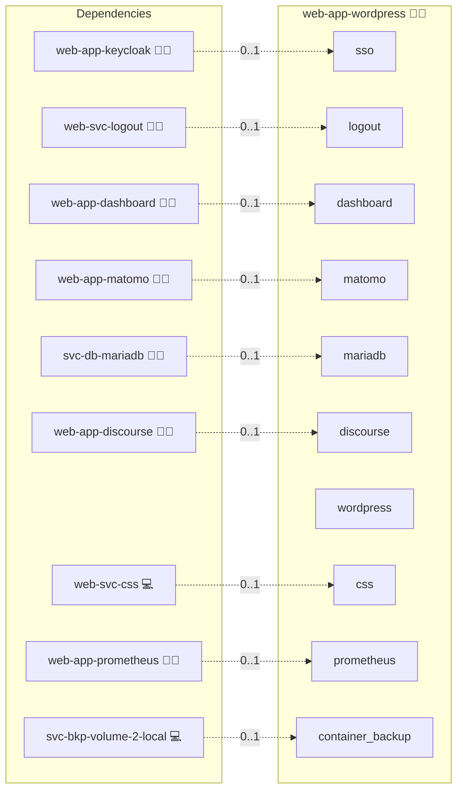

# WordPress

## Description

[WordPress](https://en.wordpress.org/) is a versatile and widely used [content management system (CMS)](https://en.wikipedia.org/wiki/Content_management_system) that powers millions of websites, from blogs and portfolios to e-commerce and corporate sites. This deployment provides a containerized WordPress instance optimized for multisite operation, advanced media management, and extensive plugin support, allowing you to fully leverage the rich features of the WordPress software.

## Overview

WordPress offers an extensive array of features that make it a robust platform for building and managing digital content:

- **User-Friendly Interface:**
  Enjoy a modern, intuitive dashboard for effortless content creation, editing, and management.

- **Customizable Themes and Plugins:**
  Extend your site's functionality with thousands of themes and plugins, enabling you to tailor your website's look, feel, and capabilities to your exact needs.

- **Multisite Management:**
  Easily create and maintain multiple sites with a single WordPress installation, ideal for networks of blogs, corporate intranets, or educational institutions.

- **Responsive Design:**
  Ensure that your website looks great on all devices with mobile-friendly themes and layouts.

- **Advanced SEO Tools:**
  Optimize your site's visibility in search engines using built-in support for SEO best practices and a rich ecosystem of SEO plugins.

- **Robust Media Management:**
  Manage your images, videos, and other media with an integrated media library, including options for enhanced upload limits and dynamic content delivery.

- **Extensive Community and Ecosystem:**
  Benefit from a massive community with frequent updates, security patches, and a wide range of third-party tools that continuously enhance the platform.

This automated Docker Compose deployment streamlines the process by building a custom WordPress image (which includes tools like msmtp for email delivery) and configuring the necessary PHP settings, ensuring that your WordPress site is secure, scalable, and always up to date.

## Cosmos

The diagram places WordPress in the Infinito.Nexus cosmos: the components it deploys (capabilities), the central services it consumes (dependencies), and its outward reach (federation and bridged external networks).



Solid `1:1` edges are fixed relationships; dashed `0..1` edges are conditional (enabled only in matching deployments). Node markers show the role's deploy modes (💻 host, 🐳 compose, 🐝 swarm); ❌ marks a service that is explicitly turned off, and ⚙️ an Ansible role dependency declared in `meta/main.yml`.

## Features

- **Automated provisioning:** Configured by Ansible without manual steps.

## Quick Setup

### Development

Clone, set up the workstation, and deploy WordPress onto the local stack:

```bash
git clone https://github.com/infinito-nexus/core.git
cd core
make onboard
make compose-deploy mode=reinstall apps=web-app-wordpress full_cycle=false
```

### Production

Run the published image to provision the inventory and deploy WordPress to a managed server (the mounted volume persists the inventory):

```bash
APP=web-app-wordpress
HOST=<your-server>
TLS_MODE=self_signed
SSH_PUBLIC_KEY="<your-ssh-public-key>"

docker run --rm -it \
  -v "$PWD/inventories:/etc/infinito.nexus/inventories" \
  -e APP="$APP" -e HOST="$HOST" -e TLS_MODE="$TLS_MODE" -e SSH_PUBLIC_KEY="$SSH_PUBLIC_KEY" \
  ghcr.io/infinito-nexus/core/debian bash -c '
    INVENTORY=/etc/infinito.nexus/inventories/production
    infinito administration inventory provision "$INVENTORY" \
      --inventory-file "$INVENTORY/devices.yml" \
      --host "$HOST" \
      --include "$APP" \
      --vars "{\"TLS_MODE\": \"$TLS_MODE\", \"users\": {\"administrator\": {\"authorized_keys\": [\"$SSH_PUBLIC_KEY\"]}}}" &&
    infinito administration deploy dedicated "$INVENTORY/devices.yml" \
      --password-file "$INVENTORY/.password" \
      --diff -vv'
```

## Purpose

The goal of this deployment is to provide a production-ready, scalable WordPress instance with multisite capabilities and enhanced performance. By automating the custom image build and configuration processes via Docker Compose and Ansible, it minimizes manual intervention, reduces errors, and allows you to concentrate on building great content.

## Multisite (requirement 005)

WordPress Multisite is opt-in. Set `services.wordpress.multisite.enabled: true` in the inventory to convert the deployed instance into a sub-domain Multisite network. Every entry in `domains.canonical` becomes a site in the network; the first entry is the network primary, subsequent entries are child sites.

RBAC under Multisite uses the hierarchical Keycloak group path:

- Per-site role: `/roles/web-app-wordpress/<canonical-domain>/<role>`
- Network-wide super-admin: `/roles/web-app-wordpress/network-administrator`

Operator-facing instructions for assigning these groups live in [Administration RBAC](../../docs/administration/configuration/rbac.md). The design contract is in [RBAC design](../../docs/contributing/design/iam/rbac.md).

## Addons

Plugins and the OIDC→RBAC mu-plugin are declared in
[`meta/addons/`](./meta/addons/) under the unified addon contract
(requirement 026). The OIDC and WP-Discourse runtime config lives in each addon's `config:` block.

| Addon | Mechanism | Default state | Bridges |
|-------|-----------|---------------|---------|
| `daggerhart-openid-connect-generic` | `plugin` | enabled with the `sso` service | `sso` → `web-app-keycloak` |
| `wp-discourse` | `plugin` | enabled with the `discourse` service | `discourse` → `web-app-discourse` |
| `activitypub` | `plugin` | always enabled (Fediverse federation) | none |
| `infinito-oidc-rbac-mapper` | `mu_plugin` | `required` (always installed, vendored) | `sso` → `web-app-keycloak` |

The OIDC login + RBAC paths are covered by `test-admin-oidc-login.js` /
`test-rbac-roles.js`, the Discourse round-trip by `test-discourse-roundtrip.js`.

## Playwright service dependencies

The Playwright suite in [files/playwright/playwright.spec.js](files/playwright/playwright.spec.js) gates its scenarios on the following shared services (requirement 006). Scenarios that depend on a service report as `skipped` when the corresponding `<SERVICE>_SERVICE_ENABLED=false` in the staged `.env`:

- `oidc`: baseline admin OIDC round-trip plus the three RBAC scenarios (subscriber/editor/administrator).
- `ldap`: the three RBAC scenarios additionally depend on LDAP group sync; disabling LDAP skips them alongside OIDC.
- `discourse`: the WP->Discourse post round-trip scenario (requirement 007). Disabling Discourse skips it; front-page reachability and CSP baselines stay active.

The front-page CSP + canonical-domain baseline is ungated and always runs.

## Further Resources

- [WordPress Official Website](https://wordpress.org/)
- [WordPress Multisite Documentation](https://wordpress.org/support/article/create-a-network/)
- [WordPress Plugin Repository](https://wordpress.org/plugins/)
- [WP Discourse Plugin](https://wordpress.org/plugins/wp-discourse/)

## Credits

Implemented by **[Kevin Veen-Birkenbach](https://www.veen.world)**.
Part of the [Infinito.Nexus Project](https://s.infinito.nexus/code) and maintained by [Kevin Veen-Birkenbach](https://www.veen.world).
Licensed under the [Infinito.Nexus Community License (Non-Commercial)](https://s.infinito.nexus/license).
