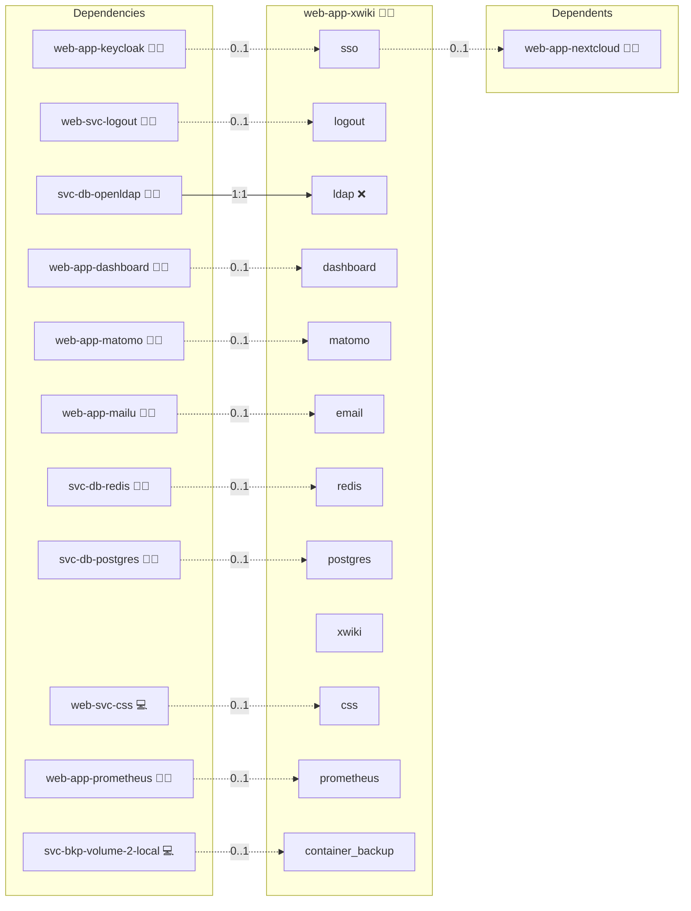

# XWiki

## Description

Empower your organization with **XWiki**, an open-source enterprise wiki and knowledge management platform. XWiki provides powerful collaboration features, structured content management, and extensibility through applications and plugins, all under your control.

## Overview

This role deploys XWiki using Docker, automating the installation, configuration, and management of your XWiki server. It integrates with an relational database and a reverse proxy. The role supports advanced features such as global CSS injection, Matomo analytics, OIDC authentication, and centralized logout, making it a powerful and customizable solution within the Infinito.Nexus ecosystem.

## Cosmos

The diagram places XWiki in the Infinito.Nexus cosmos: the components it deploys (capabilities), the central services it consumes (dependencies), and its outward reach (federation and bridged external networks).



Solid `1:1` edges are fixed relationships; dashed `0..1` edges are conditional (enabled only in matching deployments). Node markers show the role's deploy modes (💻 host, 🐳 compose, 🐝 swarm); ❌ marks a service that is explicitly turned off, and ⚙️ an Ansible role dependency declared in `meta/main.yml`.

## Features

- **Enterprise Wiki Platform:** Create, edit, and organize pages with a powerful WYSIWYG editor and structured content support.  
- **Advanced Rights Management:** Fine-grained permissions for users, groups, and spaces.  
- **Extensions & Applications:** Extend functionality with hundreds of available XWiki extensions and macros.  
- **Powerful Search:** Full-text and structured search to quickly find knowledge across spaces.  
- **Office Integration:** Import, export, and collaborate on Office documents (Word, Excel, PDF).  
- **Customization & Theming:** Adapt the look and feel of your wiki with skins, CSS, and scripting.  
- **Integration Ready:** Connect with external systems such as Keycloak (OIDC), LDAP, or analytics tools like Matomo.  

## Quick Setup

### Development

Clone, set up the workstation, and deploy XWiki onto the local stack:

```bash
git clone https://github.com/infinito-nexus/core.git
cd core
make onboard
make compose-deploy mode=reinstall apps=web-app-xwiki full_cycle=false
```

### Production

Run the published image to provision the inventory and deploy XWiki to a managed server (the mounted volume persists the inventory):

```bash
APP=web-app-xwiki
HOST=<your-server>
TLS_MODE=self_signed
SSH_PUBLIC_KEY="<your-ssh-public-key>"

docker run --rm -it \
  -v "$PWD/inventories:/etc/infinito.nexus/inventories" \
  -e APP="$APP" -e HOST="$HOST" -e TLS_MODE="$TLS_MODE" -e SSH_PUBLIC_KEY="$SSH_PUBLIC_KEY" \
  ghcr.io/infinito-nexus/core/debian bash -c '
    INVENTORY=/etc/infinito.nexus/inventories/production
    infinito administration inventory provision "$INVENTORY" \
      --inventory-file "$INVENTORY/devices.yml" \
      --host "$HOST" \
      --include "$APP" \
      --vars "{\"TLS_MODE\": \"$TLS_MODE\", \"users\": {\"administrator\": {\"authorized_keys\": [\"$SSH_PUBLIC_KEY\"]}}}" &&
    infinito administration deploy dedicated "$INVENTORY/devices.yml" \
      --password-file "$INVENTORY/.password" \
      --diff -vv'
```

## Addons

Extensions are declared in [`meta/addons/`](./meta/addons/) under the unified addon contract.
Each one is installed through the XWiki Extension Manager and pins its upstream version; the Maven coordinate is carried under the addon's `config.id`:

| Addon | Mechanism | Default state | Bridges |
|-------|-----------|---------------|---------|
| `oidc-authenticator` | `extension` | enabled whenever the `sso` service is present (`web-app-keycloak` co-deployed) | `sso` → `web-app-keycloak` |
| `ldap-authenticator` | `extension` | enabled whenever the `ldap` service is present (`svc-db-openldap` co-deployed) | `ldap` → `svc-db-openldap` |
| `matomo` | `extension` | enabled whenever the `matomo` service is present (`web-app-matomo` co-deployed) | `matomo` → `web-app-matomo` |

`oidc-authenticator` and `ldap-authenticator` are mutually exclusive auth backends (only one may be enabled; see [`tasks/02_validation.yml`](./tasks/02_validation.yml)), each deriving its enablement from its bridged service flag.
The OIDC/LDAP runtime configuration (provider URLs, bind DN, secrets) lives in the XWiki property templates and is read via `lookup('config', application_id, 'credentials.<name>')`; the addon `config:` carries only the installer coordinate.

## Further Resources

- [XWiki Official Website](https://www.xwiki.org/)  
- [XWiki Documentation](https://www.xwiki.org/xwiki/bin/view/Documentation/)  
- [XWiki GitHub Repository](https://github.com/xwiki/xwiki-platform)  

## Credits

Implemented by **[Kevin Veen-Birkenbach](https://www.veen.world)**.
Part of the [Infinito.Nexus Project](https://s.infinito.nexus/code) and maintained by [Kevin Veen-Birkenbach](https://www.veen.world).
Licensed under the [Infinito.Nexus Community License (Non-Commercial)](https://s.infinito.nexus/license).
