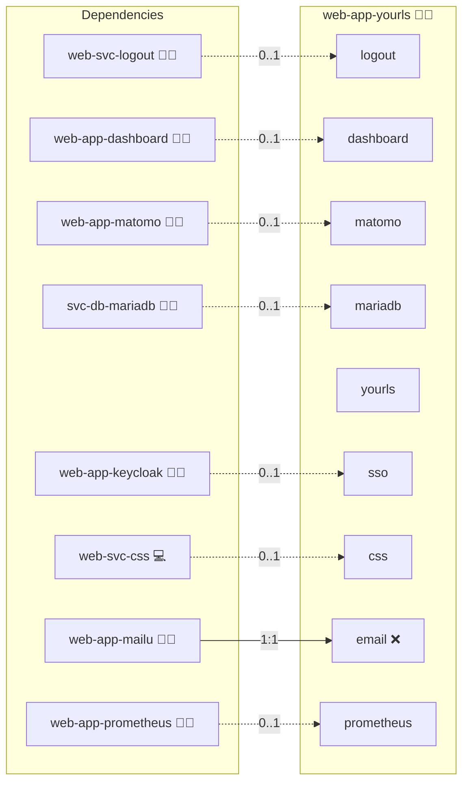

# YOURLS

## Description

YOURLS (Your Own URL Shortener) is an open‑source URL shortening solution that enables you to create, track, and manage short links with ease. This deployment leverages Docker to provide a secure and easily scalable environment, ensuring that your YOURLS instance is configured for optimal performance and reliability.

## Overview

This containerized YOURLS solution is built on robust Docker Compose and Ansible automation. It simplifies the deployment process by integrating with centralized MariaDB management and providing pre‑configured health checks and environment settings. Whether you're looking to quickly generate memorable links or need detailed analytics, this deployment supports your digital strategy seamlessly.

## Cosmos

The diagram places YOURLS in the Infinito.Nexus cosmos: the components it deploys (capabilities), the central services it consumes (dependencies), and its outward reach (federation and bridged external networks).



Solid `1:1` edges are fixed relationships; dashed `0..1` edges are conditional (enabled only in matching deployments). Node markers show the role's deploy modes (💻 host, 🐳 compose, 🐝 swarm); ❌ marks a service that is explicitly turned off, and ⚙️ an Ansible role dependency declared in `meta/main.yml`.

## Features

- **Efficient URL Shortening:**  
  Quickly generate short, branded links that help streamline your online presence.

- **Built-in Analytics:**  
  Monitor link performance and track click data to gain valuable insights into user engagement.

- **Centralized Database Integration:**  
  Seamlessly connect to a MariaDB instance for consistent, reliable data storage and management.

- **Configurable Environment:**  
  Easily customize your YOURLS instance through environment variables: set your site URL, admin credentials, and more.

- **Secure and Scalable:**  
  Benefit from container isolation and reproducible deployments that ensure your service is both secure and scalable.

## Quick Setup

### Development

Clone, set up the workstation, and deploy YOURLS onto the local stack:

```bash
git clone https://github.com/infinito-nexus/core.git
cd core
make onboard
make compose-deploy mode=reinstall apps=web-app-yourls full_cycle=false
```

### Production

Run the published image to provision the inventory and deploy YOURLS to a managed server (the mounted volume persists the inventory):

```bash
APP=web-app-yourls
HOST=<your-server>
TLS_MODE=self_signed
SSH_PUBLIC_KEY="<your-ssh-public-key>"

docker run --rm -it \
  -v "$PWD/inventories:/etc/infinito.nexus/inventories" \
  -e APP="$APP" -e HOST="$HOST" -e TLS_MODE="$TLS_MODE" -e SSH_PUBLIC_KEY="$SSH_PUBLIC_KEY" \
  ghcr.io/infinito-nexus/core/debian bash -c '
    INVENTORY=/etc/infinito.nexus/inventories/production
    infinito administration inventory provision "$INVENTORY" \
      --inventory-file "$INVENTORY/devices.yml" \
      --host "$HOST" \
      --include "$APP" \
      --vars "{\"TLS_MODE\": \"$TLS_MODE\", \"users\": {\"administrator\": {\"authorized_keys\": [\"$SSH_PUBLIC_KEY\"]}}}" &&
    infinito administration deploy dedicated "$INVENTORY/devices.yml" \
      --password-file "$INVENTORY/.password" \
      --diff -vv'
```

## Further Resources

- [YOURLS Official Website](https://yourls.org/)
- [YOURLS GitHub Repository](https://github.com/YOURLS/YOURLS)

## Credits

Implemented by **[Kevin Veen-Birkenbach](https://www.veen.world)**.
Part of the [Infinito.Nexus Project](https://s.infinito.nexus/code) and maintained by [Kevin Veen-Birkenbach](https://www.veen.world).
Licensed under the [Infinito.Nexus Community License (Non-Commercial)](https://s.infinito.nexus/license).
