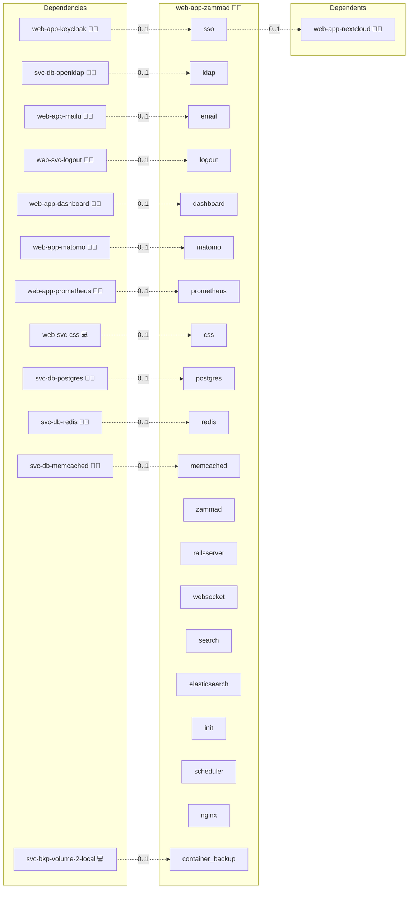

# Zammad

## Description

[Zammad](https://zammad.org/) is an open-source helpdesk and ticketing system. Agents handle customer requests across email, chat, phone and web; customers can open tickets from a self-service portal.

## Overview

This role deploys Zammad as an Infinito.Nexus web app using the upstream `ghcr.io/zammad/zammad` image (Rails app, WebSocket, scheduler, nginx, plus a one-shot init container that bypasses the setup wizard via `auto_wizard.json`). Search is provided by a bundled Elasticsearch container; PostgreSQL, Redis and Memcached are consumed from the central `svc-db-*` providers via `sys-stk-full`. Authentication uses direct OpenID Connect against the shared Keycloak client; LDAP federation and SMTP/IMAP via Mailu are wired when their providers are present.

## Cosmos

The diagram places Zammad in the Infinito.Nexus cosmos: the components it deploys (capabilities), the central services it consumes (dependencies), and its outward reach (federation and bridged external networks).



Solid `1:1` edges are fixed relationships; dashed `0..1` edges are conditional (enabled only in matching deployments). Node markers show the role's deploy modes (💻 host, 🐳 compose, 🐝 swarm); ❌ marks a service that is explicitly turned off, and ⚙️ an Ansible role dependency declared in `meta/main.yml`.

## Features

- **Helpdesk ticketing:** Multi-channel agent and customer surface for email, web and (optionally) chat tickets.
- **Direct OIDC SSO:** Sign in through the shared Keycloak OIDC client without an oauth2-proxy sidecar; redirect URI is auto-registered.
- **LDAP federation:** When `svc-db-openldap` is present, Zammad authenticates and provisions accounts against the central LDAP.
- **Mail-to-ticket:** When `web-app-mailu` is present, the `helpdesk` mailbox is auto-provisioned and Zammad polls it to create tickets from incoming mail.
- **Server-name alias:** `zammad.helpdesk.{{ DOMAIN_PRIMARY }}` is a true vhost alias of `helpdesk.{{ DOMAIN_PRIMARY }}` (not a 301 redirect).
- **Bundled Elasticsearch:** Search engine ships with the role until a central `svc-db-elasticsearch` exists.
- **Wizard bypass:** First deploy seeds `auto_wizard.json` so no manual setup UI step is required.

## Quick Setup

### Development

Clone, set up the workstation, and deploy Zammad onto the local stack:

```bash
git clone https://github.com/infinito-nexus/core.git
cd core
make onboard
make compose-deploy mode=reinstall apps=web-app-zammad full_cycle=false
```

### Production

Run the published image to provision the inventory and deploy Zammad to a managed server (the mounted volume persists the inventory):

```bash
APP=web-app-zammad
HOST=<your-server>
TLS_MODE=self_signed
SSH_PUBLIC_KEY="<your-ssh-public-key>"

docker run --rm -it \
  -v "$PWD/inventories:/etc/infinito.nexus/inventories" \
  -e APP="$APP" -e HOST="$HOST" -e TLS_MODE="$TLS_MODE" -e SSH_PUBLIC_KEY="$SSH_PUBLIC_KEY" \
  ghcr.io/infinito-nexus/core/debian bash -c '
    INVENTORY=/etc/infinito.nexus/inventories/production
    infinito administration inventory provision "$INVENTORY" \
      --inventory-file "$INVENTORY/devices.yml" \
      --host "$HOST" \
      --include "$APP" \
      --vars "{\"TLS_MODE\": \"$TLS_MODE\", \"users\": {\"administrator\": {\"authorized_keys\": [\"$SSH_PUBLIC_KEY\"]}}}" &&
    infinito administration deploy dedicated "$INVENTORY/devices.yml" \
      --password-file "$INVENTORY/.password" \
      --diff -vv'
```

## Developer Notes

Variant matrix lives in [variants.yml](./meta/variants.yml). Service flags and image pins in [services.yml](./meta/services.yml). Credentials declared in [schema.yml](./meta/schema.yml).

## Further Resources

- [Zammad Official Website](https://zammad.org/)
- [Zammad Docker Compose Documentation](https://docs.zammad.org/en/latest/install/docker-compose.html)
- [Zammad GitHub](https://github.com/zammad/zammad)

## Credits

Implemented by **[Kevin Veen-Birkenbach](https://www.veen.world)**.
Part of the [Infinito.Nexus Project](https://s.infinito.nexus/code) and maintained by [Kevin Veen-Birkenbach](https://www.veen.world).
Licensed under the [Infinito.Nexus Community License (Non-Commercial)](https://s.infinito.nexus/license).
