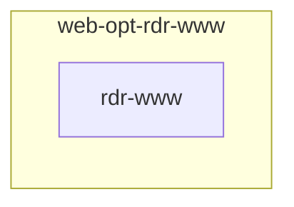

# NGINX WWW Redirect

## Description

Automates the creation of NGINX server blocks that redirect all `www.` subdomains to their non-www equivalents. Simple, idempotent, and SEO-friendly! 🚀

## Overview

This role will:

- **Discover** existing `*.conf` vhosts in your NGINX servers directory  
- **Filter** domains with or without your `DOMAIN_PRIMARY`  
- **Generate** redirect rules via the `web-opt-rdr-domains` role  
- **Optionally** include a wildcard redirect template (experimental) ⭐️  
- **Clean up** leftover configs when running in cleanup mode 🧹  

All tasks are guarded by “run once” facts and `MODE_CLEANUP` flags to avoid unintended re-runs or stale files.

## Cosmos

The diagram places NGINX WWW Redirect in the Infinito.Nexus cosmos: the components it deploys (capabilities), the central services it consumes (dependencies), and its outward reach (federation and bridged external networks).



Solid `1:1` edges are fixed relationships; dashed `0..1` edges are conditional (enabled only in matching deployments). Node markers show the role's deploy modes (💻 host, 🐳 compose, 🐝 swarm); ❌ marks a service that is explicitly turned off.

## Purpose

Ensure that any request to `www.example.com` automatically and permanently redirects to `https://example.com`, improving user experience, SEO, and certificate management. 🎯

## Features

- **Auto-Discovery**: Scans your NGINX `servers` directory for `.conf` files. 🔍  
- **Dynamic Redirects**: Builds `source: "www.domain"` → `target: "domain"` mappings on the fly. 🔧  
- **Wildcard Redirect**: Includes a templated wildcard server block for `www.*` domains (toggleable). ✨  
- **Cleanup Mode**: Removes the wildcard config file when `CERTBOT_FLAVOR` is set to `dedicated` and `MODE_CLEANUP` is enabled. 🗑️
- **Debug Output**: Optional `MODE_DEBUG` gives detailed variable dumps for troubleshooting. 🐛  

## Quick Setup

### Development

Clone, set up the workstation, and deploy NGINX WWW Redirect onto the local stack:

```bash
git clone https://github.com/infinito-nexus/core.git
cd core
make onboard
make compose-deploy mode=reinstall apps=web-opt-rdr-www full_cycle=false
```

### Production

Run the published image to provision the inventory and deploy NGINX WWW Redirect to a managed server (the mounted volume persists the inventory between the two runs):

```bash
docker run --rm -it \
  -v "$PWD/inventories:/etc/infinito.nexus/inventories" \
  ghcr.io/infinito-nexus/core/debian \
  infinito administration inventory provision /etc/infinito.nexus/inventories/prod \
  --inventory-file /etc/infinito.nexus/inventories/prod/devices.yml \
  --host <your-server> \
  --vars-file inventories/<env>/default.yml \
  --include 'web-opt-rdr-www'

docker run --rm -it \
  -v "$PWD/inventories:/etc/infinito.nexus/inventories" \
  ghcr.io/infinito-nexus/core/debian \
  infinito administration deploy dedicated /etc/infinito.nexus/inventories/prod/devices.yml \
  --password-file /etc/infinito.nexus/inventories/prod/.password \
  --id web-opt-rdr-www \
  --diff \
  -vv
```

## Credits

Implemented by **[Kevin Veen-Birkenbach](https://www.veen.world)**.
Part of the [Infinito.Nexus Project](https://s.infinito.nexus/code) and maintained by [Kevin Veen-Birkenbach](https://www.veen.world).
Licensed under the [Infinito.Nexus Community License (Non-Commercial)](https://s.infinito.nexus/license).
