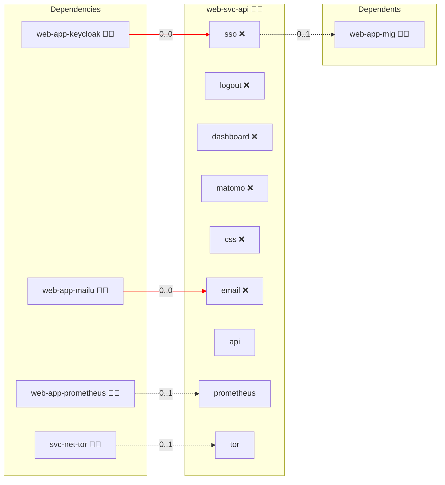

# API

## Description

The Infinito.Nexus API is a public, read-only REST service built with [FastAPI](https://fastapi.tiangolo.com/). It answers every question an app built on Infinito.Nexus asks about the platform: which roles exist, what their metadata says, how they are categorised, which bundles combine them, what the history of the repository and its forks looks like, and how all of that reads in each of the 184 ISO 639-1 languages.

## Overview

This role builds the API image from `files/Dockerfile`, bakes a snapshot of the deployed working tree into it and serves it at `api.<domain>`. The container keeps one bare git repository with the branches and tags of core, of every public fork (discovered through the GitHub forks endpoint) and the snapshot as the ref `deployed`, and fetches on a fixed interval. Every data endpoint takes a `ref`: `deployed`, a commit SHA, a branch or tag of core, or `<owner>:<branch or tag>` of a fork. Translations come from the `core` gettext catalogs under `locale/`, which `make i18n-extract` and `make i18n-translate` maintain.

The API has no authentication tier: it serves public repository data only, so SSO and logout are disabled and the Playwright persona scenarios are declared blocked for `biber` and `administrator`.

## Cosmos

The diagram places API in the Infinito.Nexus cosmos: the components it deploys (capabilities), the central services it consumes (dependencies), and its outward reach (federation and bridged external networks).



Solid `1:1` edges are fixed relationships; dashed `0..1` edges are conditional (enabled only in matching deployments); red `0..0` edges are turned off in this role. Node markers show the role's deploy modes (💻 host, 🐳 compose, 🐝 swarm); ❌ marks a service that is explicitly turned off, and ⚙️ an Ansible role dependency declared in `meta/main.yml`.

## Features

- **Every ref:** Role data, categories, bundles, files and TODO markers for the deployed working tree, any branch, tag or commit of core, and every branch or tag of its forks.
- **Translated data:** `lang` and `Accept-Language` translate role descriptions and category texts; `/v1/catalogs/core/<code>` returns a whole catalog as JSON and `/v1/languages` reports how complete each language is.
- **No clone needed:** `/v1/tree` and `/v1/file` read any path of a ref, `/v1/log` walks its history.
- **Safe with untrusted forks:** Trees are read as data only (safe YAML, Babel catalogs); refs and paths are validated before git sees them.
- **Cache friendly:** Responses for a commit SHA are immutable; every response carries `Access-Control-Allow-Origin: *`.

## Quick Setup

### Development

Clone, set up the workstation, and deploy API onto the local stack:

```bash
git clone https://github.com/infinito-nexus/core.git
cd core
make onboard
make compose-deploy mode=reinstall apps=web-svc-api full_cycle=false
```

### Production

Run the published image to provision the inventory and deploy API to a managed server (the mounted volume persists the inventory):

```bash
APP=web-svc-api
HOST=<your-server>
DOMAIN=<your-domain>
TLS_MODE=self_signed
SSH_PUBLIC_KEY="<your-ssh-public-key>"

docker run --rm -it \
  -v "$PWD/inventories:/etc/infinito.nexus/inventories" \
  -e APP="$APP" -e HOST="$HOST" -e DOMAIN="$DOMAIN" -e TLS_MODE="$TLS_MODE" -e SSH_PUBLIC_KEY="$SSH_PUBLIC_KEY" \
  ghcr.io/infinito-nexus/core/debian bash -c '
    INVENTORY=/etc/infinito.nexus/inventories/production
    infinito administration inventory provision "$INVENTORY" \
      --inventory-file "$INVENTORY/devices.yml" \
      --host "$HOST" \
      --include "$APP" \
      --vars "{\"TLS_MODE\": \"$TLS_MODE\", \"DOMAIN_PRIMARY\": \"$DOMAIN\", \"users\": {\"administrator\": {\"authorized_keys\": [\"$SSH_PUBLIC_KEY\"]}}}" &&
    infinito administration deploy dedicated "$INVENTORY/devices.yml" \
      --password-file "$INVENTORY/.password" \
      --diff -vv'
```

## Further Resources

- [FastAPI](https://fastapi.tiangolo.com/)

## Credits

Implemented by **[Kevin Veen-Birkenbach](https://www.veen.world)**.
Part of the [Infinito.Nexus Project](https://s.infinito.nexus/code) and maintained by [Kevin Veen-Birkenbach](https://www.veen.world).
Licensed under the [Infinito.Nexus Community License (Non-Commercial)](https://s.infinito.nexus/license).
