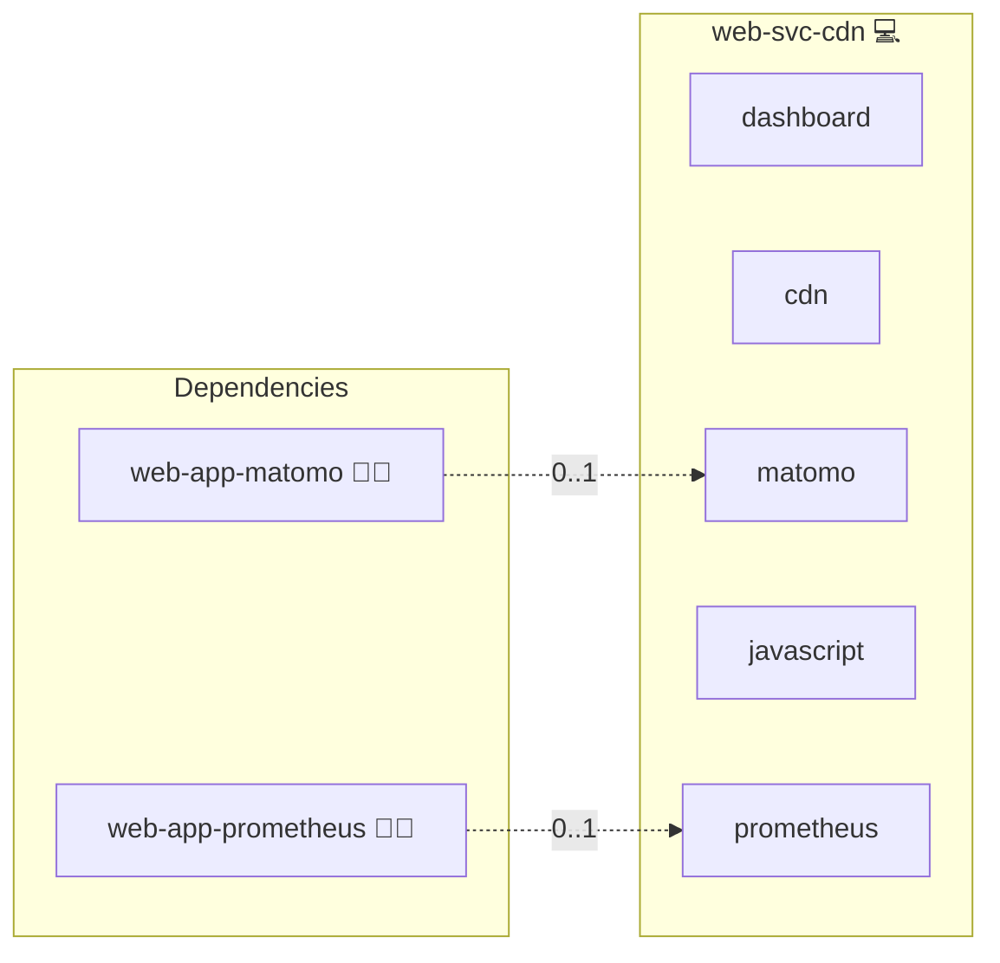

# Content Delivery Network

## Description

[Nginx](https://nginx.org/) is a high-performance web server and reverse proxy.
This role wraps Nginx as an internal Content Delivery Network that serves static assets such as CSS and JavaScript bundles for other web applications in the stack.

## Overview

This role deploys an Nginx-based CDN container behind the project's standard reverse proxy and exposes the canonical `cdn` service so that other roles can consume it through `services.cdn`.
It also publishes the `css` and `javascript` aliases as canonical references back to `cdn` so dependent applications can opt into either alias without duplicating configuration.

## Cosmos

The diagram places Content Delivery Network in the Infinito.Nexus cosmos: the components it deploys (capabilities), the central services it consumes (dependencies), and its outward reach (federation and bridged external networks).



Solid `1:1` edges are fixed relationships; dashed `0..1` edges are conditional (enabled only in matching deployments). Node markers show the role's deploy modes (💻 host, 🐳 compose, 🐝 swarm); ❌ marks a service that is explicitly turned off, and ⚙️ an Ansible role dependency declared in `meta/main.yml`.

## Features

- **Canonical CDN service:** Provides the primary `cdn` service entry consumed via `services.cdn` across the stack.
- **Aliased asset channels:** Exposes `css` and `javascript` as canonical aliases of `cdn` for clearer per-asset wiring.
- **TLS-aware delivery:** Runs behind the project's reverse proxy and inherits its certificate management.
- **Container-managed:** Deploys via Docker Compose with project-standard healthchecks, restart policy, and resource limits.
- **Matomo and Prometheus aware:** Toggles tracker and metrics integration based on the presence of the corresponding application roles.

## Quick Setup

### Development

Clone, set up the workstation, and deploy Content Delivery Network onto the local stack:

```bash
git clone https://github.com/infinito-nexus/core.git
cd core
make onboard
make compose-deploy mode=reinstall apps=web-svc-cdn full_cycle=false
```

### Production

Install Content Delivery Network directly onto the target machine — clone the repository, install the OS prerequisites and the repository toolchain, then deploy against localhost over a local connection (no SSH, no container):

```bash
git clone https://github.com/infinito-nexus/core.git
cd core
bash scripts/install/package.sh
make install
source scripts/meta/env/load.sh

APP=web-svc-cdn
TLS_MODE=self_signed
SSH_PUBLIC_KEY="<your-ssh-public-key>"
INVENTORY=inventories/production
infinito administration inventory provision "$INVENTORY" \
  --inventory-file "$INVENTORY/devices.yml" \
  --host localhost \
  --include "$APP" \
  --vars "{\"TLS_MODE\": \"$TLS_MODE\", \"users\": {\"administrator\": {\"authorized_keys\": [\"$SSH_PUBLIC_KEY\"]}}}"
infinito administration deploy dedicated "$INVENTORY/devices.yml" \
  --password-file "$INVENTORY/.password" \
  --diff -vv
```

## Further Resources

- [Nginx](https://nginx.org/)
- [Content delivery network on Wikipedia](https://en.wikipedia.org/wiki/Content_delivery_network)

## Credits

Implemented by **[Kevin Veen-Birkenbach](https://www.veen.world)**.
Part of the [Infinito.Nexus Project](https://s.infinito.nexus/code) and maintained by [Kevin Veen-Birkenbach](https://www.veen.world).
Licensed under the [Infinito.Nexus Community License (Non-Commercial)](https://s.infinito.nexus/license).
