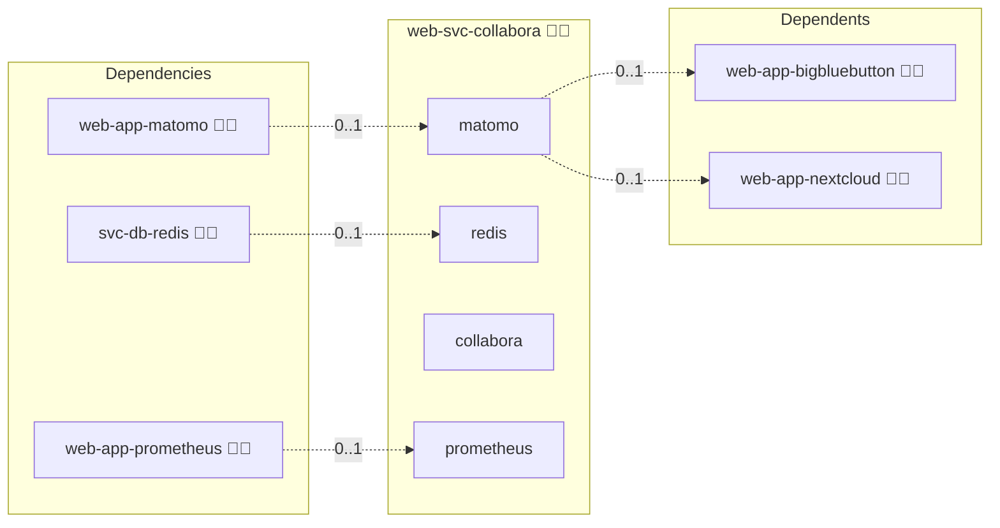

# Collabora

## Description

This Ansible role deploys Collabora Online (CODE) in Docker to enable real-time, in-browser document editing for Nextcloud. It automates the setup of the Collabora CODE container, NGINX reverse proxy configuration, network isolation via Docker networks, and environment variable management.

## Overview

* **Dockerized Collabora CODE:** Uses the official `collabora/code` image.
* **NGINX Reverse Proxy:** Configures a public-facing proxy with TLS termination and WebSocket support for `/cool/` paths.
* **Docker Network Management:** Creates an isolated `/28` subnet for Collabora and connects containers securely.
* **Environment Configuration:** Generates a `.env` file with domain, credentials, and extra parameters for Collabora's WOPI server.

## Cosmos

The diagram places Collabora in the Infinito.Nexus cosmos: the components it deploys (capabilities), the central services it consumes (dependencies), and its outward reach (federation and bridged external networks).



Solid `1:1` edges are fixed relationships; dashed `0..1` edges are conditional (enabled only in matching deployments). Node markers show the role's deploy modes (💻 host, 🐳 compose, 🐝 swarm); ❌ marks a service that is explicitly turned off, and ⚙️ an Ansible role dependency declared in `meta/main.yml`.

## Features

* Automatic creation of a dedicated Docker network for Collabora.
* Proxy configuration template for NGINX with long timeouts and WebSocket upgrades.
* Customizable domain names and ports via Ansible variables.
* Support for SSL termination at the proxy level.
* Integration hooks to restart NGINX and recreate Docker Compose stacks on changes.

## Quick Setup

### Development

Clone, set up the workstation, and deploy Collabora onto the local stack:

```bash
git clone https://github.com/infinito-nexus/core.git
cd core
make onboard
make compose-deploy mode=reinstall apps=web-svc-collabora full_cycle=false
```

### Production

Run the published image to provision the inventory and deploy Collabora to a managed server (the mounted volume persists the inventory):

```bash
APP=web-svc-collabora
HOST=<your-server>
TLS_MODE=self_signed
SSH_PUBLIC_KEY="<your-ssh-public-key>"

docker run --rm -it \
  -v "$PWD/inventories:/etc/infinito.nexus/inventories" \
  -e APP="$APP" -e HOST="$HOST" -e TLS_MODE="$TLS_MODE" -e SSH_PUBLIC_KEY="$SSH_PUBLIC_KEY" \
  ghcr.io/infinito-nexus/core/debian bash -c '
    INVENTORY=/etc/infinito.nexus/inventories/production
    infinito administration inventory provision "$INVENTORY" \
      --inventory-file "$INVENTORY/devices.yml" \
      --host "$HOST" \
      --include "$APP" \
      --vars "{\"TLS_MODE\": \"$TLS_MODE\", \"users\": {\"administrator\": {\"authorized_keys\": [\"$SSH_PUBLIC_KEY\"]}}}" &&
    infinito administration deploy dedicated "$INVENTORY/devices.yml" \
      --password-file "$INVENTORY/.password" \
      --diff -vv'
```

## Further Resources

* [Official Collabora CODE website](https://www.collaboraoffice.com/code/)

## Credits

Implemented by **[Kevin Veen-Birkenbach](https://www.veen.world)**.
Part of the [Infinito.Nexus Project](https://s.infinito.nexus/code) and maintained by [Kevin Veen-Birkenbach](https://www.veen.world).
Licensed under the [Infinito.Nexus Community License (Non-Commercial)](https://s.infinito.nexus/license).
