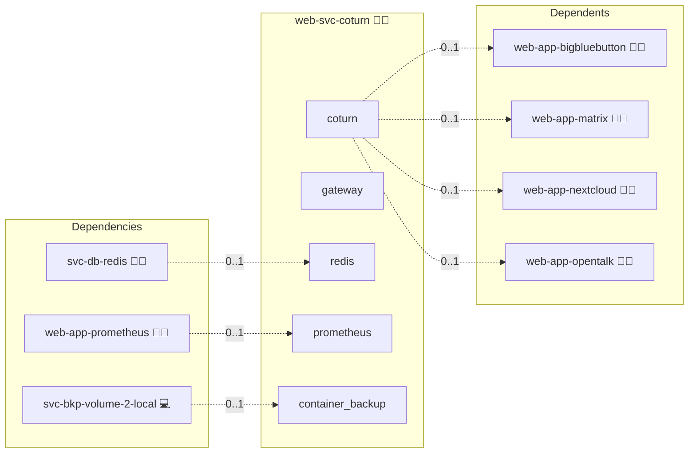

# Coturn

This folder contains the role to deploy and manage a [Coturn](https://github.com/coturn/coturn) service.

## Description

[Coturn](https://github.com/coturn/coturn) is a free and open-source **TURN (Traversal Using Relays around NAT)** and **STUN (Session Traversal Utilities for NAT)** server.  
It enables real-time communication (RTC) applications such as **WebRTC** to work reliably across NATs and firewalls.

Without TURN/STUN, video calls, conferencing, and peer-to-peer connections often fail due to NAT traversal issues.  
Coturn solves this by acting as a **relay server** and/or **discovery service** for public IP addresses.

More background:  

* Wikipedia: [Traversal Using Relays around NAT](https://en.wikipedia.org/wiki/Traversal_Using_Relays_around_NAT)  
* Wikipedia: [Session Traversal Utilities for NAT](https://en.wikipedia.org/wiki/STUN)  
* Official Coturn Docs: [https://github.com/coturn/coturn/wiki](https://github.com/coturn/coturn/wiki)

## Overview

This role deploys Coturn via Docker Compose using the `sys-stk-semi-stateless` stack.  
It automatically configures:

* TURN and STUN listening ports
* Relay port ranges
* TLS certificates (via Let’s Encrypt integration)
* Long-term credentials and/or REST API secrets

Typical use cases:

* Nextcloud Talk
* Jitsi
* BigBlueButton
* Any WebRTC-based application

## Cosmos

The diagram places Coturn in the Infinito.Nexus cosmos: the components it deploys (capabilities), the central services it consumes (dependencies), and its outward reach (federation and bridged external networks).



Solid `1:1` edges are fixed relationships; dashed `0..1` edges are conditional (enabled only in matching deployments). Node markers show the role's deploy modes (💻 host, 🐳 compose, 🐝 swarm); ❌ marks a service that is explicitly turned off, and ⚙️ an Ansible role dependency declared in `meta/main.yml`.

## Features

* Stateless container deployment (no database or persistent volume required)  
* Automatic TLS handling via `sys-stk-front-base`  
* TURN and STUN support over TCP and UDP  
* Configurable relay port ranges for scaling  
* Integration into Infinito.Nexus inventory/variable system

## Quick Setup

### Development

Clone, set up the workstation, and deploy Coturn onto the local stack:

```bash
git clone https://github.com/infinito-nexus/core.git
cd core
make onboard
make compose-deploy mode=reinstall apps=web-svc-coturn full_cycle=false
```

### Production

Run the published image to provision the inventory and deploy Coturn to a managed server (the mounted volume persists the inventory):

```bash
APP=web-svc-coturn
HOST=<your-server>
TLS_MODE=self_signed
SSH_PUBLIC_KEY="<your-ssh-public-key>"

docker run --rm -it \
  -v "$PWD/inventories:/etc/infinito.nexus/inventories" \
  -e APP="$APP" -e HOST="$HOST" -e TLS_MODE="$TLS_MODE" -e SSH_PUBLIC_KEY="$SSH_PUBLIC_KEY" \
  ghcr.io/infinito-nexus/core/debian bash -c '
    INVENTORY=/etc/infinito.nexus/inventories/production
    infinito administration inventory provision "$INVENTORY" \
      --inventory-file "$INVENTORY/devices.yml" \
      --host "$HOST" \
      --include "$APP" \
      --vars "{\"TLS_MODE\": \"$TLS_MODE\", \"users\": {\"administrator\": {\"authorized_keys\": [\"$SSH_PUBLIC_KEY\"]}}}" &&
    infinito administration deploy dedicated "$INVENTORY/devices.yml" \
      --password-file "$INVENTORY/.password" \
      --diff -vv'
```

## Further Resources

* Coturn Project: [github.com/coturn/coturn](https://github.com/coturn/coturn)  
* Coturn Wiki: [github.com/coturn/coturn/wiki](https://github.com/coturn/coturn/wiki)  
* TURN on Wikipedia: [en.wikipedia.org/wiki/Traversal_Using_Relays_around_NAT](https://en.wikipedia.org/wiki/Traversal_Using_Relays_around_NAT)  
* STUN on Wikipedia: [en.wikipedia.org/wiki/STUN](https://en.wikipedia.org/wiki/STUN)  

## Credits

Implemented by **[Kevin Veen-Birkenbach](https://www.veen.world)**.
Part of the [Infinito.Nexus Project](https://s.infinito.nexus/code) and maintained by [Kevin Veen-Birkenbach](https://www.veen.world).
Licensed under the [Infinito.Nexus Community License (Non-Commercial)](https://s.infinito.nexus/license).
