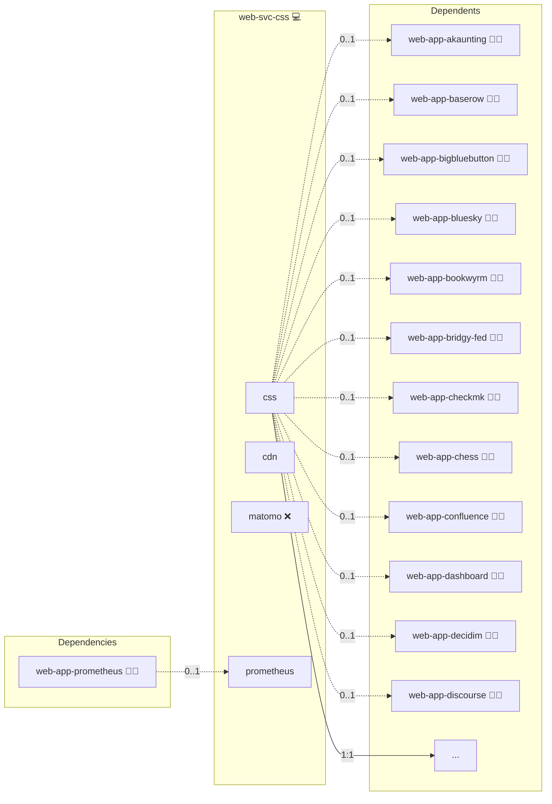

# Corporate Design

## Description

[CSS](https://developer.mozilla.org/en-US/docs/Web/CSS) styles the user-facing surfaces of web applications across the deployment.
This role registers `css` as a canonical service in the deployment's service registry so consumer roles can declare CSS as a runtime dependency.

## Overview

This role owns the `css` service flag and declares `web-svc-cdn` as the upstream that serves the actual CSS bytes.
Consumer roles gate CSS-dependent surfaces on `'web-svc-css' in group_names` via their own `meta/services.yml`.
The role's canonical domain 301-redirects to the CDN's canonical domain so health probes against the CSS hostname return a valid response.

## Cosmos

The diagram places Corporate Design in the Infinito.Nexus cosmos: the components it deploys (capabilities), the central services it consumes (dependencies), and its outward reach (federation and bridged external networks).



Solid `1:1` edges are fixed relationships; dashed `0..1` edges are conditional (enabled only in matching deployments). Node markers show the role's deploy modes (💻 host, 🐳 compose, 🐝 swarm); ❌ marks a service that is explicitly turned off, and ⚙️ an Ansible role dependency declared in `meta/main.yml`.

## Features

- **Service flag ownership:** Owns the `css` entry in the central service registry.
- **CDN-backed delivery:** Declares `web-svc-cdn` as the upstream that serves the actual CSS bytes.
- **Health-probe friendly:** Redirects the canonical CSS hostname to the CDN so HTTP probes return a valid response.
- **Variant-matrix coverage:** Ships `meta/variants.yml` exercising both polarities of the `cdn` dependency.

## Quick Setup

### Development

Clone, set up the workstation, and deploy Corporate Design onto the local stack:

```bash
git clone https://github.com/infinito-nexus/core.git
cd core
make onboard
make compose-deploy mode=reinstall apps=web-svc-css full_cycle=false
```

### Production

Install Corporate Design directly onto the target machine — clone the repository, install the OS prerequisites and the repository toolchain, then deploy against localhost over a local connection (no SSH, no container):

```bash
git clone https://github.com/infinito-nexus/core.git
cd core
bash scripts/install/package.sh
make install
source scripts/meta/env/load.sh

APP=web-svc-css
TLS_MODE=self_signed
SSH_PUBLIC_KEY="<your-ssh-public-key>"
INVENTORY=inventories/production
infinito administration inventory provision "$INVENTORY" \
  --inventory-file "$INVENTORY/devices.yml" \
  --host localhost \
  --include "$APP" \
  --vars "{\"TLS_MODE\": \"$TLS_MODE\", \"users\": {\"administrator\": {\"authorized_keys\": [\"$SSH_PUBLIC_KEY\"]}}}"
infinito administration deploy dedicated "$INVENTORY/devices.yml" \
  --password-file "$INVENTORY/.password" \
  --diff -vv
```

## Further Resources

- [CSS on MDN](https://developer.mozilla.org/en-US/docs/Web/CSS)

## Credits

Implemented by **[Kevin Veen-Birkenbach](https://www.veen.world)**.
Part of the [Infinito.Nexus Project](https://s.infinito.nexus/code) and maintained by [Kevin Veen-Birkenbach](https://www.veen.world).
Licensed under the [Infinito.Nexus Community License (Non-Commercial)](https://s.infinito.nexus/license).
