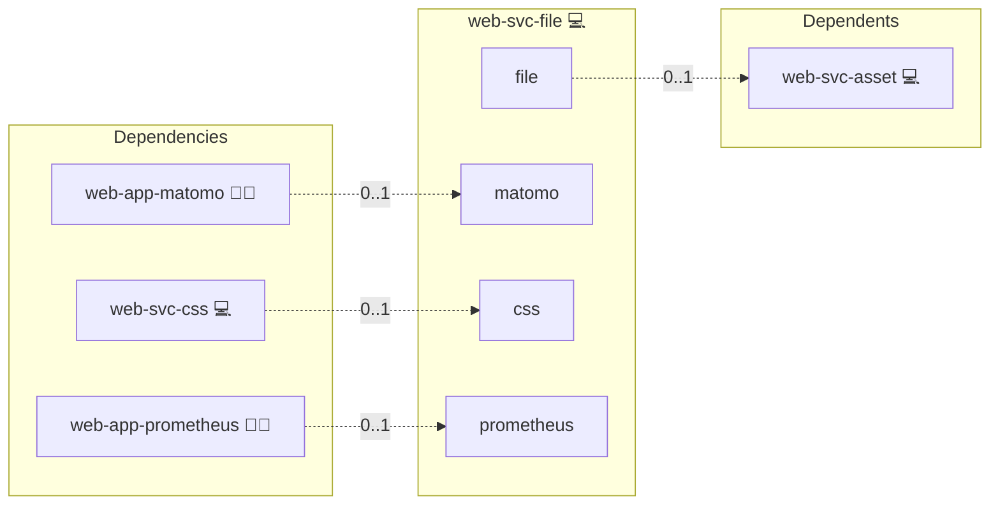

# File Server

## Description

The NGINX File Server role sets up a simple and secure static file server using [NGINX](https://NGINX.org/). It provides an easy way to serve files over HTTPS, including directory listing, `.well-known` support, and automatic SSL/TLS certificate integration via Let's Encrypt.

## Overview

Optimized for Archlinux, this role configures NGINX to act as a lightweight and efficient file server. It ensures that files are served securely, with optional directory browsing enabled, and proper MIME type handling for standard web clients.

## Cosmos

The diagram places File Server in the Infinito.Nexus cosmos: the components it deploys (capabilities), the central services it consumes (dependencies), and its outward reach (federation and bridged external networks).



Solid `1:1` edges are fixed relationships; dashed `0..1` edges are conditional (enabled only in matching deployments). Node markers show the role's deploy modes (💻 host, 🐳 compose, 🐝 swarm); ❌ marks a service that is explicitly turned off, and ⚙️ an Ansible role dependency declared in `meta/main.yml`.

## Features

- **Automatic SSL/TLS Certificate Management:** Integrates with Let's Encrypt for secure access.
- **Simple Configuration:** Minimal setup with clear, maintainable templates.
- **Directory Listings:** Enables browsing through served files with human-readable file sizes and timestamps.
- **Static Content Hosting:** Serve any type of static files (documents, software, media, etc.).
- **Well-Known Folder Support:** Allows serving validation files and other standardized resources easily.

## Quick Setup

### Development

Clone, set up the workstation, and deploy File Server onto the local stack:

```bash
git clone https://github.com/infinito-nexus/core.git
cd core
make onboard
make compose-deploy mode=reinstall apps=web-svc-file full_cycle=false
```

### Production

Install File Server directly onto the target machine — clone the repository, install the OS prerequisites and the repository toolchain, then deploy against localhost over a local connection (no SSH, no container):

```bash
git clone https://github.com/infinito-nexus/core.git
cd core
bash scripts/install/package.sh
make install
source scripts/meta/env/load.sh

APP=web-svc-file
TLS_MODE=self_signed
SSH_PUBLIC_KEY="<your-ssh-public-key>"
INVENTORY=inventories/production
infinito administration inventory provision "$INVENTORY" \
  --inventory-file "$INVENTORY/devices.yml" \
  --host localhost \
  --include "$APP" \
  --vars "{\"TLS_MODE\": \"$TLS_MODE\", \"users\": {\"administrator\": {\"authorized_keys\": [\"$SSH_PUBLIC_KEY\"]}}}"
infinito administration deploy dedicated "$INVENTORY/devices.yml" \
  --password-file "$INVENTORY/.password" \
  --diff -vv
```

## Further Resources

- [NGINX Official Website](https://NGINX.org/)
- [Let's Encrypt](https://letsencrypt.org/)
- [HTTPS (Wikipedia)](https://en.wikipedia.org/wiki/HTTPS)

## Credits

Implemented by **[Kevin Veen-Birkenbach](https://www.veen.world)**.
Part of the [Infinito.Nexus Project](https://s.infinito.nexus/code) and maintained by [Kevin Veen-Birkenbach](https://www.veen.world).
Licensed under the [Infinito.Nexus Community License (Non-Commercial)](https://s.infinito.nexus/license).
