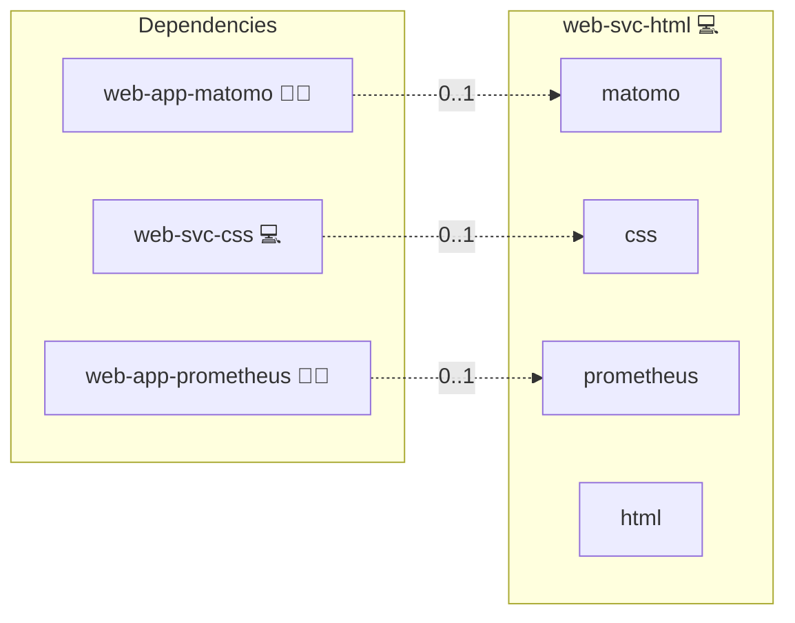

# HTML Server

## Description

This role configures an [NGINX](https://NGINX.org/) server to host a static HTML homepage securely over HTTPS. It automates domain configuration, SSL/TLS certificate retrieval using [Let's Encrypt](https://letsencrypt.org/), and ensures your site is ready for production with minimal setup.

## Overview

Optimized for Archlinux environments, this role provides a lightweight, reliable solution for serving static websites. It automatically configures NGINX to serve files from a predefined directory, sets up secure HTTPS connections, and includes support for `.well-known` paths required by ACME challenges.

### Key Features

- **Static Site Hosting:** Serves HTML, CSS, JavaScript, and other static files.
- **Let's Encrypt Integration:** Automatically requests and installs SSL/TLS certificates.
- **Simple Root Configuration:** Defines a clean webroot with `index.html` support.
- **Secure by Default:** Includes modern SSL headers and best practices via NGINX.
- **.well-known Support:** Ensures full ACME challenge compatibility.

## Cosmos

The diagram places HTML Server in the Infinito.Nexus cosmos: the components it deploys (capabilities), the central services it consumes (dependencies), and its outward reach (federation and bridged external networks).



Solid `1:1` edges are fixed relationships; dashed `0..1` edges are conditional (enabled only in matching deployments). Node markers show the role's deploy modes (💻 host, 🐳 compose, 🐝 swarm); ❌ marks a service that is explicitly turned off, and ⚙️ an Ansible role dependency declared in `meta/main.yml`.

## Purpose

The NGINX Static HTML Server role provides a simple and efficient method to publish static websites with HTTPS, perfect for personal homepages, landing pages, or small projects.

## Features

- **Automatic HTTPS Certificates:** Handles secure certificate issuance via Let's Encrypt.
- **Minimal NGINX Setup:** Clean and optimized default configurations.
- **Highly Portable:** Works out-of-the-box with minimal variables.
- **Local Time Support:** Properly displays directory listing timestamps when needed.

## Quick Setup

### Development

Clone, set up the workstation, and deploy HTML Server onto the local stack:

```bash
git clone https://github.com/infinito-nexus/core.git
cd core
make onboard
make compose-deploy mode=reinstall apps=web-svc-html full_cycle=false
```

### Production

Install HTML Server directly onto the target machine — clone the repository, install the OS prerequisites and the repository toolchain, then deploy against localhost over a local connection (no SSH, no container):

```bash
git clone https://github.com/infinito-nexus/core.git
cd core
bash scripts/install/package.sh
make install
source scripts/meta/env/load.sh

APP=web-svc-html
TLS_MODE=self_signed
SSH_PUBLIC_KEY="<your-ssh-public-key>"
INVENTORY=inventories/production
infinito administration inventory provision "$INVENTORY" \
  --inventory-file "$INVENTORY/devices.yml" \
  --host localhost \
  --include "$APP" \
  --vars "{\"TLS_MODE\": \"$TLS_MODE\", \"users\": {\"administrator\": {\"authorized_keys\": [\"$SSH_PUBLIC_KEY\"]}}}"
infinito administration deploy dedicated "$INVENTORY/devices.yml" \
  --password-file "$INVENTORY/.password" \
  --diff -vv
```

## Learn More

- [NGINX Official Website](https://NGINX.org/)
- [Let's Encrypt](https://letsencrypt.org/)
- [Static Web Page (Wikipedia)](https://en.wikipedia.org/wiki/Static_web_page)
- [HTTPS (Wikipedia)](https://en.wikipedia.org/wiki/HTTPS)

## ‍ Author Information

Created in 2023 by [Kevin Veen-Birkenbach](https://www.veen.world/)

## Credits

Implemented by **[Kevin Veen-Birkenbach](https://www.veen.world)**.
Part of the [Infinito.Nexus Project](https://s.infinito.nexus/code) and maintained by [Kevin Veen-Birkenbach](https://www.veen.world).
Licensed under the [Infinito.Nexus Community License (Non-Commercial)](https://s.infinito.nexus/license).
