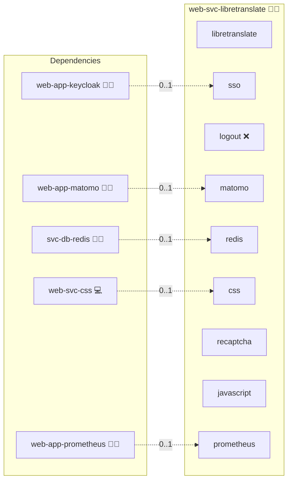

# LibreTranslate

This role deploys **LibreTranslate** as a containerized web service using Docker Compose.
It is designed to integrate seamlessly into the Infinito.Nexus stack, including optional Redis and database backends, CSP handling, and analytics integration.

## Description

LibreTranslate is an open-source machine translation API that can be self-hosted.
This role provides a standardized, reproducible deployment with optional extensions such as Redis caching, database persistence, and Matomo tracking.

The role follows Infinito.Nexus conventions:

- container abstraction (`container`, `compose`)
- per-role meta configuration under `meta/services.yml` and `meta/server.yml`
- CSP-aware reverse proxy integration
- optional shared services (database, analytics)

## Overview

- Deployment via Docker Compose
- Stateless by default, with optional stateful backends
- Designed for reverse-proxy setups
- Suitable for internal services, public APIs, or desktop integration
- Compatible with the Infinito.Nexus role and metadata system

## Cosmos

The diagram places LibreTranslate in the Infinito.Nexus cosmos: the components it deploys (capabilities), the central services it consumes (dependencies), and its outward reach (federation and bridged external networks).



Solid `1:1` edges are fixed relationships; dashed `0..1` edges are conditional (enabled only in matching deployments). Node markers show the role's deploy modes (💻 host, 🐳 compose, 🐝 swarm); ❌ marks a service that is explicitly turned off, and ⚙️ an Ansible role dependency declared in `meta/main.yml`.

## Features

- LibreTranslate service deployment
- Configurable container image and version
- Optional Redis backend
- Optional database backend
- Optional Matomo analytics integration
- CSP configuration support
- Custom JavaScript injection
- Desktop integration toggle
- Health checks via HTTP
- Network and dependency handling via shared system roles

## Quick Setup

### Development

Clone, set up the workstation, and deploy LibreTranslate onto the local stack:

```bash
git clone https://github.com/infinito-nexus/core.git
cd core
make onboard
make compose-deploy mode=reinstall apps=web-svc-libretranslate full_cycle=false
```

### Production

Run the published image to provision the inventory and deploy LibreTranslate to a managed server (the mounted volume persists the inventory):

```bash
APP=web-svc-libretranslate
HOST=<your-server>
TLS_MODE=self_signed
SSH_PUBLIC_KEY="<your-ssh-public-key>"

docker run --rm -it \
  -v "$PWD/inventories:/etc/infinito.nexus/inventories" \
  -e APP="$APP" -e HOST="$HOST" -e TLS_MODE="$TLS_MODE" -e SSH_PUBLIC_KEY="$SSH_PUBLIC_KEY" \
  ghcr.io/infinito-nexus/core/debian bash -c '
    INVENTORY=/etc/infinito.nexus/inventories/production
    infinito administration inventory provision "$INVENTORY" \
      --inventory-file "$INVENTORY/devices.yml" \
      --host "$HOST" \
      --include "$APP" \
      --vars "{\"TLS_MODE\": \"$TLS_MODE\", \"users\": {\"administrator\": {\"authorized_keys\": [\"$SSH_PUBLIC_KEY\"]}}}" &&
    infinito administration deploy dedicated "$INVENTORY/devices.yml" \
      --password-file "$INVENTORY/.password" \
      --diff -vv'
```

## Single sign-on

OIDC is wired in via a sidecar `web-app-keycloak`'s SSO-proxy sidecar that fronts the human-facing web UI only.
The programmatic API endpoints (`/translate`, `/detect`, …) MUST stay reachable with API-key auth even when the UI is gated, so the OIDC gate is restricted to the UI subpath; otherwise machine clients break.

LDAP is not feasible: LibreTranslate authenticates programmatic clients with API keys, and LDAP cannot map onto that model.
RBAC is also not feasible because authorisation in LibreTranslate is API-key-tier only and decoupled from any IDP.
The OIDC gate protects the UI but does not grant differential authorisation inside the app.
These LDAP and RBAC exceptions are documented per [lifecycle.md](../../docs/contributing/design/role/services/lifecycle.md).

## Configuration

All configuration is handled via `meta/services.yml` (services map at file root) and `meta/server.yml` (server block at file root).

Key sections include:

- `services.libretranslate`: image and version
- `services.redis`: enable Redis backend
- `services.matomo`: enable analytics
- `domains`: canonical and alias domains
- `csp`:

## Credits

Implemented by **[Kevin Veen-Birkenbach](https://www.veen.world)**.
Part of the [Infinito.Nexus Project](https://s.infinito.nexus/code) and maintained by [Kevin Veen-Birkenbach](https://www.veen.world).
Licensed under the [Infinito.Nexus Community License (Non-Commercial)](https://s.infinito.nexus/license).
