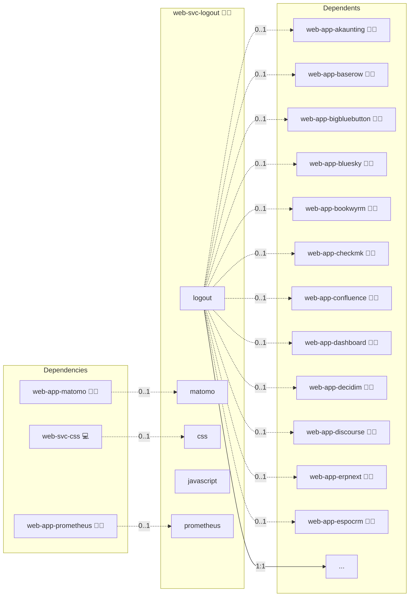

# Universal Logout

This folder contains an Ansible role to deploy and configure the **Universal Logout Service**.

## Description

This role sets up the universal logout proxy service, a Dockerized Python Flask container that coordinates logout requests across multiple OIDC-integrated applications. It also configures the necessary NGINX proxy snippets and environment variables to enable unified logout flows.

It solves the common challenge of logging a user out from all connected apps with a single action, especially in environments where apps live on multiple subdomains and use OIDC authentication.

## Overview

- Deploys the universal logout service container based on the official [universal-logout GitHub repository](https://github.com/kevinveenbirkenbach/universal-logout).
- Configures the logout domains dynamically based on application inventory and features using custom Ansible filters.
- Provides an NGINX `/logout` proxy configuration snippet that handles CORS and forwards logout requests to the logout service.
- Supplies a user-friendly logout conductor UI that requests logout on all configured domains and shows live status.
- Designed to be used as the Front Channel Logout URL for Keycloak or other OpenID Connect providers, enabling a seamless, service-spanning logout experience.

## Cosmos

The diagram places Universal Logout in the Infinito.Nexus cosmos: the components it deploys (capabilities), the central services it consumes (dependencies), and its outward reach (federation and bridged external networks).



Solid `1:1` edges are fixed relationships; dashed `0..1` edges are conditional (enabled only in matching deployments). Node markers show the role's deploy modes (💻 host, 🐳 compose, 🐝 swarm); ❌ marks a service that is explicitly turned off, and ⚙️ an Ansible role dependency declared in `meta/main.yml`.

## Features

- Automatic discovery of logout domains from applications with the `features.logout` flag enabled.
- Centralized logout proxy that clears cookies and sessions across all configured subdomains.
- Status page with live feedback on logout progress for each domain.
- Built-in support for Docker Compose deployment and integration with the Infinito.Nexus ecosystem.
- Includes security-conscious headers (CORS, CSP) for smooth cross-domain logout operations.

## Quick Setup

### Development

Clone, set up the workstation, and deploy Universal Logout onto the local stack:

```bash
git clone https://github.com/infinito-nexus/core.git
cd core
make onboard
make compose-deploy mode=reinstall apps=web-svc-logout full_cycle=false
```

### Production

Run the published image to provision the inventory and deploy Universal Logout to a managed server (the mounted volume persists the inventory):

```bash
APP=web-svc-logout
HOST=<your-server>
TLS_MODE=self_signed
SSH_PUBLIC_KEY="<your-ssh-public-key>"

docker run --rm -it \
  -v "$PWD/inventories:/etc/infinito.nexus/inventories" \
  -e APP="$APP" -e HOST="$HOST" -e TLS_MODE="$TLS_MODE" -e SSH_PUBLIC_KEY="$SSH_PUBLIC_KEY" \
  ghcr.io/infinito-nexus/core/debian bash -c '
    INVENTORY=/etc/infinito.nexus/inventories/production
    infinito administration inventory provision "$INVENTORY" \
      --inventory-file "$INVENTORY/devices.yml" \
      --host "$HOST" \
      --include "$APP" \
      --vars "{\"TLS_MODE\": \"$TLS_MODE\", \"users\": {\"administrator\": {\"authorized_keys\": [\"$SSH_PUBLIC_KEY\"]}}}" &&
    infinito administration deploy dedicated "$INVENTORY/devices.yml" \
      --password-file "$INVENTORY/.password" \
      --diff -vv'
```

## Further Resources

- [Universal Logout GitHub Repository](https://github.com/kevinveenbirkenbach/universal-logout)  
- [Infinito.Nexus Project](https://infinito.nexus)  
- [Author: Kevin Veen-Birkenbach](https://veen.world)  

---

*This role is licensed under the [Infinito.Nexus Community License (Non-Commercial)](https://s.infinito.nexus/license).*

## Credits

Implemented by **[Kevin Veen-Birkenbach](https://www.veen.world)**.
Part of the [Infinito.Nexus Project](https://s.infinito.nexus/code) and maintained by [Kevin Veen-Birkenbach](https://www.veen.world).
Licensed under the [Infinito.Nexus Community License (Non-Commercial)](https://s.infinito.nexus/license).
