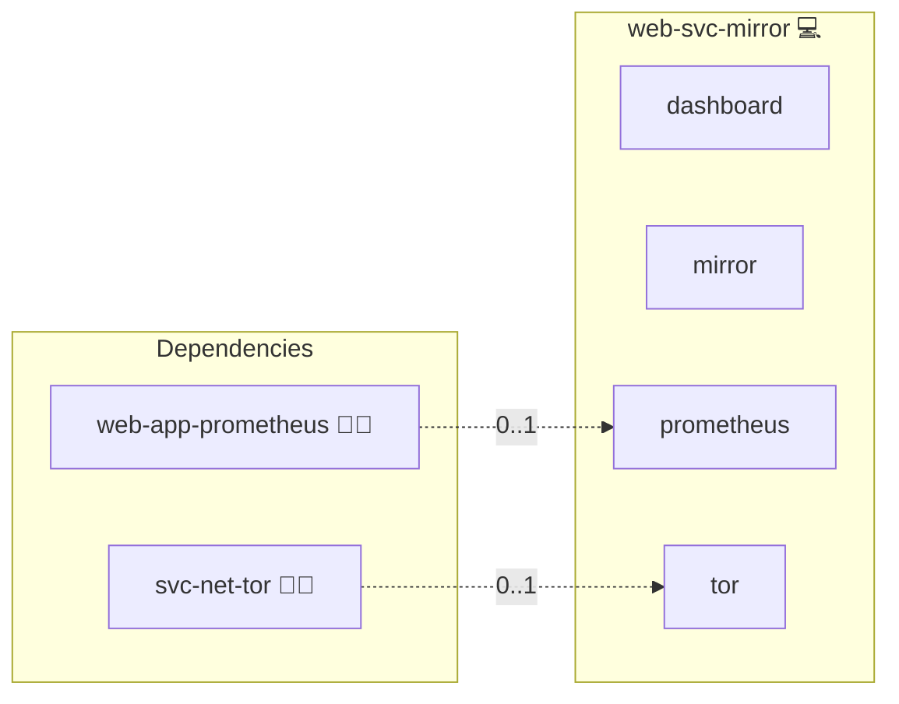

# Asset Mirror (Privacy Proxy)

## Description

[Nginx](https://nginx.org/) is a high-performance web server and reverse proxy.
This role wraps Nginx as a first-party mirror for the third-party assets other web applications declare in their CSP whitelists, so browsers fetch those assets from the deployment itself instead of contacting external hosts.

## Overview

This role deploys an Nginx vhost behind the project's standard reverse proxy and exposes the canonical `mirror` service so that other roles can consume it through `services.mirror`.
The vhost proxies path-prefixed requests (`/<origin-host>/<path>`) to exactly the external origins aggregated from all deployed applications' `server.csp.whitelist` declarations; every other upstream is refused.
When an application enables the `mirror` service, the shared body filter rewrites the external asset URLs in its HTML responses to the mirror domain, and the CSP builder allows the mirror origin in the asset directives.

## Cosmos

The diagram places Asset Mirror (Privacy Proxy) in the Infinito.Nexus cosmos: the components it deploys (capabilities), the central services it consumes (dependencies), and its outward reach (federation and bridged external networks).



Solid `1:1` edges are fixed relationships; dashed `0..1` edges are conditional (enabled only in matching deployments). Node markers show the role's deploy modes (💻 host, 🐳 compose, 🐝 swarm); ❌ marks a service that is explicitly turned off, and ⚙️ an Ansible role dependency declared in `meta/main.yml`.

## Features

- **First-party asset delivery:** Browsers never contact third-party CDNs directly; the deployment fetches and caches assets server-side.
- **CSP-derived allowlist:** Proxy upstreams are generated from the applications' CSP whitelists, so the mirror can only reach hosts the deployment already trusts.
- **Response caching:** Mirrored assets are cached with stale-serving, keeping delivery fast and resilient against upstream outages.
- **Tor-ready:** `svc-net-tor` depends on this service, so onion deployments serve all whitelisted third-party assets from the onion itself.
- **TLS-aware delivery:** Runs behind the project's reverse proxy and inherits its certificate management.

## Quick Setup

### Development

Clone, set up the workstation, and deploy Asset Mirror (Privacy Proxy) onto the local stack:

```bash
git clone https://github.com/infinito-nexus/core.git
cd core
make onboard
make compose-deploy mode=reinstall apps=web-svc-mirror full_cycle=false
```

### Production

Install Asset Mirror (Privacy Proxy) directly onto the target machine — clone the repository, install the OS prerequisites and the repository toolchain, then deploy against localhost over a local connection (no SSH, no container):

```bash
git clone https://github.com/infinito-nexus/core.git
cd core
bash scripts/install/package.sh
make install
source scripts/meta/env/load.sh

APP=web-svc-mirror
INVENTORY=inventories/prod
infinito administration inventory provision "$INVENTORY" \
  --inventory-file "$INVENTORY/devices.yml" \
  --host localhost \
  --include "$APP"
infinito administration deploy dedicated "$INVENTORY/devices.yml" \
  --password-file "$INVENTORY/.password" \
  --diff -vv
```

## Further Resources

- [Nginx](https://nginx.org/)
- [Content Security Policy on MDN](https://developer.mozilla.org/en-US/docs/Web/HTTP/CSP)

## Credits

Implemented by **Kevin Veen-Birkenbach**.
Part of the [Infinito.Nexus Project](https://s.infinito.nexus/code) and maintained by [Kevin Veen-Birkenbach](https://www.veen.world).
Licensed under the [Infinito.Nexus Community License (Non-Commercial)](https://s.infinito.nexus/license).
