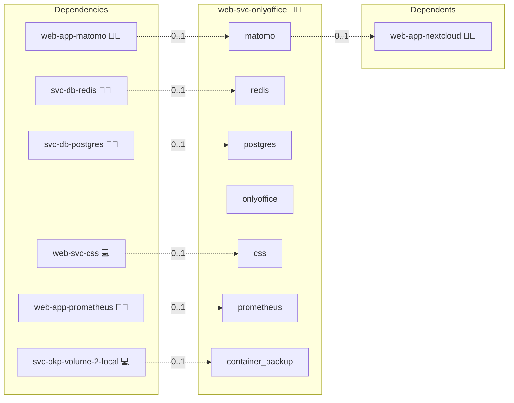

# OnlyOffice

## Description

This Ansible role deploys the ONLYOFFICE Document Server in Docker to provide real-time, in-browser editing for documents, spreadsheets, and presentations.
It automates the setup of the Document Server container, NGINX reverse proxy configuration, network isolation via Docker networks, and environment variable management for secure integration with Nextcloud or other WOPI-compatible platforms.

## Overview

* **Dockerized ONLYOFFICE Document Server:** Uses the official `onlyoffice/documentserver` image.
* **NGINX Reverse Proxy:** Configures a public-facing proxy with TLS termination for `/` and internal API calls.
* **Docker Network Management:** Creates an isolated `/28` subnet for ONLYOFFICE and connects containers securely.
* **Environment Configuration:** Generates a `.env` file containing domain, credentials, and JWT configuration for secure document editing.

## Cosmos

The diagram places OnlyOffice in the Infinito.Nexus cosmos: the components it deploys (capabilities), the central services it consumes (dependencies), and its outward reach (federation and bridged external networks).



Solid `1:1` edges are fixed relationships; dashed `0..1` edges are conditional (enabled only in matching deployments). Node markers show the role's deploy modes (💻 host, 🐳 compose, 🐝 swarm); ❌ marks a service that is explicitly turned off, and ⚙️ an Ansible role dependency declared in `meta/main.yml`.

## Features

* Automatic creation of a dedicated Docker network for ONLYOFFICE.
* Proxy configuration template for NGINX with long timeouts.
* Customizable domain names and ports via Ansible variables.
* Support for SSL/TLS termination at the proxy level.
* Optional JWT signing for secure communication between Nextcloud and Document Server.
* Integration hooks to restart NGINX and recreate Docker Compose stacks on changes.

## Quick Setup

### Development

Clone, set up the workstation, and deploy OnlyOffice onto the local stack:

```bash
git clone https://github.com/infinito-nexus/core.git
cd core
make onboard
make compose-deploy mode=reinstall apps=web-svc-onlyoffice full_cycle=false
```

### Production

Run the published image to provision the inventory and deploy OnlyOffice to a managed server (the mounted volume persists the inventory):

```bash
APP=web-svc-onlyoffice
HOST=<your-server>
TLS_MODE=self_signed
SSH_PUBLIC_KEY="<your-ssh-public-key>"

docker run --rm -it \
  -v "$PWD/inventories:/etc/infinito.nexus/inventories" \
  -e APP="$APP" -e HOST="$HOST" -e TLS_MODE="$TLS_MODE" -e SSH_PUBLIC_KEY="$SSH_PUBLIC_KEY" \
  ghcr.io/infinito-nexus/core/debian bash -c '
    INVENTORY=/etc/infinito.nexus/inventories/production
    infinito administration inventory provision "$INVENTORY" \
      --inventory-file "$INVENTORY/devices.yml" \
      --host "$HOST" \
      --include "$APP" \
      --vars "{\"TLS_MODE\": \"$TLS_MODE\", \"users\": {\"administrator\": {\"authorized_keys\": [\"$SSH_PUBLIC_KEY\"]}}}" &&
    infinito administration deploy dedicated "$INVENTORY/devices.yml" \
      --password-file "$INVENTORY/.password" \
      --diff -vv'
```

## Further Resources

* [Official ONLYOFFICE Document Server Documentation](https://helpcenter.onlyoffice.com/docs/)
* [Nextcloud → ONLYOFFICE Integration App](https://apps.nextcloud.com/apps/onlyoffice)
* [ONLYOFFICE Document Server on Docker Hub](https://hub.docker.com/r/onlyoffice/documentserver)

## Credits

Implemented by **[Kevin Veen-Birkenbach](https://www.veen.world)**.
Part of the [Infinito.Nexus Project](https://s.infinito.nexus/code) and maintained by [Kevin Veen-Birkenbach](https://www.veen.world).
Licensed under the [Infinito.Nexus Community License (Non-Commercial)](https://s.infinito.nexus/license).
