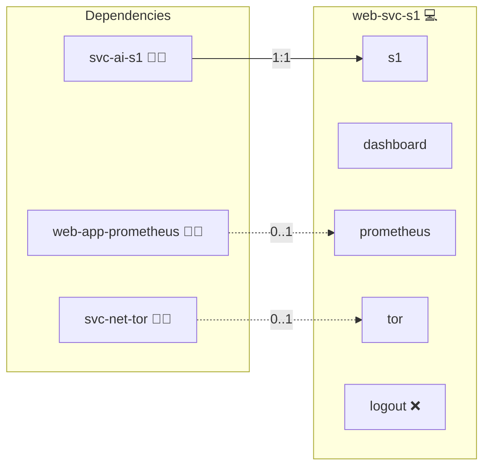

# System One API

## Description

Public vhost for the System One decision service. It serves [`svc-ai-s1`](../svc-ai-s1/) at `s1.ai.<domain>` so a client outside the deployment can ask it a typed question over the same `POST /v1/systemone` contract the gateway uses.

## Overview

This role ships no container. It renders one vhost through [`sys-stk-front-proxy`](../sys-stk-front-proxy/) and forwards to the container `svc-ai-s1` already runs, the way [`web-app-litellm`](../web-app-litellm/) fronts `svc-ai-litellm`. Deploying it without `svc-ai-s1` leaves the vhost answering nothing.

Callers authenticate with the bearer token `svc-ai-s1` already requires: the proxy passes `Authorization` through untouched and adds no credential of its own, so there is no second secret to rotate and the backend stays the single place that decides who may ask.

## Cosmos

The diagram places System One API in the Infinito.Nexus cosmos: the components it deploys (capabilities), the central services it consumes (dependencies), and its outward reach (federation and bridged external networks).



Solid `1:1` edges are fixed relationships; dashed `0..1` edges are conditional (enabled only in matching deployments); red `0..0` edges are turned off in this role. Node markers show the role's deploy modes (💻 host, 🐳 compose, 🐝 swarm); ❌ marks a service that is explicitly turned off, and ⚙️ an Ansible role dependency declared in `meta/main.yml`.

## Features

- **No second service.** A vhost and nothing else; the answer comes from the container `svc-ai-s1` runs.
- **One credential.** The bearer the backend issues is the bearer the caller sends.
- **Same contract.** `POST /v1/systemone` as the gateway speaks it, plus the `GET /health` the backend already serves.

## Quick Setup

### Development

Clone, set up the workstation, and deploy System One API onto the local stack:

```bash
git clone https://github.com/infinito-nexus/core.git
cd core
make onboard
make compose-deploy mode=reinstall apps=web-svc-s1 full_cycle=false
```

### Production

Install System One API directly onto the target machine: clone the repository, install the OS prerequisites and the repository toolchain, then deploy against localhost over a local connection (no SSH, no container):

```bash
git clone https://github.com/infinito-nexus/core.git
cd core
bash scripts/install/package.sh
make install
source scripts/meta/env/load.sh

APP=web-svc-s1
DOMAIN="<your-domain>"
TLS_MODE=self_signed
SSH_PUBLIC_KEY="<your-ssh-public-key>"
INVENTORY=inventories/production
infinito administration inventory provision "$INVENTORY" \
  --inventory-file "$INVENTORY/devices.yml" \
  --host localhost \
  --include "$APP" \
  --vars "{\"TLS_MODE\": \"$TLS_MODE\", \"DOMAIN_PRIMARY\": \"$DOMAIN\", \"users\": {\"administrator\": {\"authorized_keys\": [\"$SSH_PUBLIC_KEY\"]}}}"
infinito administration deploy dedicated "$INVENTORY/devices.yml" \
  --password-file "$INVENTORY/.password" \
  --diff -vv
```

## Further Resources

- [svc-ai-s1](../svc-ai-s1/README.md)

## Credits

Implemented by **[Kevin Veen-Birkenbach](https://social.infinito.nexus/profile/kevinveenbirkenbach/profile)**.
Part of the [Infinito.Nexus Project](https://s.infinito.nexus/code) and maintained by [Kevin Veen-Birkenbach](https://www.veen.world).
Licensed under the [Infinito.Nexus Community License (Non-Commercial)](https://s.infinito.nexus/license).
