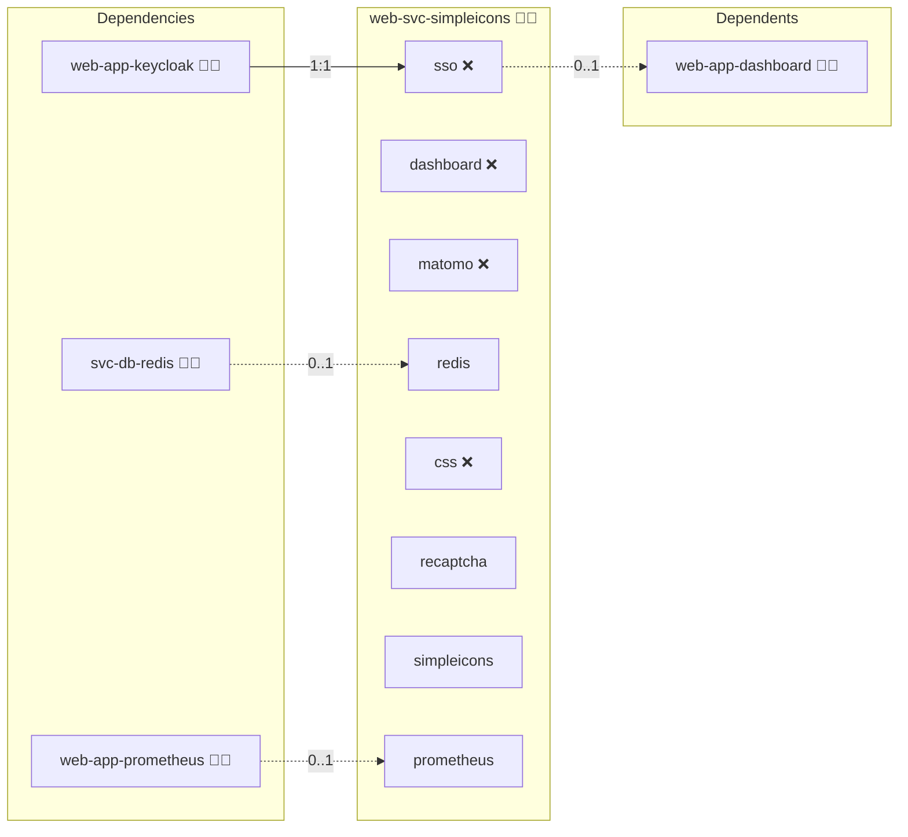

# Simple Icons

## Description

This Ansible role deploys and manages a containerized [Simple Icons](https://simpleicons.org/) server, providing easy access to over 2,000 SVG and PNG icons for use in web projects, documentation, and branding.

## Overview

Ideal for developers and content creators, the role simplifies deploying a dedicated icon server. It automates container setup, configuration, and routing, ensuring reliable, quick access to icons. Easily integrate scalable icons into your projects without managing individual asset files.

## Cosmos

The diagram places Simple Icons in the Infinito.Nexus cosmos: the components it deploys (capabilities), the central services it consumes (dependencies), and its outward reach (federation and bridged external networks).



Solid `1:1` edges are fixed relationships; dashed `0..1` edges are conditional (enabled only in matching deployments). Node markers show the role's deploy modes (💻 host, 🐳 compose, 🐝 swarm); ❌ marks a service that is explicitly turned off, and ⚙️ an Ansible role dependency declared in `meta/main.yml`.

## Purpose

The Docker-SimpleIcons role streamlines the deployment and management of a simple, efficient icon server. It helps you:

- Quickly deploy a lightweight, dedicated icon server.
- Serve icons consistently and reliably across multiple projects.
- Reduce manual maintenance of icon assets.
- Integrate seamlessly with complementary Ansible roles and web server configurations.

## Features

- **Icon Server:** Serves scalable SVG and PNG icons from the Simple Icons collection.
- **Containerized Deployment:** Utilizes Docker and Docker Compose for isolated, reliable deployment.
- **Dynamic Icon Delivery:** Icons are dynamically served via RESTful endpoints.
- **Customizable Setup:** Configure icon sizes, formats, and routes effortlessly.
- **Efficient Integration:** Works seamlessly with web server roles for robust domain routing.
- **Automated Maintenance:** Simplifies updates and re-deployments via automated container management.

## Quick Setup

### Development

Clone, set up the workstation, and deploy Simple Icons onto the local stack:

```bash
git clone https://github.com/infinito-nexus/core.git
cd core
make onboard
make compose-deploy mode=reinstall apps=web-svc-simpleicons full_cycle=false
```

### Production

Run the published image to provision the inventory and deploy Simple Icons to a managed server (the mounted volume persists the inventory):

```bash
APP=web-svc-simpleicons
HOST=<your-server>
TLS_MODE=self_signed
SSH_PUBLIC_KEY="<your-ssh-public-key>"

docker run --rm -it \
  -v "$PWD/inventories:/etc/infinito.nexus/inventories" \
  -e APP="$APP" -e HOST="$HOST" -e TLS_MODE="$TLS_MODE" -e SSH_PUBLIC_KEY="$SSH_PUBLIC_KEY" \
  ghcr.io/infinito-nexus/core/debian bash -c '
    INVENTORY=/etc/infinito.nexus/inventories/production
    infinito administration inventory provision "$INVENTORY" \
      --inventory-file "$INVENTORY/devices.yml" \
      --host "$HOST" \
      --include "$APP" \
      --vars "{\"TLS_MODE\": \"$TLS_MODE\", \"users\": {\"administrator\": {\"authorized_keys\": [\"$SSH_PUBLIC_KEY\"]}}}" &&
    infinito administration deploy dedicated "$INVENTORY/devices.yml" \
      --password-file "$INVENTORY/.password" \
      --diff -vv'
```

## Credits

Implemented by **[Kevin Veen-Birkenbach](https://www.veen.world)**.
Part of the [Infinito.Nexus Project](https://s.infinito.nexus/code) and maintained by [Kevin Veen-Birkenbach](https://www.veen.world).
Licensed under the [Infinito.Nexus Community License (Non-Commercial)](https://s.infinito.nexus/license).
