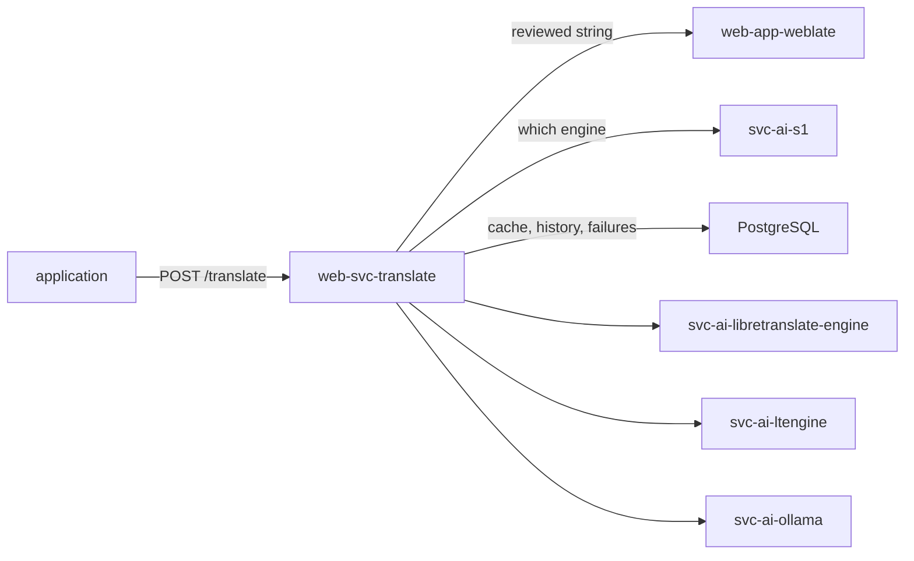

# Translation Gateway

## Description

One translation endpoint for every application in the deployment. It speaks the [LibreTranslate](https://libretranslate.com) API, chooses which engine answers, remembers which engine won earlier comparisons, caches what it has already paid for, and returns a reviewed human translation ahead of any machine output.

## Overview

The gateway is published at `api.translate.{{ DOMAIN_PRIMARY }}`. An application points at that one URL; anything that already speaks to LibreTranslate works unchanged.

Three backends are declared as consumer entries in `meta/services.yml`, each switched on by deploying the role that provides it:

| Backend | Provider | Reached over |
| --- | --- | --- |
| `libretranslate` | [`svc-ai-libretranslate-engine`](../svc-ai-libretranslate-engine/) | the LibreTranslate API |
| `ltengine` | [`svc-ai-ltengine`](../svc-ai-ltengine/) | the LibreTranslate API |
| `ollama` | [`svc-ai-ollama`](../svc-ai-ollama/) | Ollama's generate API, as a prompt |

## Reading the memory

The gateway authenticates to Weblate with the API token [`web-app-weblate`](../web-app-weblate/) writes to the token store after its own deploy. A web service is deployed before the web applications, so on the very first run of a fresh deployment that token does not exist yet: the gateway starts without a memory and answers from the engines. The next deploy renders the stored token and the reviewed strings take precedence from then on.

## Features

- **One API:** `POST /translate`, `POST /detect` and `GET /languages` in LibreTranslate's request and response shapes.
- **Reviewed strings win:** a string approved in [`web-app-weblate`](../web-app-weblate/) is returned verbatim and no engine is called.
- **Engine choice that learns:** with [`svc-ai-s1`](../svc-ai-s1/) deployed the router asks the decider which engine should answer, states each engine's record in the criteria, and after a configured number of comparisons routes straight to the leader.
- **Blind verdict:** while sampling, several engines answer the same request and the decider picks between the translations alone, labelled `option-0`, `option-1`, …, never by engine name.
- **Glossary protection:** a term the glossary protects must survive the translation; an answer that drops it is rejected rather than cached.
- **Loud failure:** with no engine able to answer, the gateway returns an error. It never hands the untranslated source text back as a translation.

## Schema

## Boundary

This role translates the content users put into the applications, at request time. Two neighbouring mechanisms translate something else, and neither goes through this gateway:

- `make i18n-translate` translates this repository's own `.po` catalogues at build time by calling an engine directly. One batch of known strings, with no request to cache and no caller to serve.
- The core surfaces (the docs site, the dashboard, the logout panel) read those catalogues at render time.

The boundary is build time against request time.

## Further resources

- [LibreTranslate API](https://libretranslate.com/docs/)
