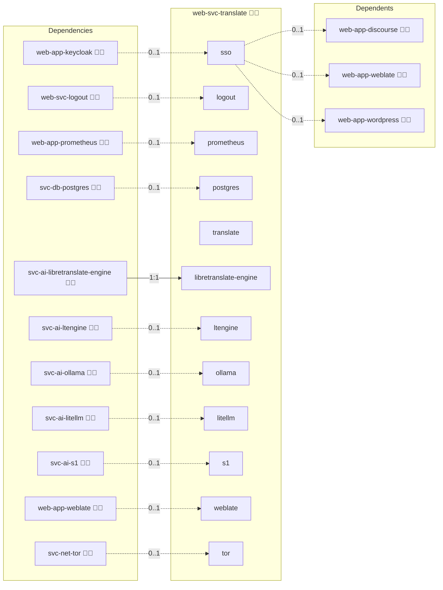
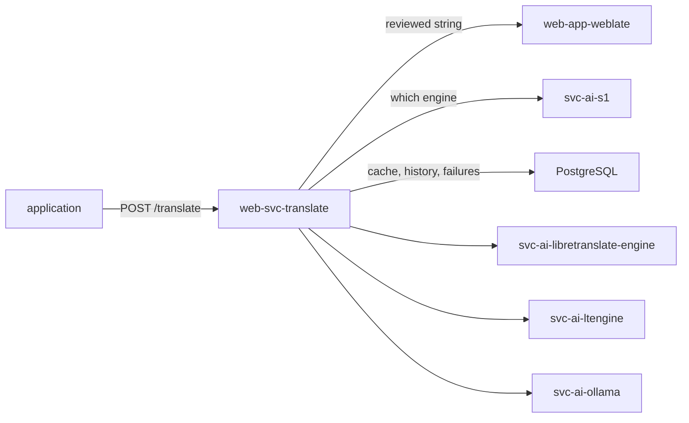

# Translation Gateway

## Description

One translation endpoint for every application in the deployment. It speaks the [LibreTranslate](https://libretranslate.com) API, chooses which engine answers, remembers which engine won earlier comparisons, caches what it has already paid for, and returns a reviewed human translation ahead of any machine output.

## Overview

The gateway is published at `api.translate.{{ DOMAIN_PRIMARY }}`. An application points at that one URL; anything that already speaks to LibreTranslate works unchanged.

Three backends are declared as consumer entries in `meta/services.yml`, each switched on by deploying the role that provides it:

| Backend | Provider | Reached over |
| --- | --- | --- |
| `libretranslate` | [`svc-ai-libretranslate-engine`](../svc-ai-libretranslate-engine/) | the LibreTranslate API |
| `ltengine` | [`svc-ai-ltengine`](../svc-ai-ltengine/) | the LibreTranslate API |
| `ollama` | [`svc-ai-ollama`](../svc-ai-ollama/) | Ollama's generate API, as a prompt |

## Cosmos

The diagram places Translation Gateway in the Infinito.Nexus cosmos: the components it deploys (capabilities), the central services it consumes (dependencies), and its outward reach (federation and bridged external networks).



Solid `1:1` edges are fixed relationships; dashed `0..1` edges are conditional (enabled only in matching deployments); red `0..0` edges are turned off in this role. Node markers show the role's deploy modes (💻 host, 🐳 compose, 🐝 swarm); ❌ marks a service that is explicitly turned off, and ⚙️ an Ansible role dependency declared in `meta/main.yml`.

## Reading the memory

The gateway authenticates to Weblate with the API token [`web-app-weblate`](../web-app-weblate/) writes to the token store after its own deploy. A web service is deployed before the web applications, so on the very first run of a fresh deployment that token does not exist yet: the gateway starts without a memory and answers from the engines. The next deploy renders the stored token and the reviewed strings take precedence from then on.

## Features

- **One API:** `POST /translate`, `POST /detect` and `GET /languages` in LibreTranslate's request and response shapes.
- **Reviewed strings win:** a string approved in [`web-app-weblate`](../web-app-weblate/) is returned verbatim and no engine is called.
- **Engine choice that learns:** with [`svc-ai-s1`](../svc-ai-s1/) deployed the router asks the decider which engine should answer, states each engine's record in the criteria, and after a configured number of comparisons routes straight to the leader.
- **Blind verdict:** while sampling, several engines answer the same request and the decider picks between the translations alone, labelled `option-0`, `option-1`, …, never by engine name.
- **Glossary protection:** a term the glossary protects must survive the translation; an answer that drops it is rejected rather than cached.
- **Loud failure:** with no engine able to answer, the gateway returns an error. It never hands the untranslated source text back as a translation.

## Quick Setup

### Development

Clone, set up the workstation, and deploy Translation Gateway onto the local stack:

```bash
git clone https://github.com/infinito-nexus/core.git
cd core
make onboard
make compose-deploy mode=reinstall apps=web-svc-translate full_cycle=false
```

### Production

Run the published image to provision the inventory and deploy Translation Gateway to a managed server (the mounted volume persists the inventory):

```bash
APP=web-svc-translate
HOST="<your-server>"
DOMAIN="<your-domain>"
TLS_MODE=self_signed
SSH_PUBLIC_KEY="<your-ssh-public-key>"

docker run --rm -it \
  -v "$PWD/inventories:/etc/infinito.nexus/inventories" \
  -e APP="$APP" -e HOST="$HOST" -e DOMAIN="$DOMAIN" -e TLS_MODE="$TLS_MODE" -e SSH_PUBLIC_KEY="$SSH_PUBLIC_KEY" \
  ghcr.io/infinito-nexus/core/debian:latest bash -c '
    INVENTORY=/etc/infinito.nexus/inventories/production
    infinito administration inventory provision "$INVENTORY" \
      --inventory-file "$INVENTORY/devices.yml" \
      --host "$HOST" \
      --include "$APP" \
      --vars "{\"TLS_MODE\": \"$TLS_MODE\", \"DOMAIN_PRIMARY\": \"$DOMAIN\", \"users\": {\"administrator\": {\"authorized_keys\": [\"$SSH_PUBLIC_KEY\"]}}}" &&
    infinito administration deploy dedicated "$INVENTORY/devices.yml" \
      --password-file "$INVENTORY/.password" \
      --diff -vv'
```

## Credits

Implemented by **[Kevin Veen-Birkenbach](https://social.infinito.nexus/profile/kevinveenbirkenbach/profile)**.
Part of the [Infinito.Nexus Project](https://s.infinito.nexus/code) and maintained by [Kevin Veen-Birkenbach](https://www.veen.world).
Licensed under the [Infinito.Nexus Community License (Non-Commercial)](https://s.infinito.nexus/license).

## Schema



## Boundary

This role translates the content users put into the applications, at request time. Two neighbouring mechanisms translate something else, and neither goes through this gateway:

- `make i18n-translate` translates this repository's own `.po` catalogues at build time by calling an engine directly. One batch of known strings, with no request to cache and no caller to serve.
- The core surfaces (the docs site, the dashboard, the logout panel) read those catalogues at render time.

The boundary is build time against request time.

## Further resources

- [LibreTranslate API](https://libretranslate.com/docs/)
