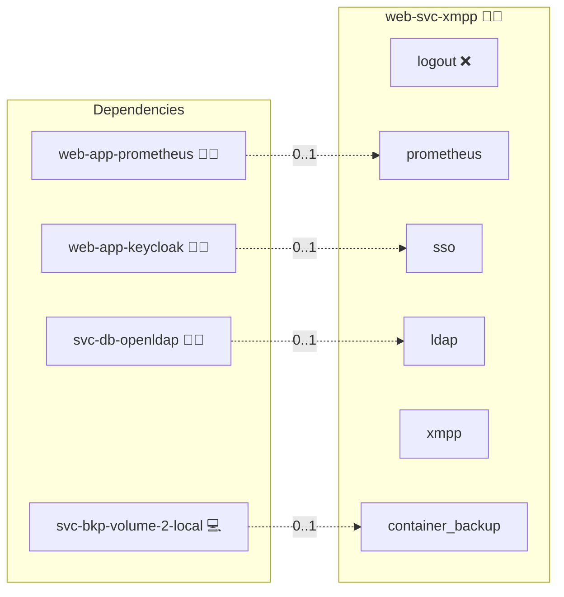

# XMPP

## Description

[ejabberd](https://www.ejabberd.im/) is a robust, scalable, and modular XMPP server that implements the full XMPP specification plus a number of extensions (XEPs). Clients connect over TCP/TLS on ports 5222 (client-to-server) and 5269 (server-to-server), with an optional HTTP listener for the admin UI and BOSH/WebSocket bindings.

## Overview

This role deploys ejabberd on Docker Compose with the project's standard role-meta wiring. It binds ejabberd's `auth_method` to `svc-db-openldap` so XMPP clients authenticate against the project's central LDAP. The OIDC variant additionally loads `mod_oauth2_client` so a Keycloak-issued bearer token can be exchanged for an ejabberd session, but most XMPP clients still rely on SCRAM-SHA-256 over LDAP, which remains the interoperable default.

## Cosmos

The diagram places XMPP in the Infinito.Nexus cosmos: the components it deploys (capabilities), the central services it consumes (dependencies), and its outward reach (federation and bridged external networks).



Solid `1:1` edges are fixed relationships; dashed `0..1` edges are conditional (enabled only in matching deployments). Node markers show the role's deploy modes (💻 host, 🐳 compose, 🐝 swarm); ❌ marks a service that is explicitly turned off, and ⚙️ an Ansible role dependency declared in `meta/main.yml`.

## Features

- **Containerized deployment:** Run ejabberd through Docker Compose with the project's standard role-meta wiring.
- **LDAP-backed authentication:** Authenticate XMPP clients against `svc-db-openldap` using SCRAM-SHA-256.
- **Optional OIDC bridge:** Load `mod_oauth2_client` when the OIDC variant is active, for the small set of XMPP clients that support OAuth bearer-token authentication.
- **HTTP admin and BOSH:** Expose the ejabberd web admin and BOSH/WebSocket bindings on the role's HTTP port for browser-based interaction.

## Quick Setup

### Development

Clone, set up the workstation, and deploy XMPP onto the local stack:

```bash
git clone https://github.com/infinito-nexus/core.git
cd core
make onboard
make compose-deploy mode=reinstall apps=web-svc-xmpp full_cycle=false
```

### Production

Run the published image to provision the inventory and deploy XMPP to a managed server (the mounted volume persists the inventory):

```bash
APP=web-svc-xmpp
HOST=<your-server>
TLS_MODE=self_signed
SSH_PUBLIC_KEY="<your-ssh-public-key>"

docker run --rm -it \
  -v "$PWD/inventories:/etc/infinito.nexus/inventories" \
  -e APP="$APP" -e HOST="$HOST" -e TLS_MODE="$TLS_MODE" -e SSH_PUBLIC_KEY="$SSH_PUBLIC_KEY" \
  ghcr.io/infinito-nexus/core/debian bash -c '
    INVENTORY=/etc/infinito.nexus/inventories/production
    infinito administration inventory provision "$INVENTORY" \
      --inventory-file "$INVENTORY/devices.yml" \
      --host "$HOST" \
      --include "$APP" \
      --vars "{\"TLS_MODE\": \"$TLS_MODE\", \"users\": {\"administrator\": {\"authorized_keys\": [\"$SSH_PUBLIC_KEY\"]}}}" &&
    infinito administration deploy dedicated "$INVENTORY/devices.yml" \
      --password-file "$INVENTORY/.password" \
      --diff -vv'
```

## Watch Points

- Many XMPP clients do NOT support OAuth bearer-token authentication. LDAP plus SCRAM-SHA-256 is the interoperable default. If you advertise OIDC, document the small set of XMPP clients confirmed to work (Conversations, Movim, Dino) and keep LDAP plus SCRAM as the fallback path.
- ejabberd's `mod_admin` HTTP UI is the only Playwright-testable surface; XMPP client login itself runs over 5222/5269 and MUST be exercised by an XMPP-aware client outside the Playwright test loop.

## Further Resources

- [ejabberd Official Website](https://www.ejabberd.im/)
- [ejabberd Container Documentation](https://docs.ejabberd.im/CONTAINER/)
- [Converse.js](https://conversejs.org/)

## Credits

Implemented by **[Kevin Veen-Birkenbach](https://www.veen.world)**.
Part of the [Infinito.Nexus Project](https://s.infinito.nexus/code) and maintained by [Kevin Veen-Birkenbach](https://www.veen.world).
Licensed under the [Infinito.Nexus Community License (Non-Commercial)](https://s.infinito.nexus/license).
