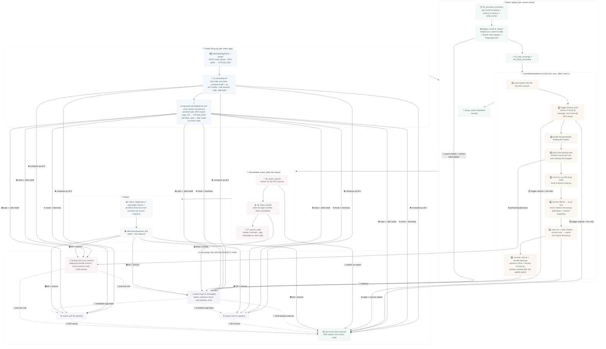

# Swarm deploy test harness

Simulates a full Docker Swarm cluster on a single CI runner (or host via
`make swarm-zombie` / `make roundtrip`) and deploys one application
through it end to end: provision an inventory, deploy every variant
round with the in-deploy Playwright e2e, run the backup+restore DR drill
between rounds, then prove state survives a worker reschedule.

The cluster consists of privileged systemd containers on a dedicated lab
bridge (`192.168.244.0/24`, MTU 1400): three swarm nodes (1 manager +
2 workers), a non-swarm NFSv4 server serving the shared volume storage,
and a non-swarm backup host for the DR drill. The node image
([`compose/swarm/Dockerfile`](../../../../compose/swarm/Dockerfile))
bakes python3 + dnsmasq; the containers and the lab network are declared
in [`compose/swarm/compose.yml`](../../../../compose/swarm/compose.yml) (project
`${SWARM_NAME}`, backup host behind the `drill` profile) and started by
one `docker compose up` in `routine/01_bootstrap.sh`. Lab DNS is provisioned
by `compose/swarm/playbook.yml` over `ansible_connection: docker` (Ansible never
uses ssh here); swarm init/join itself happens inside the deploy via the
`svc-swarm-node` role, not in any bring-up script.

## Flow

The drill proves the full `svc-bkp-*` chain forward through the DEPLOYED
systemd units on every host (volume + secrets on the manager, nfs on the
export host, remote pull + device sync on the backup host) and every
`recover.py` back (device -> local root -> NFS export, docker volume and
host secrets into the live system paths), with marker files that must
survive the whole loop: the matrix update pass boots the recovered stack
and `verify_recovered_marker.sh` asserts the marker on the live volume. It
reuses the round-1 stack instead of spinning a dedicated cluster, and skips
cleanly when the app declares no NFS-flagged volume. The backup host is started by `routine/01_bootstrap.sh` (drill
profile) and receives its two roles via `extend_inventory`; the pull
trust (backup keypair) and the role config (backup_providers, device
mount/target/source) come from `utils/tests/swarm/write/extras.py`.

## Scripts

The sequenced flow lives in `routine/`, the naming SPOT in `utils/topology/`,
shared helpers in `utils/`, and
the cluster declaration (image, containers, network, DNS play) in
`compose/swarm/` + `compose/swarm/compose.yml`.

| Stage | Script | Purpose |
|---|---|---|
| bring-up | `utils/topology/base.sh` | SPOT: node names + NFS export/state paths (sourced, not run) |
| bring-up | `utils/topology/export.sh` | write the topology SPOT into `$GITHUB_ENV` |
| bring-up | `compose/swarm/compose.yml` + `compose/swarm/Dockerfile` | declare the 5 node containers, node image + lab network (compose SPOT) |
| bring-up | `routine/01_bootstrap.sh` | one CI step, host side: pre-clean, `compose build` + one `compose up`, sudo `.deb` build, then the play |
| bring-up | `compose/swarm/playbook.yml` | node side over docker connection: systemd wait, NFS-export wipe, IPs into `$GITHUB_ENV`, lab DNS, repo + `.deb` install |
| deploy | `routine/02_provision_inventory.sh` | provision the per-round inventory |
| deploy | `routine/03_wait_converge.sh` | wait for every stack service to converge |
| deploy | `routine/04_verify_reachable.sh` | probe the app is reachable in-cluster |
| deploy | `routine/backup/base.sh` (+ per-host routines in `routine/backup/`) | backup+restore DR drill between rounds |
| deploy | `utils/clean/purge_stacks.sh` | remove prior-round stacks between rounds |
| chaos | `routine/05_seed_content.sh` | seed a marker on the NFS volume |
| chaos | `routine/06_drain_worker.sh` | drain the app's worker + force reschedule |
| chaos | `routine/07_assert_state.sh` | assert the marker + reachability survived |
| teardown | `utils/collect/diagnostics.sh` | collect stack/service diagnostics on failure |
| teardown | `utils/collect/playwright_reports.sh` | pull Playwright reports from the manager |
| teardown | `utils/clean/teardown.sh` | kill the nodes + remove the lab network |
| helper | `utils/_context.sh` | per-app facts (entity, service, NFS volume, probes) |
| helper | `utils/unmount_nfs_mounts.sh` | best-effort NFS unmount before node removal |
| recovery | `utils/clean/all.sh` | reap leftover clusters across every cluster id |
| recovery | `utils/clean/stale_nfs.sh` | recover stale in-namespace NFS mounts |

The matrix orchestrator
(`utils/tests/swarm/matrix.py`) drives the deploy stage
per variant round; the workflow `.github/workflows/test-deploy-swarm.yml`
drives the surrounding stages. Run one app locally with
`make swarm-zombie app=<id>` (keeps the cluster for inspection) or the
whole matrix via `make roundtrip`.
