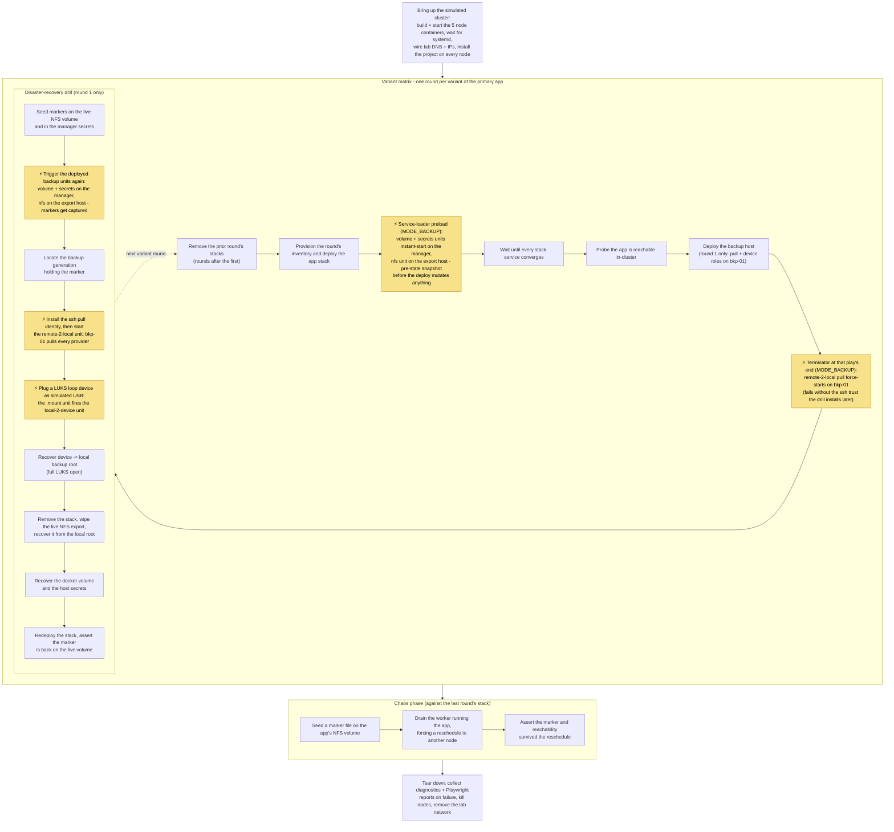

# Swarm test routine 🔁

Sequenced steps of the swarm lab run. Bring-up and the chaos phase are
workflow steps; the per-round loop in between is driven by
`utils.tests.swarm.matrix` (one round per variant of the
primary app). Highlighted boxes (⚡) are the moments a backup-executing
systemd unit actually starts. See [../README.md](../README.md) for
topology, naming SPOTs and helpers; the DR drill's own steps are
documented in [backup/README.md](backup/README.md).

The nightly timers (volume 01:00, nfs 01:30, secrets 01:45, device
02:00, remote pull 00:30) run independently of every step above and
never fire during a lab run.

Scripts per step: bring-up [01_bootstrap.sh](01_bootstrap.sh) -
provision [02_provision_inventory.sh](02_provision_inventory.sh) -
converge [03_wait_converge.sh](03_wait_converge.sh) -
reachability [04_verify_reachable.sh](04_verify_reachable.sh) -
drill [backup/base.sh](backup/base.sh) -
marker [05_seed_content.sh](05_seed_content.sh) -
drain [06_drain_worker.sh](06_drain_worker.sh) -
assert [07_assert_state.sh](07_assert_state.sh) -
purge [../utils/clean/purge_stacks.sh](../utils/clean/purge_stacks.sh).
