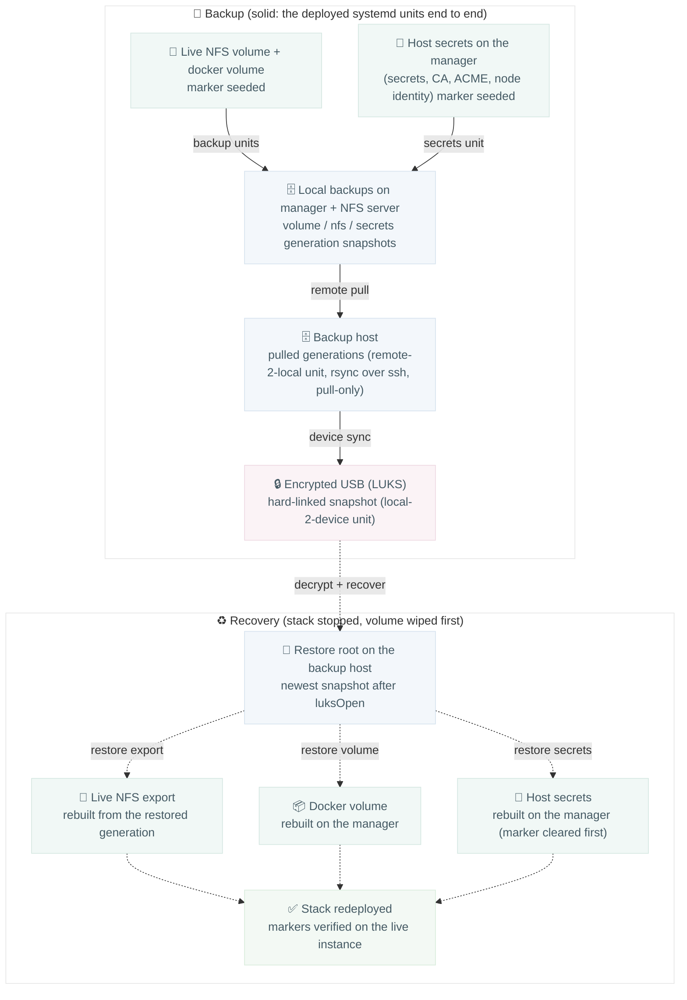

# DR drill: backup + restore

Marker files seeded into the live NFS volume and into the manager's host
secrets travel the full backup chain forward and are recovered back onto
the live instance; the drill passes only when every marker survives the
whole loop.

