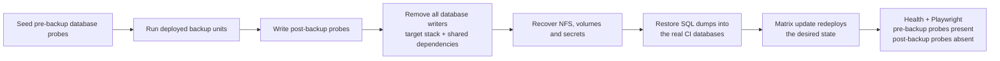
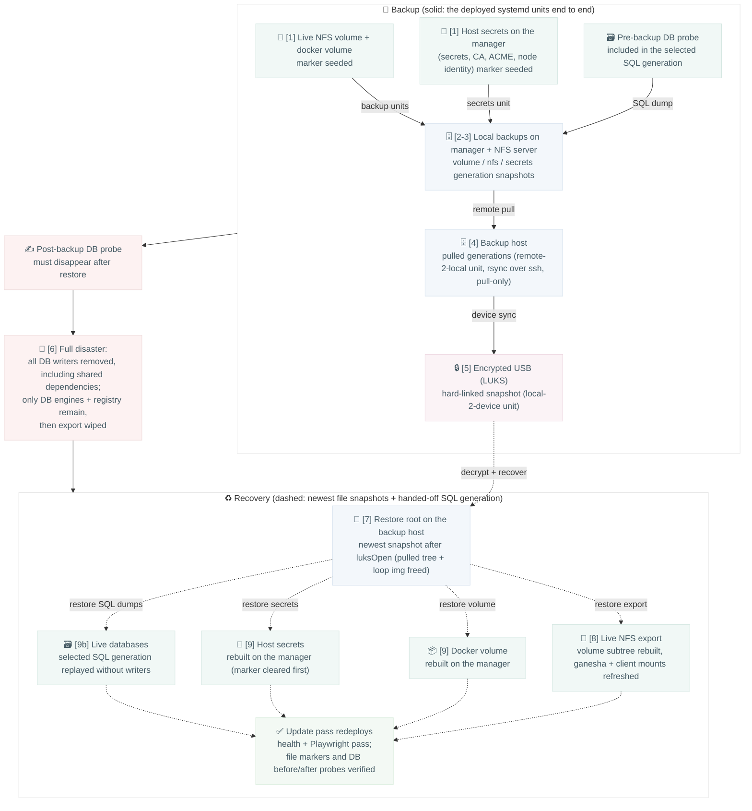

# DR drill: backup + restore

Marker files seeded into the live NFS volume and into the manager's host
secrets travel the full backup chain forward and are recovered back onto
the live instance; the drill passes only when every marker survives the
whole loop. `base.sh` runs the nine steps below; the numbers in both
diagrams are its `[n/9]` log markers.

## Schema

The CI drill includes destructive database recovery. The disposable test
cluster keeps only the database engines and local registry available while
every database-writing workload, including shared dependencies such as
Discourse, is stopped. The normal matrix update remains the single source of
truth for bringing the workloads back.



## Step sequence (who does what)

```mermaid
sequenceDiagram
    autonumber
    participant N as nfs-server
    participant M as manager
    participant D as database engines
    participant B as backup host
    participant U as LUKS "USB" (loop img on B)

    Note over M,D: role test seeds pre-backup DB probes, backs up, then seeds post-backup probes

    Note over N,M: [1/9] seed file markers
    N->>N: marker → live NFS volume dir
    M->>M: marker → host secrets dir

    Note over N,M: [2/9] trigger deployed backup units
    M->>M: svc-bkp-volume-2-local + secrets-2-local
    N->>N: svc-bkp-nfs-2-local

    Note over N,M: [3/9] locate the generation holding the marker
    N-->>M: find marker in files/*/<volume>/ (volume-scoped)

    Note over B: [4/9] pull via remote-2-local unit (rsync over ssh)
    B->>N: pull nfs generations
    B->>M: pull volume + secrets generations

    Note over B,U: [5/9] plug LUKS device, sync via local-2-device unit
    B->>U: hard-linked snapshot

    Note over M,D: [6/9] quiesce writers
    alt database handoff exists
        M->>M: remove all non-DB/non-registry stacks and containers
    else file-only drill
        M->>M: remove the target stack or node-local compose project
    end

    Note over B,U: [7/9] recover device → local root
    U-->>B: luksOpen + recover CLI → /var/tmp restore root
    B->>B: drop pulled tree + loop image (free disk)

    Note over N: [8/9] recover local root → live NFS export
    B-->>N: tar the volume subtree → recover CLI
    N->>N: [8b] restart ganesha, remount clients, coherence probe

    Note over M: [9/9] recover docker volume + host secrets
    B-->>M: volume generation → recover CLI
    B-->>M: secrets generation → recover CLI

    Note over M,D: [9b/9] restore selected SQL generation
    B-->>M: device-recovered volume backup repository
    M->>D: replay dumps while all writers remain stopped

    Note over M,N: matrix update redeploys; health, Playwright, file markers and DB before/after probes must pass
```

## Data flow (what is proven)



## Applicability

- The first matrix round runs the complete file chain whenever the app
  declares an NFS-flagged volume (`PRIMARY_NFS_VOLUME`). A database handoff
  is destructive even without NFS: all writers are quiesced and the selected
  manager-local generation is restored.
- Later variant rounds skip the expensive file chain. If their role test
  hands off SQL dumps, they still run the destructive database restore and
  post-update probe verification; no Swarm restore is replaced by a guard.
- In a file-only drill, the workload form changes step 6: stack workloads
  get `docker stack rm`, while `workload: node-local` roles have their
  Compose project stopped on every node. A database handoff instead removes
  every non-database workload in either form.
- Runs between the sync and update pass. The full NFS/device chain runs once
  per app; database recovery runs in every round that produced a handoff.
