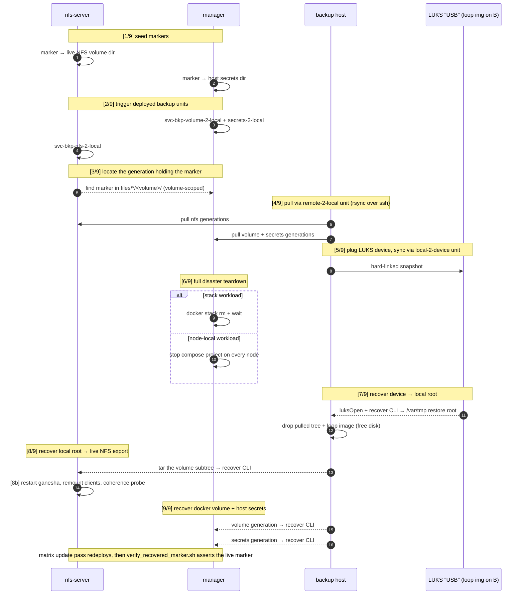
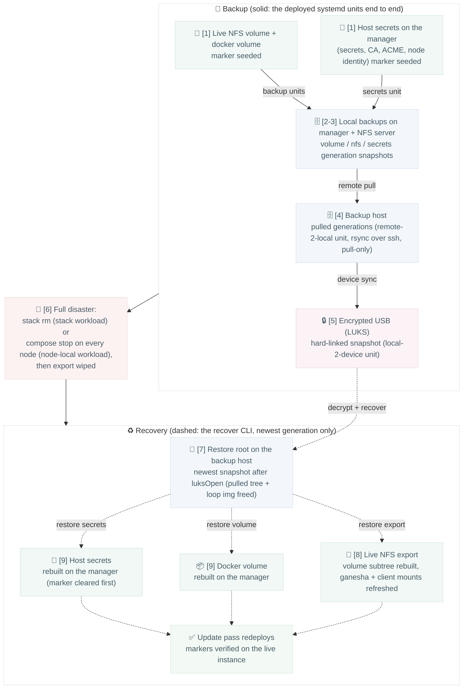

# DR drill: backup + restore

Marker files seeded into the live NFS volume and into the manager's host
secrets travel the full backup chain forward and are recovered back onto
the live instance; the drill passes only when every marker survives the
whole loop. `base.sh` runs the nine steps below; the numbers in both
diagrams are its `[n/9]` log markers.

## Step sequence (who does what)

## Data flow (what is proven)

## Applicability

- The drill runs whenever the app declares an NFS-flagged volume
  (`PRIMARY_NFS_VOLUME`); apps without one skip it, since there is nothing
  to prove a restore against.
- The workload form only changes step 6: stack workloads get
  `docker stack rm`, `workload: node-local` roles get their compose
  project stopped on every node. Every other step operates on volumes,
  the NFS export and the deployed backup units, independent of the
  orchestrator.
- Runs once per app, in the variant-0 CI job, between the matrix's first
  deploy and its update pass.
