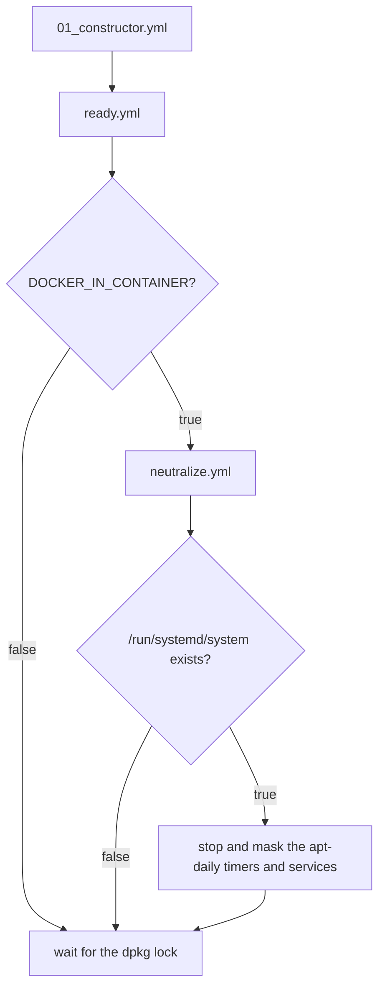

# apt readiness tasks

Included by [tasks/stages/01_constructor.yml](../../stages/01_constructor.yml)
before the first apt task of a play.

- [ready.yml](./ready.yml) is the entry point: it gates the neutralize
  include on `DOCKER_IN_CONTAINER` and always waits for the dpkg lock.
- [neutralize.yml](./neutralize.yml) stops and masks the apt-daily units,
  gated on a running systemd (`/run/systemd/system`, the sd_booted
  convention).

