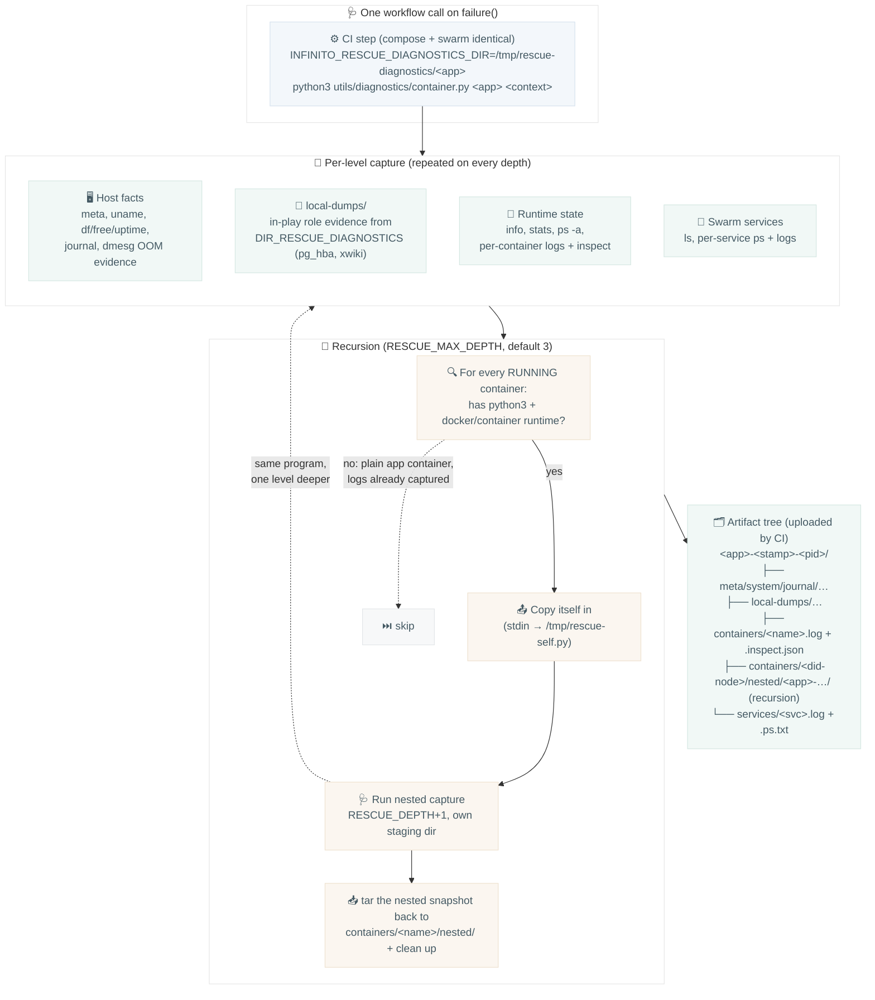

# Diagnostics: recursive container rescue snapshot

`container.py` is the single failure-diagnostics entry point. The CI
workflows (compose + swarm) call it once on the runner when a job fails;
it captures the current level and then recurses itself through every
Docker-in-Docker boundary, so one call collects evidence from the
outermost runner down to the innermost application container. It always
exits 1.

Ansible `rescue:` blocks are forbidden
(`tests/lint/ansible/structure/test_no_rescue_blocks.py`); the rare
justified block (`# nocheck: rescue-<reason>`) leaves its role-specific
evidence in `DIR_RESCUE_DIAGNOSTICS`, which every capture level ships as
`local-dumps/`.
