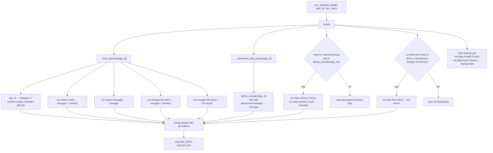

# Swarm test inventory extension

`extend_inventory.py` expands a provisioned swarm-test inventory so the static
validator and the deploy see every group the run will use. It reads `APP_ID`,
`INV_PATH` and `SWARM_NAME` from the environment, merges the computed groups
into `INV_PATH`, and writes a sibling `backup.yml` for the second (backup-host)
play.

## Flow

## Groups

| Group | Host | Condition |
| --- | --- | --- |
| `APP_ID` | manager, workers | workers dropped when the role is `placement: manager` |
| `svc-swarm-node` | manager, workers | always |
| `svc-swarm-manager` | manager | always |
| `svc-storage-nfs-client` | manager, workers | always |
| `svc-storage-nfs-server` | nfs-server | always |
| dep roles from `derive_includes` | manager | role declares `placement: manager` |
| `svc-bkp-volume-2-local` | manager | `derive_includes(APP_ID)` pulls it in via the `container_backup` consumer |
| `svc-bkp-secrets-2-local` | manager | `derive_includes(APP_ID)` pulls it in |
| `svc-bkp-nfs-2-local` | nfs-server | `derive_includes(svc-storage-nfs-server)` pulls it in via the `nfs_backup` consumer |
| `svc-bkp-remote-2-local`, `svc-bkp-local-2-device` | backup host | always, written to `backup.yml` |

Node names come from `default.env` (`INFINITO_SWARM_*_NAME`) with the
`SWARM_NAME` prefix. `INFINITO_APP_VARIANTS` feeds `derive_includes` to select
the active variant.
